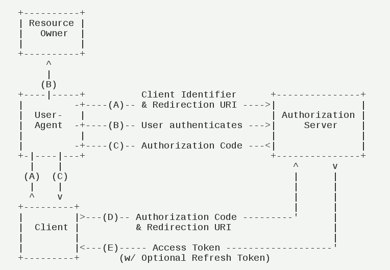
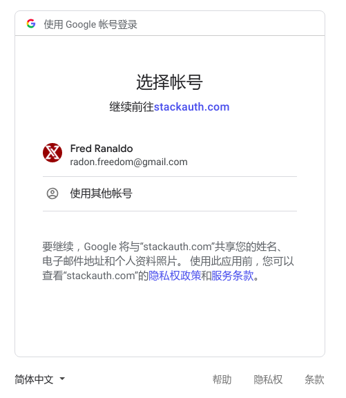

# Oauth2

## 授权码模式

授权码模式是功能最完整、使用最广泛、流程最严密的授权模式。

由于这是一个基于重定向的流，所以客户端必须能够与资源所有者的用户代理(通常是web浏览器)进行交互，并且能够从授权服务器接收传入的请求(通过重定向)。

- （A）**资源所有者（用户）在第三方客户端上期望用微信登录，第三方客户端将用户导向授权服务器，通过用户代理（`User-Agent`）发送包括它的**
  - 客户端标识符 `client id`和`client secret` (标识自己是哪个想得到授权的APP) 
  - 请求的范围 (想获取哪些资源)
  - 本地状态
  - 重定向URI（用于定位到客户端API, 传输给第三方客户端对应想访问资源权限的访问令牌）
- （B）**授权服务器对资源所有者（用户）进行身份验证(通过用户代理)**
  - 资源所有者（用户）授予 (在拉出的微信界面上用户点击确认) : **转（C）**
  - 资源所有者（用户）拒绝客户端的访问请求 (客户不响应拉出的微信APP界面或取消确认) : **结束**;
- （C）授权服务器**使用重定向URI（`redirection URI`）重定向到客户端，并附上一个授权码（`code`）和一个前面提供的本地状态（`state`）（如果有的话，则会原值返回）。**
- （D）**客户端收到授权码，附上早先的`重定向URI`，向授权服务器申请令牌。**
  - 这一步是在客户端的后台的服务器上完成的，对用户不可见。
  - 在发出请求时，授权服务器对客户端进行身份验证。请求参数包含授权代码、用于获得验证的授权代码的重定向URI、标识客户端身份的`client id`和`client secret`。
- （E）授权服务器对客户端进行身份验证，验证授权代码，并确保所收到的重定向URI与用于在步骤(C)中对客户端重定向的URI相匹配，如果有效，授权服务器将发送访问令牌`access token`和刷新令牌`refresh token`（可选）。

接着来介绍下各个步骤所需的参数

对于步骤A，客户端申请授权请求的URI，包含以下参数：

- `response_type`授权类型。必选项，其值固定为`code`。
- `client_id`客户端id。必选项，用于标识授权服务器中已注册的客户端。
- `redirect_uri`重定向URI。可选项，如果不填写则使用注册在授权服务器端与client_id对应的redirect_uri。
- `scope`申请的权限范围，如`read`或`write`。可选项，如果申请的请求访问超出授权服务器定义的可操作范围则会失败。
- `state`表示客户端当前状态。可选项，可以指定任意值，授权服务器会原封不动地返回这个值。

## 例子

以自己的stackoverflow登录举例. stackoverflow可以使用Google账号登录.

A : 在官网选择使用Google账号登录, 会重定向到以下链接(Google的授权服务器)

> https://accounts.google.com/signin/oauth/oauthchooseaccount?
>
> **client_id**=717762328687-p17pldm5fteklla3nplbss3ai9slta0a.apps.googleusercontent.com&
>
> **as**=9MAhWdBZCM2rDulUBuJQ3Q&
>
> **destination**=https%3A%2F%2Fstackauth.com&
>
> **approval_state**=!ChR0eG5ES09ETklnc0N3QjFaZ2VaNhIfMDRPUUEwOUQwSXNWNEJxcmlYbTVkb21pdDB2cm1oWQ%E2%88%99AJDr988AAAAAXJiKAdi-awdU9OYFNzGXzD2nnu4Nipq7&
>
> **oauthgdpr**=1&
>
> **xsrfsig**=ChkAeAh8T9DtLuZkAUr0pxm1DJOdwBiKGu4eEg5hcHByb3ZhbF9zdGF0ZRILZGVzdGluYXRpb24SBXNvYWN1Eg9vYXV0aHJpc2t5c2NvcGU&
>
> **flowName**=GeneralOAuthFlow

B: 点击自己的账号确认

C: 返回授权码, 重定向

D 和 E为后台操作, 不可见

> https://stackoverflow.com/users/oauth/google?
>
> **code**=4%2fGAGHod0HFcMQEUNeV4payDBEcyl9hLru6WcVeT_h7p-ApQkqmHPX9TsAvXUVm-teiyvg3mg9xtN7y4k4gcoSP4A&state=%7b%22sid%22%3a1%2c%22cdl%22%3anull%2c%22st%22%3a%22f8d7cee198d1449c92021ffc678b463e5b07aebb27cc79c8a248e38dbad4d99f%22%2c%22ses%22%3a%2283b7f26bdae74157949428e0ad66f82a%22%7d&s=83b7f26bdae74157949428e0ad66f82a