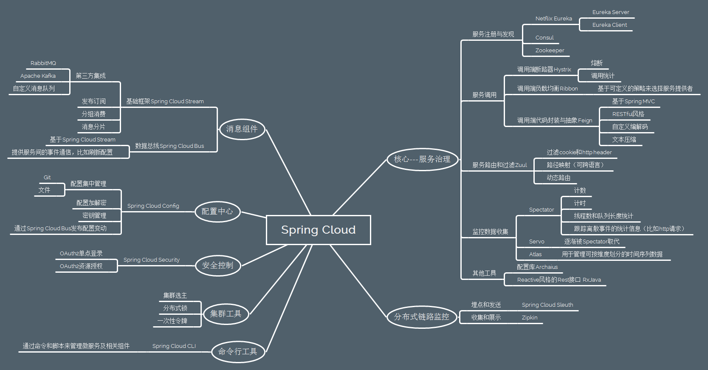

# 微服务中一些重要概念

#### RPC

Dubbo. 在Spring Cloud中是rest模板Feign.

**API 网关**

> It is a single entry point into the system, used to handle requests by routing them to the appropriate backend service or by invoking multiple backend services and [aggregating the results](http://techblog.netflix.com/2013/01/optimizing-netflix-api.html). Also, it can be used for authentication, insights, stress and canary testing, service migration, static response handling, active traffic management.

[API 网关性能比较：NGINX vs. ZUUL vs. Spring Cloud Gateway vs. Linkerd](https://infoq.cn/article/comparing-api-gateway-performances)

#### 服务自动注册和发现

Zookeeper, 在SpringCloud中是eureka.

#### 本地负载均衡 (服务之间沟通)

在SpringCloud中是ribbon

#### 客户端负载均衡 (客户端与服务沟通)

Nginx, zuul

#### 智能容错，熔断机制

Netflix Hystrix


# DUBBO 和 Spring Cloud

## Dubbo和Spring Cloud有何不同？

首先做一个简单的功能对比：

| 微服务架构所需功能               | Dubbo         | Spring Cloud        |
| -------------------------------- | ------------- | ------------------- |
| 服务注册中心                     | Zookeeper     | Netflix Eureka      |
| 服务调用方式                     | RPC           | REST API            |
| 服务监控                         | Dubbo-monitor | Spring Boot Admin   |
| 断路器                           | 不完善        | Netflix Hystrix     |
| 服务网关（客户端与服务负载均衡） | 无            | Netflix Zuul        |
| 分布式配置                       | 无            | Spring Cloud Config |
| 消息总线                         | 无            | Spring Cloud Bus    |
| 服务负载均衡（服务之间负载均衡） | 自带          | Ribbon              |

**从上图可以看出其实Dubbo的功能只是Spring Cloud体系的一部分。**

这样对比是不够公平的，首先 Dubbo 是 SOA 时代的产物，它的关注点主要在于服务的调用，流量分发、流量监控和熔断。而 Spring Cloud 诞生于微服务架构时代，考虑的是微服务治理的方方面面，另外由于依托了 Spring、Spring Boot 的优势之上，两个框架在开始目标就不一致，Dubbo 定位服务治理、Spring Cloud 是一个生态。

**如果仅仅关注于服务治理的这个层面，Dubbo其实还优于Spring Cloud很多：**

- Dubbo 支持更多的协议，如：rmi、hessian、http、webservice、thrift、memcached、redis 等。
- Dubbo 使用 RPC 协议效率更高，在极端压力测试下，Dubbo 的效率会高于 Spring Cloud 效率一倍多。
- Dubbo 有更强大的后台管理，Dubbo 提供的后台管理 Dubbo Admin 功能强大，提供了路由规则、动态配置、访问控制、权重调节、均衡负载等诸多强大的功能。
- 可以限制某个 IP 流量的访问权限，设置不同服务器分发不同的流量权重，并且支持多种算法，利用这些功能我们可以在线上做灰度发布、故障转移等，Spring Cloud 到现在还不支持灰度发布、流量权重等功能。

**所以Dubbo专注于服务治理；Spring Cloud关注于微服务架构生态。**

## Dubbo重新发布对Spring Cloud有影响吗？

国内技术人喜欢拿 Dubbo 和 Spring Cloud 进行对比，是因为两者都是服务治理非常优秀的开源框架。但它们两者的出发点是不一样的，Dubbo 关注于服务治理这块并且以后也会继续往这个方向去发展。Spring Cloud 关注的是微服务治理的生态。因为微服务治理的方方面面都是它所关注的内容，服务治理也只是微服务生态的一部分而已。因此可以大胆的断定，Dubbo 未来会在服务治理方面更为出色，而 Spring Cloud 在微服务治理上面无人能敌。

同时根据 Dubbo 最新的更新技术来看，Dubbo 也会积极的拥抱开源，拥抱新技术。Dubbo 接下来的版本将会很快的支持 Spring Boot，方便我们享受高效开发的同时，也可以支持高效的服务调用。Dubbo 被广泛应用于中国各互联网公司，如今阿里又重新重视起来并且发布了新版本和一系列的计划，对于正在使用 Dubbo 的公司来说是一个喜讯，对于中国广大的开发者来说更是一件非常喜悦的事情。我们非常乐于看到中国有一款非常优秀的开源框架，让我们有更多的选择，有更好的支持。

**两者其实不一定有竞争关系，如果使用得当甚至可以互补；另外两个关注的领域也不一致，因此对 Spring Cloud 的影响甚微。**

## 搭建微服务架构使用哪个？

简而言之，Dubbo确实类似于Spring Cloud的一个子集，Dubbo功能和文档完善，在国内有很多的成熟用户，然而鉴于Dubbo的社区现状（曾经长期停止维护，2017年7月31日团队又宣布重点维护），使用起来还是有一定的门槛。

Dubbo具有调度、发现、监控、治理等功能，**支持相当丰富的服务治理能力**。Dubbo架构下，注册中心对等集群，并会缓存服务列表已被数据库失效时继续提供发现功能，本身的服务发现结构有很强的**可用性与健壮性**，足够支持高访问量的网站。

虽然Dubbo 支持短连接大数据量的服务提供模式，但绝大多数情况下都是使用长连接小数据量的模式提供服务使用的。所以，**对于类似于电商等同步调用场景多并且能支撑搭建Dubbo 这套比较复杂环境的成本的产品而言，Dubbo 确实是一个可以考虑的选择**。但如果产品业务中由于后台业务逻辑复杂、时间长而导致异步逻辑比较多的话，可能Dubbo 并不合适。同时，**对于人手不足的初创产品而言，这么重的架构维护起来也不是很方便。**

Spring Cloud由众多子项目组成，如Spring Cloud Config、Spring Cloud Netflix、Spring Cloud Consul 等，提供了搭建分布式系统及微服务常用的工具，如配置管理、服务发现、断路器、智能路由、微代理、控制总线、一次性token、全局锁、选主、分布式会话和集群状态等，**满足了构建微服务所需的所有解决方案**。比如使用Spring Cloud Config 可以实现统一配置中心，对配置进行统一管理；使用Spring Cloud Netflix 可以实现Netflix 组件的功能 - 服务发现（Eureka）、智能路由（Zuul）、客户端负载均衡（Ribbon）。

但它并没有重复造轮子，而是选用目前各家公司开发的比较成熟的、**经得住实践考验**的服务框架（我们需要特别感谢Netflix ，这家很早就成功实践微服务的公司，几年前把自家几乎整个微服务框架栈贡献给了社区，Spring Cloud主要是对Netflix开源组件的进一步封装），通过Spring Boot 进行封装集成并简化其使用方式。基于Spring Boot，意味着其使用方式如Spring Boot **简单易用**；能够与Spring Framework、Spring Boot、Spring Data 等其他Spring 项目完美融合，意味着**能从Spring获得巨大的便利**，意味着**能减少已有项目的迁移成本**。

其实，**从社区活跃度和功能完整度，再对照业务需求和团队状况，基本可以确定如何选型**。这里分享网易考拉海购实践以及团队选型的心声：

> 当前开源上可选用的微服务框架主要有Dubbo、Spring Cloud等，鉴于Dubbo完备的功能和文档且在国内被众多大型互联网公司选用，考拉自然也选择了Dubbo作为服务化的基础框架。其实相比于Dubbo，Spring Cloud可以说是一个更完备的微服务解决方案，它从功能性上是Dubbo的一个超集，个人认为从选型上对于一些中小型企业Spring Cloud可能是一个更好的选择。提起Spring Cloud，一些开发的第一印象是http+JSON的rest通信，性能上难堪重用，其实这也是一种误读。
> 微服务选型要评估以下几点：内部是否存在异构系统集成的问题；备选框架功能特性是否满足需求；http协议的通信对于应用的负载量会否真正成为瓶颈点（Spring Cloud也并不是和http+JSON强制绑定的，如有必要Thrift、protobuf等高效的RPC、序列化协议同样可以作为替代方案）；社区活跃度、团队技术储备等。作为已经没有团队持续维护的开源项目，选择Dubbo框架内部就必须要组建一个维护团队，先不论你要准备要集成多少功能做多少改造，作为一个支撑所有工程正常运转的基础组件，问题的及时响应与解答、重大缺陷的及时修复能力就已足够重要。

鉴于服务发现对服务化架构的重要性，再补充一点：Dubbo 实践通常以ZooKeeper 为注册中心（Dubbo 原生支持的Redis 方案需要服务器时间同步，且性能消耗过大）。针对分布式领域著名的CAP理论（C——数据一致性，A——服务可用性，P——服务对网络分区故障的容错性），**Zookeeper 保证的是CP ，但对于服务发现而言，可用性比数据一致性更加重要 ，而 Eureka 设计则遵循AP原则** 。

可能很多人正在犹豫，在服务治理的时候应该选择那个框架呢？如果公司对效率有极高的要求建议使用 Dubbo，相对比 RPC 的效率会比 HTTP 高很多；如果团队不想对技术架构做大的改造建议使用 Dubbo，Dubbo 仅仅需要少量的修改就可以融入到内部系统的架构中。但如果技术团队喜欢挑战新技术，建议选择 Spring Cloud，Spring Cloud 架构体系有有趣很酷的技术。如果公司选择微服务架构去重构整个技术体系，那么 Spring Cloud 是当仁不让之选，它可以说是目前最好的微服务框架没有之一。

最后，技术选型是一个综合的问题，需要考虑团队的情况、业务的发展以及公司的产品特征。最炫最酷的技术并不一定是最好的，选择适合自己团队、符合公司业务的框架才是最佳方案。





# 注册中心 EUREKA

## 功能

#### Register：服务注册

当Eureka客户端向Eureka Server注册时，它提供自身的元数据，比如IP地址、端口，运行状况指示符URL，主页等。

**服务注册一定会出现在服务刚启动时, 在第一次注册之后, 如果实例(客户端) 信息发生变化, 还会重新注册.**

Eureka Client没有写service ID，则默认为属性值  `${spring.application.name}`。

#### Renew：服务续约

Eureka客户会每隔30秒发送一次心跳来续约。 通过续约来告知Eureka Server该Eureka客户仍然存在，没有出现问题。 正常情况下，如果Eureka Server在90秒没有收到Eureka客户的续约，它会将实例从其注册表中删除。 建议不要更改续约间隔。

#### Fetch Registries：获取注册列表信息

Eureka客户端从服务器获取注册表信息，并将其缓存在本地。客户端会使用该信息查找其他服务，从而进行远程调用。该注册列表信息定期（每30秒钟）更新一次。每次返回注册列表信息可能与Eureka客户端的缓存信息不同， Eureka客户端自动处理。如果由于某种原因导致注册列表信息不能及时匹配，Eureka客户端则会重新获取整个注册表信息。 Eureka服务器缓存注册列表信息，整个注册表以及每个应用程序的信息进行了压缩，压缩内容和没有压缩的内容完全相同。默认的情况下Eureka客户端使用压缩JSON格式来获取注册列表的信息。

#### Cancel：服务下线

Eureka客户端在程序关闭时向Eureka服务器发送取消请求。 发送请求后，该客户端实例信息将从服务器的实例注册表中删除。该下线请求不会自动完成，它需要调用以下内容：

```JAVA
DiscoveryManager.getInstance().shutdownComponent()；
```

#### Eviction 服务剔除

在默认的情况下，当Eureka客户端连续90秒没有向Eureka服务器发送服务续约，即心跳，Eureka服务器会将该服务实例从服务注册列表删除，即服务剔除。

#### Eureka 的自我保护模式

当一个新的Eureka Server出现时，它尝试从相邻节点获取所有实例注册表信息。如果从Peer节点获取信息时出现问题，Eureka Serve会尝试其他的Peer节点。如果服务器能够成功获取所有实例，则根据该信息设置应该接收的更新阈值。

如果有任何时间，Eureka Serve接收到的续约低于为该值配置的百分比（默认为15分钟内低于85％），则服务器开启自我保护模式，即不再剔除注册列表的信息。

这样做的好处就是，如果是Eureka Server自身的网络问题，导致Eureka Client的续约不上，Eureka Client的注册列表信息不再被删除，也就是Eureka Client还可以被其他服务消费。

#### Eureka的高可用架构

如图为Eureka的高级架构图.

从图可以看出在这个体系中，有2个角色，即Eureka Server和Eureka Client。而Eureka Client又分为Applicaton Service和Application Client，即服务提供者何服务消费者。 每个区域有一个Eureka集群，并且每个区域至少有一个eureka服务器可以处理区域故障，以防服务器瘫痪。

Eureka Client向Eureka Server注册，并将自己的一些客户端信息发送Eureka Server。然后，Eureka Client通过向Eureka Serve发送心跳（每30秒）来续约服务的。 如果客户端持续不能续约，那么，它将在大约90秒内从服务器注册表中删除。 注册信息和续订被复制到集群中的Eureka Serve所有节点。 来自任何区域的Eureka Client都可以查找注册表信息（每30秒发生一次）。根据这些注册表信息，Application Client可以远程调用Applicaton Service来消费服务。


## 原理与配置详解

### 客户端原理: `DiscoveryClient`

在`com.netflix.discovery`包下的`DiscoveryClient`类，该类包含了Eureka Client的相关方法。


> The class that is instrumental for interactions with Eureka Server.
> Eureka Client is responsible for:
>
> a) Registering the instance with Eureka Server 注册
>
> b) Renewalof the lease with Eureka Server 续约
>
> c) Cancellation of the lease from Eureka Server during shutdown 取消续约
>
> d) Querying the list of services/instances registered with Eureka Server fetch服务列表
>
> Eureka Client needs a configured list of Eureka Server java.net.URLs to talk to. These java.net.URLs are typically amazon elastic eips which do not change. All of the functions defined above fail-over to other java.net.URLs specified in the list in the case of failure.
>
> 关于URL配置, 可以在eureka.client.service-url中配置为键值对, 示例如下:
>
> ```YML
> eureka:
>   client:
>     service-url:
>       defaultZone: http://localhost:8763/eureka/
>       zone2: http://localhost:8764/eureka/
>       zone3: http://localhost:8765/eureka/
>       zone4: http://localhost:8766/eureka/
> ```

看一下源码, 在整个服务启动时, 首先是 `DiscoveryClient`构造器中进行了诸多操作:

```JAVA
@Singleton
public class DiscoveryClient implements EurekaClient {    
    
	DiscoveryClient(ApplicationInfoManager applicationInfoManager, EurekaClientConfig config, 
                    AbstractDiscoveryClientOptionalArgs args,
                    Provider<BackupRegistry> backupRegistryProvider) {
        if (args != null) {
            this.healthCheckHandlerProvider = args.healthCheckHandlerProvider;
            this.healthCheckCallbackProvider = args.healthCheckCallbackProvider;
            this.eventListeners.addAll(args.getEventListeners());
            this.preRegistrationHandler = args.preRegistrationHandler;
        } else {
            this.healthCheckCallbackProvider = null;
            this.healthCheckHandlerProvider = null;
            this.preRegistrationHandler = null;
        }
        
        this.applicationInfoManager = applicationInfoManager;
        InstanceInfo myInfo = applicationInfoManager.getInfo();

        clientConfig = config;
        staticClientConfig = clientConfig;
        transportConfig = config.getTransportConfig();
        instanceInfo = myInfo;
        if (myInfo != null) {
            appPathIdentifier = instanceInfo.getAppName() + "/" + instanceInfo.getId();
        } else {
            logger.warn("Setting instanceInfo to a passed in null value");
        }

        this.backupRegistryProvider = backupRegistryProvider;

        this.urlRandomizer = new EndpointUtils.InstanceInfoBasedUrlRandomizer(instanceInfo);
        localRegionApps.set(new Applications());

        fetchRegistryGeneration = new AtomicLong(0);

        remoteRegionsToFetch = new AtomicReference<String>(clientConfig.fetchRegistryForRemoteRegions());
        remoteRegionsRef = new AtomicReference<>(remoteRegionsToFetch.get() == null ? null : remoteRegionsToFetch.get().split(","));

        if (config.shouldFetchRegistry()) {
            this.registryStalenessMonitor = new ThresholdLevelsMetric(this, METRIC_REGISTRY_PREFIX + "lastUpdateSec_", new long[]{15L, 30L, 60L, 120L, 240L, 480L});
        } else {
            this.registryStalenessMonitor = ThresholdLevelsMetric.NO_OP_METRIC;
        }

        if (config.shouldRegisterWithEureka()) {
            this.heartbeatStalenessMonitor = new ThresholdLevelsMetric(this, METRIC_REGISTRATION_PREFIX + "lastHeartbeatSec_", new long[]{15L, 30L, 60L, 120L, 240L, 480L});
        } else {
            this.heartbeatStalenessMonitor = ThresholdLevelsMetric.NO_OP_METRIC;
        }

        logger.info("Initializing Eureka in region {}", clientConfig.getRegion());

        //通常我们在eureka服务器端进行这样的配置, 不拉取注册表也不注册自己, 所以基本直接return
        if (!config.shouldRegisterWithEureka() && !config.shouldFetchRegistry()) {
            logger.info("Client configured to neither register nor query for data.");
            scheduler = null;
            heartbeatExecutor = null;
            cacheRefreshExecutor = null;
            eurekaTransport = null;
            instanceRegionChecker = new InstanceRegionChecker(new PropertyBasedAzToRegionMapper(config), clientConfig.getRegion());

            // This is a bit of hack to allow for existing code using 
            // DiscoveryManager.getInstance() to work with DI'd DiscoveryClient
            DiscoveryManager.getInstance().setDiscoveryClient(this);
            DiscoveryManager.getInstance().setEurekaClientConfig(config);

            initTimestampMs = System.currentTimeMillis();
            logger.info
                ("Discovery Client initialized at timestamp {} with initial instances count: {}",
                    initTimestampMs, this.getApplications().size());

            return;  // no need to setup up an network tasks and we are done
        }

        try {
            //初始化三个线程池, scheduler会调度heartbeatExecutor和cacheRefreshExecutor
            // default size of 2
            //1 each for heartbeat and cacheRefresh
            scheduler = Executors.newScheduledThreadPool(2,
                    new ThreadFactoryBuilder()
                            .setNameFormat("DiscoveryClient-%d")
                            .setDaemon(true)
                            .build());

            heartbeatExecutor = new ThreadPoolExecutor(
                    1, clientConfig.getHeartbeatExecutorThreadPoolSize(), 0, TimeUnit.SECONDS,
                    new SynchronousQueue<Runnable>(),
                    new ThreadFactoryBuilder()
                            .setNameFormat("DiscoveryClient-HeartbeatExecutor-%d")
                            .setDaemon(true)
                            .build()
            );  // use direct handoff

            cacheRefreshExecutor = new ThreadPoolExecutor(
                    1, clientConfig.getCacheRefreshExecutorThreadPoolSize(), 0, TimeUnit.SECONDS,
                    new SynchronousQueue<Runnable>(),
                    new ThreadFactoryBuilder()
                            .setNameFormat("DiscoveryClient-CacheRefreshExecutor-%d")
                            .setDaemon(true)
                            .build()
            );  // use direct handoff

            eurekaTransport = new EurekaTransport();
            scheduleServerEndpointTask(eurekaTransport, args);

            AzToRegionMapper azToRegionMapper;
            if (clientConfig.shouldUseDnsForFetchingServiceUrls()) {
                azToRegionMapper = new DNSBasedAzToRegionMapper(clientConfig);
            } else {
                azToRegionMapper = new PropertyBasedAzToRegionMapper(clientConfig);
            }
            if (null != remoteRegionsToFetch.get()) {
                azToRegionMapper.setRegionsToFetch(remoteRegionsToFetch.get().split(","));
            }
            instanceRegionChecker = new InstanceRegionChecker(azToRegionMapper, clientConfig.getRegion());
        } catch (Throwable e) {
            throw new RuntimeException("Failed to initialize DiscoveryClient!", e);
        }

        //shouldFetchRegistry可以配置, 默认true
        // 第一次执行fetchRegistry()是full fetch, 之后只是fetch delta, 从而大大节省带宽
        // 因为注册表更新频率远小于fetch频率
        if (clientConfig.shouldFetchRegistry() && !fetchRegistry(false)) {
            fetchRegistryFromBackup();
        }

        // call and execute the pre registration handler before all background tasks (inc registration) is started
        if (this.preRegistrationHandler != null) {
            this.preRegistrationHandler.beforeRegistration();
        }

        //eureka.client.registerWithEureka, 默认true
        if (clientConfig.shouldRegisterWithEureka() && 
            //should-enforce-registration-at-init, Defaults to false.
            //Indicates whether the client should enforce registration during initialization. 
            //默认启动后40s注册, 具体分析见initScheduledTasks()源码
            clientConfig.shouldEnforceRegistrationAtInit()) {
            //默认不执行
            try {
                if (!register() ) {
                    throw new IllegalStateException
                        ("Registration error at startup. Invalid server response.");
                }
            } catch (Throwable th) {
                logger.error("Registration error at startup: {}", th.getMessage());
                throw new IllegalStateException(th);
            }
        }

        // finally, init the schedule tasks 
        // (e.g. cluster resolvers, heartbeat, instanceInfo replicator, fetch
        //下面看看这个方法中初始化了哪些调度任务
        initScheduledTasks();

        try {
            Monitors.registerObject(this);
        } catch (Throwable e) {
            logger.warn("Cannot register timers", e);
        }

        // This is a bit of hack to allow for existing code using DiscoveryManager.getInstance()
        // to work with DI'd DiscoveryClient
        DiscoveryManager.getInstance().setDiscoveryClient(this);
        DiscoveryManager.getInstance().setEurekaClientConfig(config);

        initTimestampMs = System.currentTimeMillis();
        logger.
            info("Discovery Client initialized at timestamp {} with initial instances count: {}",
                initTimestampMs, this.getApplications().size());
    }
    
    
    
    private void initScheduledTasks() {
        
        //初始化注册表获取(也可以说成是注册表缓存刷新)调度任务
        if (clientConfig.shouldFetchRegistry()) {
            // registry cache refresh timer
            //获取注册表的间隔时间, 默认30
            int registryFetchIntervalSeconds = clientConfig.getRegistryFetchIntervalSeconds();
            //cache-refresh-executor-exponential-back-off-bound, 默认10.
            //It is a maximum multiplier value for retry delay, 
            //in case where a sequence of timeouts occurred.  
            int expBackOffBound = clientConfig.getCacheRefreshExecutorExponentialBackOffBound();
            
            //以后refreshRegistry()任务每registryFetchIntervalSeconds由cacheRefreshExecutor执行一次
            scheduler.schedule(
                    new TimedSupervisorTask(
                            "cacheRefresh",
                            scheduler,
                            cacheRefreshExecutor,
                            registryFetchIntervalSeconds,
                            TimeUnit.SECONDS,
                            expBackOffBound,
                            new CacheRefreshThread()
                    ),
                    registryFetchIntervalSeconds, TimeUnit.SECONDS);
        }

        
        //初始化注册和心跳包发送调度任务
        if (clientConfig.shouldRegisterWithEureka()) {
            //默认30
            int renewalIntervalInSecs = instanceInfo.getLeaseInfo().getRenewalIntervalInSecs();
            //默认10
            int expBackOffBound = clientConfig.getHeartbeatExecutorExponentialBackOffBound();
            logger.info("Starting heartbeat executor: " + "renew interval is: {}", renewalIntervalInSecs);

            //服务续约
            //以后renew()任务每renewalIntervalInSecs由heartbeatExecutor执行一次
            // Heartbeat timer
            scheduler.schedule(
                    new TimedSupervisorTask(
                            "heartbeat",
                            scheduler,
                            heartbeatExecutor,
                            renewalIntervalInSecs,
                            TimeUnit.SECONDS,
                            expBackOffBound,
                            new HeartbeatThread()
                    ),
                    renewalIntervalInSecs, TimeUnit.SECONDS);

            
            // InstanceInfo replicator
            // 负责首次的注册操作和接下来的discoveryClient.refreshInstanceInfo();
            // 以及实例状态变动时的instanceInfoReplicator.onDemandUpdate();
            instanceInfoReplicator = new InstanceInfoReplicator(
                    this,
                    instanceInfo,
                	//Indicates how often(in seconds) to replicate instance changes
                	//to be replicated to the eureka server. 默认30
                    clientConfig.getInstanceInfoReplicationIntervalSeconds(),
                    2); // burstSize

            //statusChangeListener: 实例状态变动立刻调用instanceInfoReplicator.onDemandUpdate();
            statusChangeListener = new ApplicationInfoManager.StatusChangeListener() {
                @Override
                public String getId() {
                    return "statusChangeListener";
                }
                @Override
                public void notify(StatusChangeEvent statusChangeEvent) {
                    if (InstanceStatus.DOWN == statusChangeEvent.getStatus() ||
                            InstanceStatus.DOWN == statusChangeEvent.getPreviousStatus()) {
                        // log at warn level if DOWN was involved
                        logger.warn("Saw local status change event {}", statusChangeEvent);
                    } else {
                        logger.info("Saw local status change event {}", statusChangeEvent);
                    }
                    instanceInfoReplicator.onDemandUpdate();
                }
            };

            /*
            If set to true, local status updates via 
   			com.netflix.appinfo.ApplicationInfoManager.setInstanceStatus
   			(com.netflix.appinfo.InstanceInfo.InstanceStatus) 
   			will trigger on-demand (but rate limited) register/updates to remote eureka servers
            */
            //默认true
            if (clientConfig.shouldOnDemandUpdateStatusChange()) {
                //注册上面new的statusChangeListener到applicationInfoManager
                applicationInfoManager.registerStatusChangeListener(statusChangeListener);
            }

            //40s后进行初始化注册操作
            instanceInfoReplicator.start(
                //Indicates how long initially (in seconds) 
                //to replicate instance info to the eureka server.
                //默认40
                clientConfig.getInitialInstanceInfoReplicationIntervalSeconds());
        } else {
            logger.info("Not registering with Eureka server per configuration");
        }
    }
```

来看看上面提到的两个在`DiscoveryClient`中的任务(其实就是方法):

#### 服务续约(发送心跳包)与刷新客户端的本地注册表

- renew(): 发送心跳包
- refreshRegistry(): 刷新注册表

```JAVA
    //服务续约的方法, 关键调用为eurekaTransport.registrationClient.sendHeartBeat();
    //来发送心跳包
	boolean renew() {   			com.netflix.appinfo.ApplicationInfoManager.setInstanceStatus
   			(com.netflix.appinfo.InstanceInfo.InstanceStatus) 
        EurekaHttpResponse<InstanceInfo> httpResponse;
        try {
            httpResponse = eurekaTransport.registrationClient.sendHeartBeat(instanceInfo.getAppName(), instanceInfo.getId(), instanceInfo, null);
            logger.debug(PREFIX + "{} - Heartbeat status: {}", appPathIdentifier, httpResponse.getStatusCode());
            if (httpResponse.getStatusCode() == Status.NOT_FOUND.getStatusCode()) {
                REREGISTER_COUNTER.increment();
                logger.info(PREFIX + "{} - Re-registering apps/{}", appPathIdentifier, instanceInfo.getAppName());
                long timestamp = instanceInfo.setIsDirtyWithTime();
                boolean success = register();
                if (success) {
                    instanceInfo.unsetIsDirty(timestamp);
                }
                return success;
            }
            return httpResponse.getStatusCode() == Status.OK.getStatusCode();
        } catch (Throwable e) {
            logger.error(PREFIX + "{} - was unable to send heartbeat!", appPathIdentifier, e);
            return false;
        }
    }
    
    //刷新注册表的方法, 关键调用boolean success = fetchRegistry(remoteRegionsModified);
    //此时第一次fetch已经过去了, 默认接下来都是fetch delta
	void refreshRegistry() {
        try {
            boolean isFetchingRemoteRegionRegistries = isFetchingRemoteRegionRegistries();

            boolean remoteRegionsModified = false;
            // This makes sure that a dynamic change to remote regions to fetch is honored.
            String latestRemoteRegions = clientConfig.fetchRegistryForRemoteRegions();
            if (null != latestRemoteRegions) {
                String currentRemoteRegions = remoteRegionsToFetch.get();
                if (!latestRemoteRegions.equals(currentRemoteRegions)) {
                    // Both remoteRegionsToFetch and AzToRegionMapper.regionsToFetch need to be in sync
                    synchronized (instanceRegionChecker.getAzToRegionMapper()) {
                        if (remoteRegionsToFetch.compareAndSet(currentRemoteRegions, latestRemoteRegions)) {
                            String[] remoteRegions = latestRemoteRegions.split(",");
                            remoteRegionsRef.set(remoteRegions);
                            instanceRegionChecker.getAzToRegionMapper().setRegionsToFetch(remoteRegions);
                            remoteRegionsModified = true;
                        } else {
                            logger.info("Remote regions to fetch modified concurrently," +
                                    " ignoring change from {} to {}", currentRemoteRegions, latestRemoteRegions);
                        }
                    }
                } else {
                    // Just refresh mapping to reflect any DNS/Property change
                    instanceRegionChecker.getAzToRegionMapper().refreshMapping();
                }
            }

            boolean success = fetchRegistry(remoteRegionsModified);
            if (success) {
                registrySize = localRegionApps.get().size();
                lastSuccessfulRegistryFetchTimestamp = System.currentTimeMillis();
            }

            if (logger.isDebugEnabled()) {
                StringBuilder allAppsHashCodes = new StringBuilder();
                allAppsHashCodes.append("Local region apps hashcode: ");
                allAppsHashCodes.append(localRegionApps.get().getAppsHashCode());
                allAppsHashCodes.append(", is fetching remote regions? ");
                allAppsHashCodes.append(isFetchingRemoteRegionRegistries);
                for (Map.Entry<String, Applications> entry : remoteRegionVsApps.entrySet()) {
                    allAppsHashCodes.append(", Remote region: ");
                    allAppsHashCodes.append(entry.getKey());
                    allAppsHashCodes.append(" , apps hashcode: ");
                    allAppsHashCodes.append(entry.getValue().getAppsHashCode());
                }
                logger.debug("Completed cache refresh task for discovery. All Apps hash code is {} ",
                        allAppsHashCodes);
            }
        } catch (Throwable e) {
            logger.error("Cannot fetch registry from server", e);
        }
    }
}
```

看明白了`DiscoveryClient`初始化方法之后, 我们来看看`InstanceInfoReplicator`这个有趣的东西:

#### `InstanceInfoReplicator`

主要负责            

- 负责首次的注册操作, 第一次run()会调用`discoveryClient.register();`
- 每次run()都会调用`discoveryClient.refreshInstanceInfo();`
- `com.netflix.appinfo.ApplicationInfoManager.setInstanceStatus`
- `(com.netflix.appinfo.InstanceInfo.InstanceStatus)` 被调用后, 若实例状态改变, 会调用被限制频率的`instanceInfoReplicator.onDemandUpdate();`来及时地注册与更新

```JAVA
class InstanceInfoReplicator implements Runnable {
    private static final Logger logger = LoggerFactory.getLogger(InstanceInfoReplicator.class);

    private final DiscoveryClient discoveryClient;
    private final InstanceInfo instanceInfo;

    private final int replicationIntervalSeconds;
    private final ScheduledExecutorService scheduler;
    private final AtomicReference<Future> scheduledPeriodicRef;

    private final AtomicBoolean started;
    private final RateLimiter rateLimiter;
    private final int burstSize;
    private final int allowedRatePerMinute;

    InstanceInfoReplicator(DiscoveryClient discoveryClient, InstanceInfo instanceInfo, int replicationIntervalSeconds, int burstSize) {
        this.discoveryClient = discoveryClient;
        this.instanceInfo = instanceInfo;
        //单线程的定时执行器
        this.scheduler = Executors.newScheduledThreadPool(1,
                new ThreadFactoryBuilder()
                        .setNameFormat("DiscoveryClient-InstanceInfoReplicator-%d")
                        .setDaemon(true)
                        .build());

        this.scheduledPeriodicRef = new AtomicReference<Future>();

        this.started = new AtomicBoolean(false);
        this.rateLimiter = new RateLimiter(TimeUnit.MINUTES);
        this.replicationIntervalSeconds = replicationIntervalSeconds;
        this.burstSize = burstSize;

        this.allowedRatePerMinute = 60 * this.burstSize / this.replicationIntervalSeconds;
        logger.info("InstanceInfoReplicator onDemand update allowed rate per min is {}", allowedRatePerMinute);
    }

    //传入的参数是40s, 说明initial register 40s才开启第一次的run()
    //在头一次run()中会调用discoveryClient.register();
    public void start(int initialDelayMs) {
        if (started.compareAndSet(false, true)) {
            //因为这里把instanceInfo设成了dirty(没有replicate到服务器上)
            //在第一次run开始后才会进行register
            instanceInfo.setIsDirty();  // for initial register
            Future next = scheduler.schedule(this, initialDelayMs, TimeUnit.SECONDS);
            scheduledPeriodicRef.set(next);
        }
    }

    public void stop() {
        shutdownAndAwaitTermination(scheduler);
        started.set(false);
    }

    private void shutdownAndAwaitTermination(ExecutorService pool) {
        pool.shutdown();
        try {
            if (!pool.awaitTermination(3, TimeUnit.SECONDS)) {
                pool.shutdownNow();
            }
        } catch (InterruptedException e) {
            logger.warn("InstanceInfoReplicator stop interrupted");
        }
    }

    public boolean onDemandUpdate() {
        if (rateLimiter.acquire(burstSize, allowedRatePerMinute)) {
            if (!scheduler.isShutdown()) {
                scheduler.submit(new Runnable() {
                    @Override
                    public void run() {
                        logger.debug("Executing on-demand update of local InstanceInfo");
    
                        Future latestPeriodic = scheduledPeriodicRef.get();
                        if (latestPeriodic != null && !latestPeriodic.isDone()) {
                            logger.debug("Canceling the latest scheduled update, it will be rescheduled at the end of on demand update");
                            latestPeriodic.cancel(false);
                        }
                        //最后还是回调自己的run()方法
                        InstanceInfoReplicator.this.run();
                    }
                });
                return true;
            } else {
                logger.warn("Ignoring onDemand update due to stopped scheduler");
                return false;
            }
        } else {
            logger.warn("Ignoring onDemand update due to rate limiter");
            return false;
        }
    }

    public void run() {
        try {
            //每次都刷新实例信息
            discoveryClient.refreshInstanceInfo();

            Long dirtyTimestamp = instanceInfo.isDirtyWithTime();
            if (dirtyTimestamp != null) {
            //因为start把instanceInfo设成了dirty
            //在第一次run开始后才会进行register
                //只在第一次注册
                discoveryClient.register();
                instanceInfo.unsetIsDirty(dirtyTimestamp);
            }
        } catch (Throwable t) {
            logger.warn("There was a problem with the instance info replicator", t);
        } finally {
            //配置下一阶段的执行
            Future next = scheduler.schedule(this, replicationIntervalSeconds, TimeUnit.SECONDS);
            scheduledPeriodicRef.set(next);
        }
    }
}
```

下面来看看两个回调: `discoveryClient.refreshInstanceInfo();`和`discoveryClient.register();`

#### 刷新实例信息

> Refresh the current local instanceInfo. **Note that after a valid refresh where changes are observed, the isDirty flag on the instanceInfo is set to true**

```JAVA
    void refreshInstanceInfo() {
        applicationInfoManager.refreshDataCenterInfoIfRequired();
        applicationInfoManager.refreshLeaseInfoIfRequired();

        InstanceStatus status;
        try {
            status = getHealthCheckHandler().getStatus(instanceInfo.getStatus());
        } catch (Exception e) {
            logger.warn("Exception from healthcheckHandler.getStatus, setting status to DOWN", e);
            status = InstanceStatus.DOWN;
        }

        if (null != status) {
            applicationInfoManager.setInstanceStatus(status);
        }
    }
```

#### 服务注册

`DiscoveryClient#register()`通过Http请求向Eureka Client注册。其代码如下：

```JAVA
    //关键调用eurekaTransport.registrationClient.register(instanceInfo);
	//而instanceInfo恰恰是上面是刷新过的!
	boolean register() throws Throwable {
        logger.info(PREFIX + "{}: registering service...", appPathIdentifier);
        EurekaHttpResponse<Void> httpResponse;
        try {
            httpResponse = eurekaTransport.registrationClient.register(instanceInfo);
        } catch (Exception e) {
            logger.warn(PREFIX + "{} - registration failed {}", appPathIdentifier, e.getMessage(), e);
            throw e;
        }
        if (logger.isInfoEnabled()) {
            logger.info(PREFIX + "{} - registration status: {}", appPathIdentifier, httpResponse.getStatusCode());
        }
        return httpResponse.getStatusCode() == Status.NO_CONTENT.getStatusCode();
    }
```


### 服务器原理: `EurekaBootStrap`

然后在来看Eureka server端的代码，在Maven的eureka-core:1.6.2的jar包下。打开com.netflix.eureka包，很轻松的就发现了又一个EurekaBootStrap的类，BootStrapContext具有最先初始化的权限，所以先看这个类。

protected void initEurekaServerContext() throws Exception {

 ...//省略代码
   PeerAwareInstanceRegistry registry;
        if (isAws(applicationInfoManager.getInfo())) {
           ...//省略代码，如果是AWS的代码
        } else {
            registry = new PeerAwareInstanceRegistryImpl(
                    eurekaServerConfig,
                    eurekaClient.getEurekaClientConfig(),
                    serverCodecs,
                    eurekaClient
            );
        }

        PeerEurekaNodes peerEurekaNodes = getPeerEurekaNodes(
                registry,
                eurekaServerConfig,
                eurekaClient.getEurekaClientConfig(),
                serverCodecs,
                applicationInfoManager
        );
 }
其中PeerAwareInstanceRegistryImpl和PeerEurekaNodes两个类看其命名，应该和服务注册以及Eureka Server高可用有关。先追踪PeerAwareInstanceRegistryImpl类，在该类有个register()方法，该方法提供了注册，并且将注册后信息同步到其他的Eureka Server服务。代码如下：

public void register(final InstanceInfo info, final boolean isReplication) {
        int leaseDuration = Lease.DEFAULT_DURATION_IN_SECS;
        if (info.getLeaseInfo() != null && info.getLeaseInfo().getDurationInSecs() > 0) {
            leaseDuration = info.getLeaseInfo().getDurationInSecs();
        }
        super.register(info, leaseDuration, isReplication);
        replicateToPeers(Action.Register, info.getAppName(), info.getId(), info, null, isReplication);
    }
1
2
3
4
5
6
7
8
其中 super.register(info, leaseDuration, isReplication)方法，点击进去到子类AbstractInstanceRegistry可以发现更多细节，其中注册列表的信息被保存在一个Map中。replicateToPeers()方法，即同步到其他Eureka Server的其他Peers节点，追踪代码，发现它会遍历循环向所有的Peers节点注册，最终执行类PeerEurekaNodes的register()方法，该方法通过执行一个任务向其他节点同步该注册信息，代码如下：

  public void register(final InstanceInfo info) throws Exception {
        long expiryTime = System.currentTimeMillis() + getLeaseRenewalOf(info);
        batchingDispatcher.process(
                taskId("register", info),
                new InstanceReplicationTask(targetHost, Action.Register, info, null, true) {
                    public EurekaHttpResponse<Void> execute() {
                        return replicationClient.register(info);
                    }
                },
                expiryTime
        );
    }

1
2
3
4
5
6
7
8
9
10
11
12
13
经过一系列的源码追踪，可以发现PeerAwareInstanceRegistryImpl的register()方法实现了服务的注册，并且向其他Eureka Server的Peer节点同步了该注册信息，那么register()方法被谁调用了呢？之前在Eureka Client的分析可以知道，Eureka Client是通过 http来向Eureka Server注册的，那么Eureka Server肯定会提供一个注册的接口给Eureka Client调用，那么PeerAwareInstanceRegistryImpl的register()方法肯定最终会被暴露的Http接口所调用。在Idea开发工具，按住alt+鼠标左键，可以很快定位到ApplicationResource类的addInstance ()方法，即服务注册的接口，其代码如下：


@POST
    @Consumes({"application/json", "application/xml"})
    public Response addInstance(InstanceInfo info,
                                @HeaderParam(PeerEurekaNode.HEADER_REPLICATION) String isReplication) {
       
    ...//省略代码                 
               registry.register(info, "true".equals(isReplication));
        return Response.status(204).build();  // 204 to be backwards compatible
    }

1
2
3
4
5
6
7
8
9
10
11
Renew服务续约
服务续约和服务注册非常类似，通过之前的分析可以知道，服务注册在Eureka Client程序启动之后开启，并同时开启服务续约的定时任务。在eureka-client-1.6.2.jar的DiscoveryClient的类下有renew()方法，其代码如下：

  /**
     * Renew with the eureka service by making the appropriate REST call
     */
    boolean renew() {
        EurekaHttpResponse<InstanceInfo> httpResponse;
        try {
            httpResponse = eurekaTransport.registrationClient.sendHeartBeat(instanceInfo.getAppName(), instanceInfo.getId(), instanceInfo, null);
            logger.debug("{} - Heartbeat status: {}", PREFIX + appPathIdentifier, httpResponse.getStatusCode());
            if (httpResponse.getStatusCode() == 404) {
                REREGISTER_COUNTER.increment();
                logger.info("{} - Re-registering apps/{}", PREFIX + appPathIdentifier, instanceInfo.getAppName());
                return register();
            }
            return httpResponse.getStatusCode() == 200;
        } catch (Throwable e) {
            logger.error("{} - was unable to send heartbeat!", PREFIX + appPathIdentifier, e);
            return false;
        }
    }

1
2
3
4
5
6
7
8
9
10
11
12
13
14
15
16
17
18
19
20
另外服务端的续约接口在eureka-core:1.6.2.jar的 com.netflix.eureka包下的InstanceResource类下，接口方法为renewLease()，它是REST接口。为了减少类篇幅，省略了大部分代码的展示。其中有个registry.renew()方法，即服务续约，代码如下:

@PUT
public Response renewLease(...参数省略）{
     ...  代码省略
    boolean isSuccess=registry.renew(app.getName(),id, isFromReplicaNode);
       ...  代码省略
 }

1
2
3
4
5
6
7
读者可以跟踪registry.renew的代码一直深入研究。在这里就不再多讲述。另外服务续约有2个参数是可以配置，即Eureka Client发送续约心跳的时间参数和Eureka Server在多长时间内没有收到心跳将实例剔除的时间参数，在默认的情况下这两个参数分别为30秒和90秒，官方给的建议是不要修改，如果有特殊要求还是可以调整的，只需要分别在Eureka Client和Eureka Server修改以下参数：

eureka.instance.leaseRenewalIntervalInSeconds
eureka.instance.leaseExpirationDurationInSeconds

1
2
3
最后，服务注册列表的获取、服务下线和服务剔除就不在这里进行源码跟踪解读，因为和服务注册和续约类似，有兴趣的朋友可以自己看下源码，深入理解。总的来说，通过读源码，可以发现，整体架构与前面小节的eureka 的高可用架构图完全一致。

Eureka Client注册一个实例为什么这么慢
Eureka Client一启动（不是启动完成），不是立即向Eureka Server注册，它有一个延迟向服务端注册的时间，通过跟踪源码，可以发现默认的延迟时间为40秒，源码在eureka-client-1.6.2.jar的DefaultEurekaClientConfig类下，代码如下：
public int getInitialInstanceInfoReplicationIntervalSeconds() {
    return configInstance.getIntProperty(
        namespace + INITIAL_REGISTRATION_REPLICATION_DELAY_KEY, 40).get();
 }
1
2
3
4
Eureka Server的响应缓存
Eureka Server维护每30秒更新的响应缓存,可通过更改配置eureka.server.responseCacheUpdateIntervalMs来修改。 所以即使实例刚刚注册，它也不会出现在调用/ eureka / apps REST端点的结果中。

Eureka Server刷新缓存
Eureka客户端保留注册表信息的缓存。 该缓存每30秒更新一次（如前所述）。 因 此，客户端决定刷新其本地缓存并发现其他新注册的实例可能需要30秒。

LoadBalancer Refresh
Ribbon的负载平衡器从本地的Eureka Client获取服务注册列表信息。Ribbon本身还维护本地缓存，以避免为每个请求调用本地客户端。 此缓存每30秒刷新一次（可由ribbon.ServerListRefreshInterval配置）。 所以，可能需要30多秒才能使用新注册的实例。

综上几个因素，一个新注册的实例，特别是启动较快的实例（默认延迟40秒注册），不能马上被Eureka Server发现。另外，刚注册的Eureka Client也不能立即被其他服务调用，因为调用方因为各种缓存没有及时的获取到新的注册列表。


# F&Q

### bootstrap.yml application.yml 的区别？

**bootstrap.yml is loaded before application.yml.**

It is typically used for the following:

- when using Spring Cloud Config Server, you should specify `spring.application.name` and `spring.cloud.config.server.git.uri` inside `bootstrap.yml`
- some `encryption/decryption` information

Technically, `bootstrap.yml` is loaded by a parent Spring `ApplicationContext`. That parent `ApplicationContext` is loaded before the one that uses `application.yml`.


