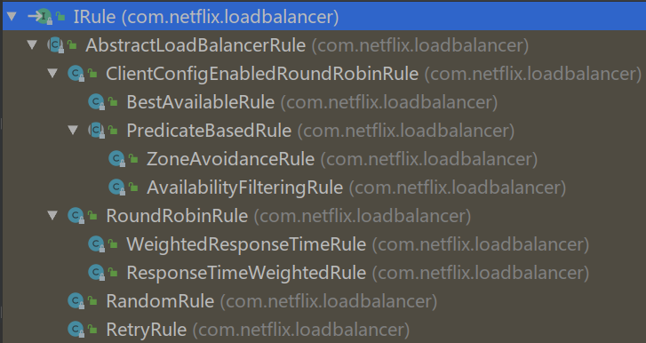

# 微服务中一些重要概念

#### RPC

Dubbo. 在Spring Cloud中是rest模板Feign.

**API 网关**

> It is a single entry point into the system, used to handle requests by routing them to the appropriate backend service or by invoking multiple backend services and [aggregating the results](http://techblog.netflix.com/2013/01/optimizing-netflix-api.html). Also, it can be used for authentication, insights, stress and canary testing, service migration, static response handling, active traffic management.

[API 网关性能比较：NGINX vs. ZUUL vs. Spring Cloud Gateway vs. Linkerd](https://infoq.cn/article/comparing-api-gateway-performances)

#### 服务自动注册和发现

Zookeeper, 在SpringCloud中是eureka.

#### 本地负载均衡 (服务之间沟通)

在SpringCloud中是ribbon

#### 客户端负载均衡 (客户端与服务沟通)

Nginx, zuul

#### 智能容错，熔断机制

Netflix Hystrix


# DUBBO 和 Spring Cloud

## Dubbo和Spring Cloud有何不同？

首先做一个简单的功能对比：

| 微服务架构所需功能               | Dubbo         | Spring Cloud         |
| -------------------------------- | ------------- | -------------------- |
| 服务注册中心                     | Zookeeper     | Eureka               |
| 服务调用方式                     | RPC           | feign                |
| 服务监控                         | Dubbo-monitor | Spring Boot Admin    |
| 断路器                           | 不完善        | Hystrix              |
| 服务网关（客户端与服务负载均衡） | 无            | Spring cloud gateway |
| 分布式配置                       | 无            | Spring Cloud Config  |
| 消息总线                         | 无            | Spring Cloud Bus     |
| 服务负载均衡（服务之间负载均衡） | 自带          | Ribbon               |

**从上图可以看出其实Dubbo的功能只是Spring Cloud体系的一部分。**

这样对比是不够公平的，首先 Dubbo 是 SOA 时代的产物，它的关注点主要在于服务的调用，流量分发、流量监控和熔断。而 Spring Cloud 诞生于微服务架构时代，考虑的是微服务治理的方方面面，另外由于依托了 Spring、Spring Boot 的优势之上，两个框架在开始目标就不一致，Dubbo 定位服务治理、Spring Cloud 是一个生态。

**如果仅仅关注于服务治理的这个层面，Dubbo其实还优于Spring Cloud很多：**

- Dubbo 支持更多的协议，如：rmi、hessian、http、webservice、thrift、memcached、redis 等。
- Dubbo 使用 RPC 协议效率更高，在极端压力测试下，Dubbo 的效率会高于 Spring Cloud 效率一倍多。
- Dubbo 有更强大的后台管理，Dubbo 提供的后台管理 Dubbo Admin 功能强大，提供了路由规则、动态配置、访问控制、权重调节、均衡负载等诸多强大的功能。
- 可以限制某个 IP 流量的访问权限，设置不同服务器分发不同的流量权重，并且支持多种算法，利用这些功能我们可以在线上做灰度发布、故障转移等，Spring Cloud 到现在还不支持灰度发布、流量权重等功能。

**所以Dubbo专注于服务治理；Spring Cloud关注于微服务架构生态。**

## Dubbo重新发布对Spring Cloud有影响吗？

国内技术人喜欢拿 Dubbo 和 Spring Cloud 进行对比，是因为两者都是服务治理非常优秀的开源框架。但它们两者的出发点是不一样的，Dubbo 关注于服务治理这块并且以后也会继续往这个方向去发展。Spring Cloud 关注的是微服务治理的生态。因为微服务治理的方方面面都是它所关注的内容，服务治理也只是微服务生态的一部分而已。因此可以大胆的断定，Dubbo 未来会在服务治理方面更为出色，而 Spring Cloud 在微服务治理上面无人能敌。

同时根据 Dubbo 最新的更新技术来看，Dubbo 也会积极的拥抱开源，拥抱新技术。Dubbo 接下来的版本将会很快的支持 Spring Boot，方便我们享受高效开发的同时，也可以支持高效的服务调用。Dubbo 被广泛应用于中国各互联网公司，如今阿里又重新重视起来并且发布了新版本和一系列的计划，对于正在使用 Dubbo 的公司来说是一个喜讯，对于中国广大的开发者来说更是一件非常喜悦的事情。我们非常乐于看到中国有一款非常优秀的开源框架，让我们有更多的选择，有更好的支持。

**两者其实不一定有竞争关系，如果使用得当甚至可以互补；另外两个关注的领域也不一致，因此对 Spring Cloud 的影响甚微。**

## 搭建微服务架构使用哪个？

简而言之，Dubbo确实类似于Spring Cloud的一个子集，Dubbo功能和文档完善，在国内有很多的成熟用户，然而鉴于Dubbo的社区现状（曾经长期停止维护，2017年7月31日团队又宣布重点维护），使用起来还是有一定的门槛。

Dubbo具有调度、发现、监控、治理等功能，**支持相当丰富的服务治理能力**。Dubbo架构下，注册中心对等集群，并会缓存服务列表已被数据库失效时继续提供发现功能，本身的服务发现结构有很强的**可用性与健壮性**，足够支持高访问量的网站。

虽然Dubbo 支持短连接大数据量的服务提供模式，但绝大多数情况下都是使用长连接小数据量的模式提供服务使用的。所以，**对于类似于电商等同步调用场景多并且能支撑搭建Dubbo 这套比较复杂环境的成本的产品而言，Dubbo 确实是一个可以考虑的选择**。但如果产品业务中由于后台业务逻辑复杂、时间长而导致异步逻辑比较多的话，可能Dubbo 并不合适。同时，**对于人手不足的初创产品而言，这么重的架构维护起来也不是很方便。**

Spring Cloud由众多子项目组成，如Spring Cloud Config、Spring Cloud Netflix、Spring Cloud Consul 等，提供了搭建分布式系统及微服务常用的工具，如配置管理、服务发现、断路器、智能路由、微代理、控制总线、一次性token、全局锁、选主、分布式会话和集群状态等，**满足了构建微服务所需的所有解决方案**。比如使用Spring Cloud Config 可以实现统一配置中心，对配置进行统一管理；使用Spring Cloud Netflix 可以实现Netflix 组件的功能 - 服务发现（Eureka）、智能路由（Zuul）、客户端负载均衡（Ribbon）。

但它并没有重复造轮子，而是选用目前各家公司开发的比较成熟的、**经得住实践考验**的服务框架（我们需要特别感谢Netflix ，这家很早就成功实践微服务的公司，几年前把自家几乎整个微服务框架栈贡献给了社区，Spring Cloud主要是对Netflix开源组件的进一步封装），通过Spring Boot 进行封装集成并简化其使用方式。基于Spring Boot，意味着其使用方式如Spring Boot **简单易用**；能够与Spring Framework、Spring Boot、Spring Data 等其他Spring 项目完美融合，意味着**能从Spring获得巨大的便利**，意味着**能减少已有项目的迁移成本**。

其实，**从社区活跃度和功能完整度，再对照业务需求和团队状况，基本可以确定如何选型**。这里分享网易考拉海购实践以及团队选型的心声：

> 当前开源上可选用的微服务框架主要有Dubbo、Spring Cloud等，鉴于Dubbo完备的功能和文档且在国内被众多大型互联网公司选用，考拉自然也选择了Dubbo作为服务化的基础框架。其实相比于Dubbo，Spring Cloud可以说是一个更完备的微服务解决方案，它从功能性上是Dubbo的一个超集，个人认为从选型上对于一些中小型企业Spring Cloud可能是一个更好的选择。提起Spring Cloud，一些开发的第一印象是http+JSON的rest通信，性能上难堪重用，其实这也是一种误读。
> 微服务选型要评估以下几点：内部是否存在异构系统集成的问题；备选框架功能特性是否满足需求；http协议的通信对于应用的负载量会否真正成为瓶颈点（Spring Cloud也并不是和http+JSON强制绑定的，如有必要Thrift、protobuf等高效的RPC、序列化协议同样可以作为替代方案）；社区活跃度、团队技术储备等。作为已经没有团队持续维护的开源项目，选择Dubbo框架内部就必须要组建一个维护团队，先不论你要准备要集成多少功能做多少改造，作为一个支撑所有工程正常运转的基础组件，问题的及时响应与解答、重大缺陷的及时修复能力就已足够重要。

鉴于服务发现对服务化架构的重要性，再补充一点：Dubbo 实践通常以ZooKeeper 为注册中心（Dubbo 原生支持的Redis 方案需要服务器时间同步，且性能消耗过大）。针对分布式领域著名的CAP理论（C——数据一致性，A——服务可用性，P——服务对网络分区故障的容错性），**Zookeeper 保证的是CP ，但对于服务发现而言，可用性比数据一致性更加重要 ，而 Eureka 设计则遵循AP原则** 。

可能很多人正在犹豫，在服务治理的时候应该选择那个框架呢？如果公司对效率有极高的要求建议使用 Dubbo，相对比 RPC 的效率会比 HTTP 高很多；如果团队不想对技术架构做大的改造建议使用 Dubbo，Dubbo 仅仅需要少量的修改就可以融入到内部系统的架构中。但如果技术团队喜欢挑战新技术，建议选择 Spring Cloud，Spring Cloud 架构体系有有趣很酷的技术。如果公司选择微服务架构去重构整个技术体系，那么 Spring Cloud 是当仁不让之选，它可以说是目前最好的微服务框架没有之一。

最后，技术选型是一个综合的问题，需要考虑团队的情况、业务的发展以及公司的产品特征。最炫最酷的技术并不一定是最好的，选择适合自己团队、符合公司业务的框架才是最佳方案。


# 注册中心 EUREKA

## 功能

#### Register：服务注册

当Eureka客户端向Eureka Server注册时，它提供自身的元数据，比如IP地址、端口，运行状况指示符URL，主页等。

**服务注册一定会出现在服务刚启动时, 在第一次注册之后, 如果实例(客户端) 信息发生变化, 还会重新注册.**

Eureka Client没有写service ID，则默认为属性值  `${spring.application.name}`。

#### Renew：服务续约

Eureka客户会每隔30秒发送一次心跳来续约。 通过续约来告知Eureka Server该Eureka客户仍然存在，没有出现问题。 正常情况下，如果Eureka Server在90秒没有收到Eureka客户的续约，它会将实例从其注册表中删除。 建议不要更改续约间隔。

#### Refresh Registry：获取注册列表信息

Eureka客户端从服务器获取注册表信息，并将其缓存在本地。客户端会使用该信息查找其他服务，从而进行远程调用。该注册列表信息定期（每30秒钟）更新一次。每次返回注册列表信息可能与Eureka客户端的缓存信息不同， Eureka客户端自动处理。如果由于某种原因导致注册列表信息不能及时匹配，Eureka客户端则会重新获取整个注册表信息。 Eureka服务器缓存注册列表信息，整个注册表以及每个应用程序的信息进行了压缩，压缩内容和没有压缩的内容完全相同。默认的情况下Eureka客户端使用压缩JSON格式来获取注册列表的信息。

#### Cancel：服务下线

Eureka客户端在程序关闭时向Eureka服务器发送取消请求。 发送请求后，该客户端实例信息将从服务器的实例注册表中删除。该下线请求不会自动完成，它需要调用以下内容：

```JAVA
DiscoveryManager.getInstance().shutdownComponent()；
```

#### Expiration: 服务剔除

在默认的情况下，当Eureka客户端连续90秒没有向Eureka服务器发送服务续约，即心跳，Eureka服务器会将该服务实例从服务注册列表删除，即服务剔除。

#### Eureka Server 的自我保护模式

当一个新的Eureka Server出现时，它尝试从相邻节点获取所有实例注册表信息。如果从Peer节点获取信息时出现问题，Eureka Serve会尝试其他的Peer节点。如果服务器能够成功获取所有实例，则根据该信息设置应该接收的更新阈值。

如果一段时间内，Eureka Serve接收到的续约低于为该值配置的百分比（默认为15分钟内低于85％），则服务器开启自我保护模式，即不再剔除注册列表的信息。

这样做的好处就是，如果是Eureka Server自身的网络问题，导致Eureka Client的续约不上，Eureka Client的注册列表信息不再被删除，也就是Eureka Client还可以被其他服务消费。

#### Eureka Server 的高可用架构

在eureka配置中, 有关于instance的配置, 表明一个注册中心服务下可以包含多个实例, 他们的是`spring.application.name`应是相同的:

从图可以看出在这个体系中，有2个角色，即Eureka Server和Eureka Client。而Eureka Client又分为Applicaton Service和Application Client，即服务提供者何服务消费者。 每个区域有一个Eureka集群，并且每个区域至少有一个eureka服务器可以处理区域故障，以防服务器瘫痪。

Eureka Client向Eureka Server注册，并将自己的一些客户端信息发送Eureka Server。然后，Eureka Client通过向Eureka Serve发送心跳（每30秒）来续约服务的。 如果客户端持续不能续约，那么，它将在大约90秒内从服务器注册表中删除。 注册信息和续订被复制到集群中的Eureka Serve所有节点。 来自任何区域的Eureka Client都可以查找注册表信息（每30秒发生一次）。根据这些注册表信息，Application Client可以远程调用Applicaton Service来消费服务。


- Eureka-Server 集群不区分**主从节点**或者 **Primary & Secondary 节点**，所有节点**相同角色( 也就是没有角色 )，完全对等**。
- Eureka-Client 可以向**任意** Eureka-Client 发起任意**读写**操作，Eureka-Server 将操作复制到另外的 Eureka-Server 以达到**最终一致性**。注意，Eureka-Server 是选择了 AP 的组件。


## 客户端原理: `DiscoveryClient`

在`com.netflix.discovery`包下的`DiscoveryClient`类，**被加入容器后调用其构造器方法进行一系列操作**, 该类包含了Eureka Client的相关方法。


> The class that is instrumental for interactions with Eureka Server.
> Eureka Client is responsible for:
>
> a) Registering the instance with Eureka Server 注册
>
> b) Renewalof the lease with Eureka Server 续约
>
> c) Cancellation of the lease from Eureka Server during shutdown 取消续约
>
> d) Querying the list of services/instances registered with Eureka Server fetch服务列表
>
> Eureka Client needs a configured list of Eureka Server java.net.URLs to talk to. These java.net.URLs are typically amazon elastic eips which do not change. All of the functions defined above fail-over to other java.net.URLs specified in the list in the case of failure.
>
> 关于URL配置, 可以在eureka.client.service-url中配置为键值对, 示例如下:
>
> ```YML
> eureka:
>   client:
>     service-url:
>       defaultZone: http://localhost:8763/eureka/
>       zone2: http://localhost:8764/eureka/
>       zone3: http://localhost:8765/eureka/
>       zone4: http://localhost:8766/eureka/
> ```

看一下源码, 在整个服务启动时, 首先是 `DiscoveryClient`构造器中进行了诸多操作:

```JAVA
@Singleton
public class DiscoveryClient implements EurekaClient {    
    
	DiscoveryClient(ApplicationInfoManager applicationInfoManager, EurekaClientConfig config, 
                    AbstractDiscoveryClientOptionalArgs args,
                    Provider<BackupRegistry> backupRegistryProvider) {
        if (args != null) {
            this.healthCheckHandlerProvider = args.healthCheckHandlerProvider;
            this.healthCheckCallbackProvider = args.healthCheckCallbackProvider;
            this.eventListeners.addAll(args.getEventListeners());
            this.preRegistrationHandler = args.preRegistrationHandler;
        } else {
            this.healthCheckCallbackProvider = null;
            this.healthCheckHandlerProvider = null;
            this.preRegistrationHandler = null;
        }
        
        this.applicationInfoManager = applicationInfoManager;
        InstanceInfo myInfo = applicationInfoManager.getInfo();

        clientConfig = config;
        staticClientConfig = clientConfig;
        transportConfig = config.getTransportConfig();
        instanceInfo = myInfo;
        if (myInfo != null) {
            appPathIdentifier = instanceInfo.getAppName() + "/" + instanceInfo.getId();
        } else {
            logger.warn("Setting instanceInfo to a passed in null value");
        }

        this.backupRegistryProvider = backupRegistryProvider;

        this.urlRandomizer = new EndpointUtils.InstanceInfoBasedUrlRandomizer(instanceInfo);
        localRegionApps.set(new Applications());

        fetchRegistryGeneration = new AtomicLong(0);

        remoteRegionsToFetch = new AtomicReference<String>(clientConfig.fetchRegistryForRemoteRegions());
        remoteRegionsRef = new AtomicReference<>(remoteRegionsToFetch.get() == null ? null : remoteRegionsToFetch.get().split(","));

        if (config.shouldFetchRegistry()) {
            this.registryStalenessMonitor = new ThresholdLevelsMetric(this, METRIC_REGISTRY_PREFIX + "lastUpdateSec_", new long[]{15L, 30L, 60L, 120L, 240L, 480L});
        } else {
            this.registryStalenessMonitor = ThresholdLevelsMetric.NO_OP_METRIC;
        }

        if (config.shouldRegisterWithEureka()) {
            this.heartbeatStalenessMonitor = new ThresholdLevelsMetric(this, METRIC_REGISTRATION_PREFIX + "lastHeartbeatSec_", new long[]{15L, 30L, 60L, 120L, 240L, 480L});
        } else {
            this.heartbeatStalenessMonitor = ThresholdLevelsMetric.NO_OP_METRIC;
        }

        logger.info("Initializing Eureka in region {}", clientConfig.getRegion());

        //通常我们在eureka服务器端进行这样的配置, 不拉取注册表也不注册自己, 所以基本直接return
        if (!config.shouldRegisterWithEureka() && !config.shouldFetchRegistry()) {
            logger.info("Client configured to neither register nor query for data.");
            scheduler = null;
            heartbeatExecutor = null;
            cacheRefreshExecutor = null;
            eurekaTransport = null;
            instanceRegionChecker = new InstanceRegionChecker(new PropertyBasedAzToRegionMapper(config), clientConfig.getRegion());

            // This is a bit of hack to allow for existing code using 
            // DiscoveryManager.getInstance() to work with DI'd DiscoveryClient
            DiscoveryManager.getInstance().setDiscoveryClient(this);
            DiscoveryManager.getInstance().setEurekaClientConfig(config);

            initTimestampMs = System.currentTimeMillis();
            logger.info
                ("Discovery Client initialized at timestamp {} with initial instances count: {}",
                    initTimestampMs, this.getApplications().size());

            return;  // no need to setup up an network tasks and we are done
        }

        try {
            //初始化三个线程池, scheduler会调度heartbeatExecutor和cacheRefreshExecutor
            // default size of 2
            //1 each for heartbeat and cacheRefresh
            scheduler = Executors.newScheduledThreadPool(2,
                    new ThreadFactoryBuilder()
                            .setNameFormat("DiscoveryClient-%d")
                            .setDaemon(true)
                            .build());

            heartbeatExecutor = new ThreadPoolExecutor(
                    1, clientConfig.getHeartbeatExecutorThreadPoolSize(), 0, TimeUnit.SECONDS,
                    new SynchronousQueue<Runnable>(),
                    new ThreadFactoryBuilder()
                            .setNameFormat("DiscoveryClient-HeartbeatExecutor-%d")
                            .setDaemon(true)
                            .build()
            );  // use direct handoff

            cacheRefreshExecutor = new ThreadPoolExecutor(
                    1, clientConfig.getCacheRefreshExecutorThreadPoolSize(), 0, TimeUnit.SECONDS,
                    new SynchronousQueue<Runnable>(),
                    new ThreadFactoryBuilder()
                            .setNameFormat("DiscoveryClient-CacheRefreshExecutor-%d")
                            .setDaemon(true)
                            .build()
            );  // use direct handoff

            eurekaTransport = new EurekaTransport();
            scheduleServerEndpointTask(eurekaTransport, args);

            AzToRegionMapper azToRegionMapper;
            if (clientConfig.shouldUseDnsForFetchingServiceUrls()) {
                azToRegionMapper = new DNSBasedAzToRegionMapper(clientConfig);
            } else {
                azToRegionMapper = new PropertyBasedAzToRegionMapper(clientConfig);
            }
            if (null != remoteRegionsToFetch.get()) {
                azToRegionMapper.setRegionsToFetch(remoteRegionsToFetch.get().split(","));
            }
            instanceRegionChecker = new InstanceRegionChecker(azToRegionMapper, clientConfig.getRegion());
        } catch (Throwable e) {
            throw new RuntimeException("Failed to initialize DiscoveryClient!", e);
        }

        //shouldFetchRegistry可以配置, 默认true
        // 第一次执行fetchRegistry()是full fetch, 之后只是fetch delta, 从而大大节省带宽
        // 因为注册表更新频率远小于fetch频率
        if (clientConfig.shouldFetchRegistry() && !fetchRegistry(false)) {
            fetchRegistryFromBackup();
        }

        // call and execute the pre registration handler before all background tasks (inc registration) is started
        if (this.preRegistrationHandler != null) {
            this.preRegistrationHandler.beforeRegistration();
        }

        //eureka.client.registerWithEureka, 默认true
        if (clientConfig.shouldRegisterWithEureka() && 
            //should-enforce-registration-at-init, Defaults to false.
            //Indicates whether the client should enforce registration during initialization. 
            //默认启动后40s注册, 具体分析见initScheduledTasks()源码
            clientConfig.shouldEnforceRegistrationAtInit()) {
            //默认不执行
            try {
                if (!register() ) {
                    throw new IllegalStateException
                        ("Registration error at startup. Invalid server response.");
                }
            } catch (Throwable th) {
                logger.error("Registration error at startup: {}", th.getMessage());
                throw new IllegalStateException(th);
            }
        }

        // finally, init the schedule tasks 
        // (e.g. cluster resolvers, heartbeat, instanceInfo replicator, fetch
        //下面看看这个方法中初始化了哪些调度任务
        initScheduledTasks();

        try {
            Monitors.registerObject(this);
        } catch (Throwable e) {
            logger.warn("Cannot register timers", e);
        }

        // This is a bit of hack to allow for existing code using DiscoveryManager.getInstance()
        // to work with DI'd DiscoveryClient
        DiscoveryManager.getInstance().setDiscoveryClient(this);
        DiscoveryManager.getInstance().setEurekaClientConfig(config);

        initTimestampMs = System.currentTimeMillis();
        logger.
            info("Discovery Client initialized at timestamp {} with initial instances count: {}",
                initTimestampMs, this.getApplications().size());
    }
    
    
    
    private void initScheduledTasks() {
        
        //初始化注册表获取(也可以说成是注册表缓存刷新)调度任务
        if (clientConfig.shouldFetchRegistry()) {
            // registry cache refresh timer
            //获取注册表的间隔时间, 默认30
            int registryFetchIntervalSeconds = clientConfig.getRegistryFetchIntervalSeconds();
            //cache-refresh-executor-exponential-back-off-bound, 默认10.
            //It is a maximum multiplier value for retry delay, 
            //in case where a sequence of timeouts occurred.  
            int expBackOffBound = clientConfig.getCacheRefreshExecutorExponentialBackOffBound();
            
            //以后refreshRegistry()任务每registryFetchIntervalSeconds由cacheRefreshExecutor执行一次
            scheduler.schedule(
                    new TimedSupervisorTask(
                            "cacheRefresh",
                            scheduler,
                            cacheRefreshExecutor,
                            registryFetchIntervalSeconds,
                            TimeUnit.SECONDS,
                            expBackOffBound,
                            new CacheRefreshThread()
                    ),
                    registryFetchIntervalSeconds, TimeUnit.SECONDS);
        }

        
        //初始化注册和心跳包发送调度任务
        if (clientConfig.shouldRegisterWithEureka()) {
            //默认30
            int renewalIntervalInSecs = instanceInfo.getLeaseInfo().getRenewalIntervalInSecs();
            //默认10
            int expBackOffBound = clientConfig.getHeartbeatExecutorExponentialBackOffBound();
            logger.info("Starting heartbeat executor: " + "renew interval is: {}", renewalIntervalInSecs);

            //服务续约
            //以后renew()任务每renewalIntervalInSecs由heartbeatExecutor执行一次
            // Heartbeat timer
            scheduler.schedule(
                    new TimedSupervisorTask(
                            "heartbeat",
                            scheduler,
                            heartbeatExecutor,
                            renewalIntervalInSecs,
                            TimeUnit.SECONDS,
                            expBackOffBound,
                            new HeartbeatThread()
                    ),
                    renewalIntervalInSecs, TimeUnit.SECONDS);

            
            // InstanceInfo replicator
            // 负责首次的注册操作和接下来的discoveryClient.refreshInstanceInfo();
            // 以及实例状态变动时的instanceInfoReplicator.onDemandUpdate();
            instanceInfoReplicator = new InstanceInfoReplicator(
                    this,
                    instanceInfo,
                	//Indicates how often(in seconds) to replicate instance changes
                	//to be replicated to the eureka server. 默认30
                    clientConfig.getInstanceInfoReplicationIntervalSeconds(),
                    2); // burstSize

            //statusChangeListener: 实例状态变动立刻调用instanceInfoReplicator.onDemandUpdate();
            statusChangeListener = new ApplicationInfoManager.StatusChangeListener() {
                @Override
                public String getId() {
                    return "statusChangeListener";
                }
                @Override
                public void notify(StatusChangeEvent statusChangeEvent) {
                    if (InstanceStatus.DOWN == statusChangeEvent.getStatus() ||
                            InstanceStatus.DOWN == statusChangeEvent.getPreviousStatus()) {
                        // log at warn level if DOWN was involved
                        logger.warn("Saw local status change event {}", statusChangeEvent);
                    } else {
                        logger.info("Saw local status change event {}", statusChangeEvent);
                    }
                    instanceInfoReplicator.onDemandUpdate();
                }
            };

            /*
            If set to true, local status updates via 
   			com.netflix.appinfo.ApplicationInfoManager.setInstanceStatus
   			(com.netflix.appinfo.InstanceInfo.InstanceStatus) 
   			will trigger on-demand (but rate limited) register/updates to remote eureka servers
            */
            //默认true
            if (clientConfig.shouldOnDemandUpdateStatusChange()) {
                //注册上面new的statusChangeListener到applicationInfoManager
                applicationInfoManager.registerStatusChangeListener(statusChangeListener);
            }

            //40s后进行初始化注册操作
            instanceInfoReplicator.start(
                //Indicates how long initially (in seconds) 
                //to replicate instance info to the eureka server.
                //默认40
                clientConfig.getInitialInstanceInfoReplicationIntervalSeconds());
        } else {
            logger.info("Not registering with Eureka server per configuration");
        }
    }
```

来看看上面提到的两个在`DiscoveryClient`中的任务(其实就是方法):

#### 服务续约与注册表获取

- renew(): 发送心跳包
- refreshRegistry(): 刷新注册表

```JAVA
    //服务续约的方法, 关键调用为eurekaTransport.registrationClient.sendHeartBeat();
    //来发送心跳包
	boolean renew() {   			com.netflix.appinfo.ApplicationInfoManager.setInstanceStatus
   			(com.netflix.appinfo.InstanceInfo.InstanceStatus) 
        EurekaHttpResponse<InstanceInfo> httpResponse;
        try {
            httpResponse = eurekaTransport.registrationClient.sendHeartBeat(instanceInfo.getAppName(), instanceInfo.getId(), instanceInfo, null);
            logger.debug(PREFIX + "{} - Heartbeat status: {}", appPathIdentifier, httpResponse.getStatusCode());
            if (httpResponse.getStatusCode() == Status.NOT_FOUND.getStatusCode()) {
                REREGISTER_COUNTER.increment();
                logger.info(PREFIX + "{} - Re-registering apps/{}", appPathIdentifier, instanceInfo.getAppName());
                long timestamp = instanceInfo.setIsDirtyWithTime();
                boolean success = register();
                if (success) {
                    instanceInfo.unsetIsDirty(timestamp);
                }
                return success;
            }
            return httpResponse.getStatusCode() == Status.OK.getStatusCode();
        } catch (Throwable e) {
            logger.error(PREFIX + "{} - was unable to send heartbeat!", appPathIdentifier, e);
            return false;
        }
    }
    
    //刷新注册表的方法, 关键调用boolean success = fetchRegistry(remoteRegionsModified);
    //此时第一次fetch已经过去了, 默认接下来都是fetch delta
	void refreshRegistry() {
        try {
            boolean isFetchingRemoteRegionRegistries = isFetchingRemoteRegionRegistries();

            boolean remoteRegionsModified = false;
            // This makes sure that a dynamic change to remote regions to fetch is honored.
            String latestRemoteRegions = clientConfig.fetchRegistryForRemoteRegions();
            if (null != latestRemoteRegions) {
                String currentRemoteRegions = remoteRegionsToFetch.get();
                if (!latestRemoteRegions.equals(currentRemoteRegions)) {
                    // Both remoteRegionsToFetch and AzToRegionMapper.regionsToFetch need to be in sync
                    synchronized (instanceRegionChecker.getAzToRegionMapper()) {
                        if (remoteRegionsToFetch.compareAndSet(currentRemoteRegions, latestRemoteRegions)) {
                            String[] remoteRegions = latestRemoteRegions.split(",");
                            remoteRegionsRef.set(remoteRegions);
                            instanceRegionChecker.getAzToRegionMapper().setRegionsToFetch(remoteRegions);
                            remoteRegionsModified = true;
                        } else {
                            logger.info("Remote regions to fetch modified concurrently," +
                                    " ignoring change from {} to {}", currentRemoteRegions, latestRemoteRegions);
                        }
                    }
                } else {
                    // Just refresh mapping to reflect any DNS/Property change
                    instanceRegionChecker.getAzToRegionMapper().refreshMapping();
                }
            }

            boolean success = fetchRegistry(remoteRegionsModified);
            if (success) {
                registrySize = localRegionApps.get().size();
                lastSuccessfulRegistryFetchTimestamp = System.currentTimeMillis();
            }

            if (logger.isDebugEnabled()) {
                StringBuilder allAppsHashCodes = new StringBuilder();
                allAppsHashCodes.append("Local region apps hashcode: ");
                allAppsHashCodes.append(localRegionApps.get().getAppsHashCode());
                allAppsHashCodes.append(", is fetching remote regions? ");
                allAppsHashCodes.append(isFetchingRemoteRegionRegistries);
                for (Map.Entry<String, Applications> entry : remoteRegionVsApps.entrySet()) {
                    allAppsHashCodes.append(", Remote region: ");
                    allAppsHashCodes.append(entry.getKey());
                    allAppsHashCodes.append(" , apps hashcode: ");
                    allAppsHashCodes.append(entry.getValue().getAppsHashCode());
                }
                logger.debug("Completed cache refresh task for discovery. All Apps hash code is {} ",
                        allAppsHashCodes);
            }
        } catch (Throwable e) {
            logger.error("Cannot fetch registry from server", e);
        }
    }
}
```

看明白了`DiscoveryClient`初始化方法之后, 我们来看看`InstanceInfoReplicator`这个有趣的东西:

#### `InstanceInfoReplicator`

主要负责            

- 负责首次的注册操作, 第一次run()会调用`discoveryClient.register();`
- 每次run()都会调用`discoveryClient.refreshInstanceInfo();`
- `com.netflix.appinfo.ApplicationInfoManager.setInstanceStatus`
- `(com.netflix.appinfo.InstanceInfo.InstanceStatus)` 被调用后, 若实例状态改变, 会调用被限制频率的`instanceInfoReplicator.onDemandUpdate();`来及时地注册与更新

```JAVA
class InstanceInfoReplicator implements Runnable {
    private static final Logger logger = LoggerFactory.getLogger(InstanceInfoReplicator.class);

    private final DiscoveryClient discoveryClient;
    private final InstanceInfo instanceInfo;

    private final int replicationIntervalSeconds;
    private final ScheduledExecutorService scheduler;
    private final AtomicReference<Future> scheduledPeriodicRef;

    private final AtomicBoolean started;
    private final RateLimiter rateLimiter;
    private final int burstSize;
    private final int allowedRatePerMinute;

    InstanceInfoReplicator(DiscoveryClient discoveryClient, InstanceInfo instanceInfo, int replicationIntervalSeconds, int burstSize) {
        this.discoveryClient = discoveryClient;
        this.instanceInfo = instanceInfo;
        //单线程的定时执行器
        this.scheduler = Executors.newScheduledThreadPool(1,
                new ThreadFactoryBuilder()
                        .setNameFormat("DiscoveryClient-InstanceInfoReplicator-%d")
                        .setDaemon(true)
                        .build());

        this.scheduledPeriodicRef = new AtomicReference<Future>();

        this.started = new AtomicBoolean(false);
        this.rateLimiter = new RateLimiter(TimeUnit.MINUTES);
        this.replicationIntervalSeconds = replicationIntervalSeconds;
        this.burstSize = burstSize;

        this.allowedRatePerMinute = 60 * this.burstSize / this.replicationIntervalSeconds;
        logger.info("InstanceInfoReplicator onDemand update allowed rate per min is {}", allowedRatePerMinute);
    }

    //传入的参数是40s, 说明initial register 40s才开启第一次的run()
    //在头一次run()中会调用discoveryClient.register();
    public void start(int initialDelayMs) {
        if (started.compareAndSet(false, true)) {
            //因为这里把instanceInfo设成了dirty(没有replicate到服务器上)
            //在第一次run开始后才会进行register
            instanceInfo.setIsDirty();  // for initial register
            Future next = scheduler.schedule(this, initialDelayMs, TimeUnit.SECONDS);
            scheduledPeriodicRef.set(next);
        }
    }

    public void stop() {
        shutdownAndAwaitTermination(scheduler);
        started.set(false);
    }

    private void shutdownAndAwaitTermination(ExecutorService pool) {
        pool.shutdown();
        try {
            if (!pool.awaitTermination(3, TimeUnit.SECONDS)) {
                pool.shutdownNow();
            }
        } catch (InterruptedException e) {
            logger.warn("InstanceInfoReplicator stop interrupted");
        }
    }

    public boolean onDemandUpdate() {
        if (rateLimiter.acquire(burstSize, allowedRatePerMinute)) {
            if (!scheduler.isShutdown()) {
                scheduler.submit(new Runnable() {
                    @Override
                    public void run() {
                        logger.debug("Executing on-demand update of local InstanceInfo");
    
                        Future latestPeriodic = scheduledPeriodicRef.get();
                        if (latestPeriodic != null && !latestPeriodic.isDone()) {
                            logger.debug("Canceling the latest scheduled update, it will be rescheduled at the end of on demand update");
                            latestPeriodic.cancel(false);
                        }
                        //最后还是回调自己的run()方法
                        InstanceInfoReplicator.this.run();
                    }
                });
                return true;
            } else {
                logger.warn("Ignoring onDemand update due to stopped scheduler");
                return false;
            }
        } else {
            logger.warn("Ignoring onDemand update due to rate limiter");
            return false;
        }
    }

    public void run() {
        try {
            //每次都刷新实例信息
            discoveryClient.refreshInstanceInfo();

            Long dirtyTimestamp = instanceInfo.isDirtyWithTime();
            if (dirtyTimestamp != null) {
            //因为start把instanceInfo设成了dirty
            //在第一次run开始后才会进行register
                //只在第一次注册
                discoveryClient.register();
                instanceInfo.unsetIsDirty(dirtyTimestamp);
            }
        } catch (Throwable t) {
            logger.warn("There was a problem with the instance info replicator", t);
        } finally {
            //配置下一阶段的执行
            Future next = scheduler.schedule(this, replicationIntervalSeconds, TimeUnit.SECONDS);
            scheduledPeriodicRef.set(next);
        }
    }
}
```

下面来看看两个回调: `discoveryClient.refreshInstanceInfo();`和`discoveryClient.register();`

#### 刷新实例信息

> Refresh the current local instanceInfo. **Note that after a valid refresh where changes are observed, the isDirty flag on the instanceInfo is set to true**

```JAVA
    void refreshInstanceInfo() {
        applicationInfoManager.refreshDataCenterInfoIfRequired();
        applicationInfoManager.refreshLeaseInfoIfRequired();

        InstanceStatus status;
        try {
            status = getHealthCheckHandler().getStatus(instanceInfo.getStatus());
        } catch (Exception e) {
            logger.warn("Exception from healthcheckHandler.getStatus, setting status to DOWN", e);
            status = InstanceStatus.DOWN;
        }

        if (null != status) {
            applicationInfoManager.setInstanceStatus(status);
        }
    }
```

#### 服务注册

`DiscoveryClient#register()`通过Http请求向Eureka Client注册。其代码如下：

```JAVA
    //关键调用eurekaTransport.registrationClient.register(instanceInfo);
	//而instanceInfo恰恰是上面是刷新过的!
	boolean register() throws Throwable {
        logger.info(PREFIX + "{}: registering service...", appPathIdentifier);
        EurekaHttpResponse<Void> httpResponse;
        try {
            httpResponse = eurekaTransport.registrationClient.register(instanceInfo);
        } catch (Exception e) {
            logger.warn(PREFIX + "{} - registration failed {}", appPathIdentifier, e.getMessage(), e);
            throw e;
        }
        if (logger.isInfoEnabled()) {
            logger.info(PREFIX + "{} - registration status: {}", appPathIdentifier, httpResponse.getStatusCode());
        }
        return httpResponse.getStatusCode() == Status.NO_CONTENT.getStatusCode();
    }
```


## 服务器原理

服务器端的基础功能有:

- Register
- Renew
- Cancel
- Expiration
- Status Changes

服务器端的特殊功能有:

- 集群架构下的信息同步
  - 集群节点之间的节点信息同步
  - 集群节点之间的注册表同步
- 自我保护模式


其中, 在服务器启动时, 要想满足上述功能, 需要做的事情有:

- 获取集群节点信息`PeerEurekaNodes`
- 复制对等节点的注册表

在服务器运行时, 需要做的事情有:

- 每隔一段时间, 同步自己的集群节点信息`PeerEurekaNodes`, 通过client
- 将在本节点上进行的客户端操作同步到其他节点
- 接收其他节点的同步信息


### 服务器启动原理

#### `PeerEurekaNode`: 对等的eureka节点

`PeerEurekaNode`代表了注册中心集群中的其中一个节点.

> 
>
> - Eureka-Server 集群不区分**主从节点**或者 **Primary & Secondary 节点**，所有节点**相同角色( 也就是没有角色 )，完全对等**。
> - Eureka-Client 可以向**任意** Eureka-Client 发起任意**读写**操作，Eureka-Server 将操作复制到另外的 Eureka-Server 以达到**最终一致性**。注意，Eureka-Server 是选择了 AP 的组件。


#### `PeerEurekaNodes`


如上图所示, `DefaultEurekaServerContext`被加入容器后调用其初始化方法, 最重要的就是进行`peerEurekaNodes.start()`.

```JAVA
    //这个注解指明这个方法需要生命周期初始化时调用
	@PostConstruct
    @Override
    public void initialize() {
        logger.info("Initializing ...");
        peerEurekaNodes.start();
        try {
            registry.init(peerEurekaNodes);
        } catch (Exception e) {
            throw new RuntimeException(e);
        }
        logger.info("Initialized");
    }

```


#### 集群中单个节点的启动

调用 `PeerEurekaNodes#start()` 方法，集群节点启动，主要完成两个逻辑：

- 初始化集群节点信息
- 初始化固定周期( 默认：10 分钟，可配置 )更新集群节点信息的任务

```JAVA
    public void start() {
        //初始化调度线程
        taskExecutor = Executors.newSingleThreadScheduledExecutor(
                new ThreadFactory() {
                    @Override
                    public Thread newThread(Runnable r) {
                        Thread thread = new Thread(r, "Eureka-PeerNodesUpdater");
                        thread.setDaemon(true);
                        return thread;
                    }
                }
        );
        try {
            //第一次update其实是初始化集群节点信息, 后面再次调用才是更新信息
            updatePeerEurekaNodes(resolvePeerUrls());
             //初始化固定周期更新集群节点信息的任务
            Runnable peersUpdateTask = new Runnable() {
                @Override
                public void run() {
                    try {
                        updatePeerEurekaNodes(resolvePeerUrls());
                    } catch (Throwable e) {
                        logger.error("Cannot update the replica Nodes", e);
                    }

                }
            };
            //将上面的peersUpdateTask加入调度线程的任务中
            //每隔一段时间执行一次
            taskExecutor.scheduleWithFixedDelay(
                    peersUpdateTask,
                	//与server.peer-eureka-nodes-update-interval-ms配置相对应
                	//配置updatePeerEurekaNodes(resolvePeerUrls())每次执行的时间间隔
                	//默认 600000ms=10min
                    serverConfig.getPeerEurekaNodesUpdateIntervalMs(),
                    serverConfig.getPeerEurekaNodesUpdateIntervalMs(),
                    TimeUnit.MILLISECONDS
            );
        } catch (Exception e) {
            throw new IllegalStateException(e);
        }
        for (PeerEurekaNode node : peerEurekaNodes) {
            logger.info("Replica node URL:  {}", node.getServiceUrl());
        }
    }
```


#### 更新集群节点信息, 通过自己的client

来看看`updatePeerEurekaNodes(resolvePeerUrls());` :

```JAVA
    protected List<String> resolvePeerUrls() {
        
        //解析出所有的集群中节点的URL
        InstanceInfo myInfo = applicationInfoManager.getInfo();
        String zone = 
            //得到自己的zone, 在配置文件中配置键值对的键
            InstanceInfo.getZone
            (clientConfig.getAvailabilityZones(clientConfig.getRegion()), myInfo);
    	//得到和自己zone相同的replica(复制品, 就是其他节点)的Url
        List<String> replicaUrls = EndpointUtils
            .getDiscoveryServiceUrls
            (clientConfig, zone, new EndpointUtils.InstanceInfoBasedUrlRandomizer(myInfo));

        //删除自己的URL
        int idx = 0;
        while (idx < replicaUrls.size()) {
            //在第一次调用时, serverConfig.getMyUrl()为空, 所以不会删除掉自己的节点
            if (isThisMyUrl(replicaUrls.get(idx))) {
                replicaUrls.remove(idx);
            } else {
                idx++;
            }
        }
        return replicaUrls;
    }

    public boolean isThisMyUrl(String url) {
        final String myUrlConfigured = serverConfig.getMyUrl();
        if (myUrlConfigured != null) {
            return myUrlConfigured.equals(url);
        }
        return isInstanceURL(url, applicationInfoManager.getInfo());
    }
```

```JAVA
    /*
    PeerEurekaNodes中两个域保存了集群中所有节点的信息
    每次updatePeerEurekaNodes(resolvePeerUrls());实际上就是更新这两个域而已
    */
	private volatile List<PeerEurekaNode> peerEurekaNodes = Collections.emptyList();
    private volatile Set<String> peerEurekaNodeUrls = Collections.emptySet();

	protected void updatePeerEurekaNodes(List<String> newPeerUrls) {
        if (newPeerUrls.isEmpty()) {
            logger.warn("The replica size seems to be empty. Check the route 53 DNS Registry");
            return;
        }

        //因为刚刚解析出了newPeerUrls, 把所有旧的节点都加入toShutdown之列
        Set<String> toShutdown = new HashSet<>(peerEurekaNodeUrls);
        //如果之前的某个节点在newPeerUrls中, 说明它不用被toShutdown
        toShutdown.removeAll(newPeerUrls);
        //得到真正新加入的节点
        Set<String> toAdd = new HashSet<>(newPeerUrls);
        toAdd.removeAll(peerEurekaNodeUrls);

        //关闭和新增都为空, 直接返回
        if (toShutdown.isEmpty() && toAdd.isEmpty()) { // No change
            return;
        }

        // Remove peers no long available
        List<PeerEurekaNode> newNodeList = new ArrayList<>(peerEurekaNodes);

        if (!toShutdown.isEmpty()) {
            logger.info("Removing no longer available peer nodes {}", toShutdown);
            int i = 0;
            while (i < newNodeList.size()) {
                PeerEurekaNode eurekaNode = newNodeList.get(i);
                if (toShutdown.contains(eurekaNode.getServiceUrl())) {
                    newNodeList.remove(i);
                    //关闭这个节点
                    eurekaNode.shutDown();
                } else {
                    i++;
                }
            }
        }

        // Add new peers
        if (!toAdd.isEmpty()) {
            logger.info("Adding new peer nodes {}", toAdd);
            for (String peerUrl : toAdd) {
                //createPeerEurekaNode还创建了JerseyReplicationClient,见下
                newNodeList.add(createPeerEurekaNode(peerUrl));
            }
        }

        this.peerEurekaNodes = newNodeList;
        this.peerEurekaNodeUrls = new HashSet<>(newPeerUrls);
    }
```

```java
    protected PeerEurekaNode createPeerEurekaNode(String peerEurekaNodeUrl) {
        //创建JerseyReplicationClient
        HttpReplicationClient replicationClient = JerseyReplicationClient.
        createReplicationClient(serverConfig, serverCodecs, peerEurekaNodeUrl);
        
        String targetHost = hostFromUrl(peerEurekaNodeUrl);
        if (targetHost == null) {
            targetHost = "host";
        }
        return new PeerEurekaNode
            (registry, targetHost, peerEurekaNodeUrl, replicationClient, serverConfig);
    }
```


#### `EurekaServerBootstrap`

在`EurekaServerInitializerConfiguration`的生命周期方法`start()`中, 用一个新线程执行了`EurekaServerBootstrap` 的初始化生命周期方法`eurekaServerBootstrap.contextInitialized()`


```JAVA
	@Override
	public void start() {
		new Thread(new Runnable() {
			@Override
			public void run() {
				try {
					// TODO: is this class even needed now?
					eurekaServerBootstrap.contextInitialized(
							EurekaServerInitializerConfiguration.this.servletContext);
					log.info("Started Eureka Server");

					publish(new EurekaRegistryAvailableEvent(getEurekaServerConfig()));
					EurekaServerInitializerConfiguration.this.running = true;
					publish(new EurekaServerStartedEvent(getEurekaServerConfig()));
				}
				catch (Exception ex) {
					// Help!
					log.error("Could not initialize Eureka servlet context", ex);
				}
			}
		}).start();
	}
```

```JAVA
	public void contextInitialized(ServletContext context) {
		try {
            //进行默认环境配置
			initEurekaEnvironment();
            //初始化EurekaServerContext
			initEurekaServerContext();

			context.setAttribute(EurekaServerContext.class.getName(), this.serverContext);
		}
		catch (Throwable e) {
			log.error("Cannot bootstrap eureka server :", e);
			throw new RuntimeException("Cannot bootstrap eureka server :", e);
		}
	}
```

```JAVA
	protected void initEurekaServerContext() throws Exception {
        ...
     
		// Copy registry from neighboring eureka node
		int registryCount = this.registry.syncUp();
		this.registry.openForTraffic(this.applicationInfoManager, registryCount);

		// Register all monitoring statistics.
		EurekaMonitors.registerAllStats();
	}
```

#### 获取并复制注册表, 仍然通过自己的client

因为这个节点刚启动起来, 还没有注册表, 所以调用到了`PeerAwareInstanceRegistryImpl#syncUp()`来复制注册表.

> Populates the registry information from a peer eureka node. This operation fails over to other nodes until the list is exhausted if the communication fails.
>
> 使用来自对等eureka节点的注册表信息来填充自己的注册表。 如果通信失败，则此操作将转移到其他节点，直到列表用尽为止。

```JAVA
//PeerAwareInstanceRegistryImpl.java

	public int syncUp() {
        // Copy entire entry from neighboring DS node
        int count = 0;

        //Get the number of times that a eureka node 
        //would try to get the registry information from the peers during startup.
        //server.registry-sync-retries, 默认5
        //因为有count == 0作为循环条件, 一旦成功注册一个就会跳出循环
        for (int i = 0; ((i < serverConfig.getRegistrySyncRetries()) && (count == 0)); i++) {
            if (i > 0) {
                try {
                    //registry-sync-retry-wait-ms, 默认30000ms=30s
                    Thread.sleep(serverConfig.getRegistrySyncRetryWaitMs());
                } catch (InterruptedException e) {
                    logger.warn("Interrupted during registry transfer..");
                    break;
                }
            }
            
            //从自己自带的eurekaClient来得到注册表
            Applications apps = eurekaClient.getApplications();
            for (Application app : apps.getRegisteredApplications()) {
                for (InstanceInfo instance : app.getInstances()) {
                    try {
                        if (isRegisterable(instance)) {
                            register(instance, instance.getLeaseInfo().getDurationInSecs(), true);
                            count++;
                        }
                    } catch (Throwable t) {
                        logger.error("During DS init copy", t);
                    }
                }
            }
        }
        return count;
    }
```

若调用 `#syncUp()` 方法，未获取到应用实例，则 Eureka-Server 会有一段时间( 默认：5 分钟，可配 )不允许被 Eureka-Client 获取注册信息，避免影响 Eureka-Client 。

- 标记 Eureka-Server 启动时，未获取到应用实例，代码如下：

  ```JAVA
  // PeerAwareInstanceRegistryImpl.java
  
  private boolean peerInstancesTransferEmptyOnStartup = true;
  
  public void openForTraffic(ApplicationInfoManager applicationInfoManager, int count) {
      // ... 省略其他代码
      if (count > 0) {
          this.peerInstancesTransferEmptyOnStartup = false;
      }
      // ... 省略其他代码
  }
  ```

- 判断 Eureka-Server 是否允许被 Eureka-Client 获取注册信息，代码如下：

  ```JAVA
  // PeerAwareInstanceRegistryImpl.java
  public boolean shouldAllowAccess(boolean remoteRegionRequired) {
     if (this.peerInstancesTransferEmptyOnStartup) {
         // 设置启动时间
         this.startupTime = System.currentTimeMillis();
         if (!(System.currentTimeMillis() > this.startupTime + serverConfig.getWaitTimeInMsWhenSyncEmpty())) {
             return false;
         }
     }
     // ... 省略其他代码
     return true;
  }
  ```


### 服务器注册表同步原理

**本节点操作同步其他节点与接受其他节点的同步都是相同的方法, 只是接受其他节点同步信息时`isReplication`会被标记为true, 因此不会再把本来就是复制品的信息再次广播出去.**

**从下面讲到的通信原理, 可以看出最后究竟是怎么调用到这些方法的.**

`PeerAwareInstanceRegistryImpl`中实现了这些功能, 以注册为例:

> Registers the information about the InstanceInfo and replicates this information to all peer eureka nodes. If this is replication event from other replica nodes then it is not replicated.

```JAVA
    @Override
    public void register(final InstanceInfo info, final boolean isReplication) {
        int leaseDuration = Lease.DEFAULT_DURATION_IN_SECS;
        if (info.getLeaseInfo() != null && info.getLeaseInfo().getDurationInSecs() > 0) {
            leaseDuration = info.getLeaseInfo().getDurationInSecs();
        }
        //注册到本节点
        super.register(info, leaseDuration, isReplication);
        //复制到其他节点
        replicateToPeers
            (Action.Register, info.getAppName(), info.getId(), info, null, isReplication);
    }
```

```JAVA
    private void replicateToPeers(Action action, String appName, String id,
                                  InstanceInfo info /* optional */,
                                  InstanceStatus newStatus /* optional */, boolean isReplication) 
    {
        Stopwatch tracer = action.getTimer().start();
        try {
            if (isReplication) {
                numberOfReplicationsLastMin.increment();
            }
            // If it is a replication already
            //do not replicate again as this will create a poison replication
            if (peerEurekaNodes == Collections.EMPTY_LIST || isReplication) {
                return;
            }

            for (final PeerEurekaNode node : peerEurekaNodes.getPeerEurekaNodes()) {
                // If the url represents this host, do not replicate to yourself.
                if (peerEurekaNodes.isThisMyUrl(node.getServiceUrl())) {
                    continue;
                }
                replicateInstanceActionsToPeers(action, appName, id, info, newStatus, node);
            }
        } finally {
            tracer.stop();
        }
    }
```

```JAVA
    private void replicateInstanceActionsToPeers(Action action, String appName,
                                                 String id, InstanceInfo info, 
                                                 InstanceStatus newStatus,
                                                 PeerEurekaNode node) 
    {
        try {
            InstanceInfo infoFromRegistry = null;
            CurrentRequestVersion.set(Version.V2);
            switch (action) {
                case Cancel:
                    node.cancel(appName, id);
                    break;
                case Heartbeat:
                    InstanceStatus overriddenStatus = overriddenInstanceStatusMap.get(id);
                    infoFromRegistry = getInstanceByAppAndId(appName, id, false);
                    node.heartbeat(appName, id, infoFromRegistry, overriddenStatus, false);
                    break;
                case Register:
                    node.register(info);
                    break;
                case StatusUpdate:
                    infoFromRegistry = getInstanceByAppAndId(appName, id, false);
                    node.statusUpdate(appName, id, newStatus, infoFromRegistry);
                    break;
                case DeleteStatusOverride:
                    infoFromRegistry = getInstanceByAppAndId(appName, id, false);
                    node.deleteStatusOverride(appName, id, infoFromRegistry);
                    break;
            }
        } catch (Throwable t) {
            logger.error("Cannot replicate information to {} for action {}",
                         node.getServiceUrl(), action.name(), t);
        }
    }
```

可以发现最后调用到了每个`PeerEurekaNode`的对应方法来实现节点复制, 仍以注册为例:

> Sends the registration information of InstanceInfo receiving by this node to the peer node represented by this class.

```java
//PeerEurekaNode.java    
    public void register(final InstanceInfo info) throws Exception {
        long expiryTime = System.currentTimeMillis() + getLeaseRenewalOf(info);
        batchingDispatcher.process(
                taskId("register", info),
                new InstanceReplicationTask(targetHost, Action.Register, info, null, true) {
                    public EurekaHttpResponse<Void> execute() {
                        return replicationClient.register(info);
                    }
                },
                expiryTime);
    }
```


### eureka服务器最终一致性原理

Eureka-Server 是允许**同一时刻**在任意节点被 Eureka-Client 发起**写入**相关的操作

网络是不可靠的资源，Eureka-Client 可能向一个 Eureka-Server 注册成功，但是网络波动，导致 Eureka-Client 误以为失败，此时恰好 Eureka-Client 变更了应用实例的状态，重试向另一个 Eureka-Server 注册，那么两个 Eureka-Server 对该应用实例的状态产生冲突。

网络波动真的很复杂。我们来看看 Eureka 是怎么处理的。

应用实例( InstanceInfo ) 的 `lastDirtyTimestamp` 属性，使用**时间戳**，表示应用实例的**版本号**

- 当请求方( 不仅仅是 Eureka-Client ，也可能是同步注册操作的 Eureka-Server ) 向 Eureka-Server 发起注册时，若 Eureka-Server 已存在拥有更大 `lastDirtyTimestamp` 该实例( **相同应用并且相同应用实例编号被认为是相同实例** )，则请求方注册的应用实例( InstanceInfo ) 无法覆盖注册此 Eureka-Server 的该实例( 见 `AbstractInstanceRegistry#register(...)` 方法 )。
- 应用实例状态变更时，设置 `lastDirtyTimestamp` 为当前时间，见`ApplicationInfoManager#setInstanceStatus(status)` 方法 。

但是光靠**注册**请求判断 `lastDirtyTimestamp` 显然是不够的，因为网络异常情况下时，同步操作任务多次执行失败到达过期时间后，此时在 Eureka-Server 集群同步起到最终一致性**最**关键性出现了：Heartbeat 。

先上调用栈:


心跳包的传播:

> Send the heartbeat information of an instance to the node represented by this class. If the instance does not exist the node, the instance registration information is sent again to the peer node.

```JAVA
//PeerEurekaNode.java

	public void heartbeat(final String appName, final String id,
                          final InstanceInfo info, final InstanceStatus overriddenStatus,
                          boolean primeConnection) throws Throwable {
        if (primeConnection) {
            // We do not care about the result for priming request.
            replicationClient.sendHeartBeat(appName, id, info, overriddenStatus);
            return;
        }
        ReplicationTask replicationTask = new InstanceReplicationTask(targetHost, Action.Heartbeat, info, overriddenStatus, false) {
            @Override
            public EurekaHttpResponse<InstanceInfo> execute() throws Throwable {
                return replicationClient.sendHeartBeat(appName, id, info, overriddenStatus);
            }

            @Override
            public void handleFailure(int statusCode, Object responseEntity) throws Throwable {
                super.handleFailure(statusCode, responseEntity);
                if (statusCode == 404) {
                    logger.warn("{}: missing entry.", getTaskName());
                    if (info != null) {
                        logger.warn("{}: cannot find instance id {} and hence replicating the instance with status {}",
                                getTaskName(), info.getId(), info.getStatus());
                        //状态404且InstanceInfo不为空, 会对这个实例进行注册
                        register(info);
                    }
                //状态409, 会对这个实例进行更新
                } else if (config.shouldSyncWhenTimestampDiffers()) {
                    InstanceInfo peerInstanceInfo = (InstanceInfo) responseEntity;
                    if (peerInstanceInfo != null) {
                        syncInstancesIfTimestampDiffers(appName, id, info, peerInstanceInfo);
                    }
                }
            }
        };
        long expiryTime = System.currentTimeMillis() + getLeaseRenewalOf(info);
        batchingDispatcher.process(taskId("heartbeat", info), replicationTask, expiryTime);
    }
```

因为 Heartbeat 会周期性的执行，通过它一方面可以判断 Eureka-Server 是否存在心跳对应的应用实例，另外一方面可以比较应用实例的 `lastDirtyTimestamp` 。

当满足下面任意条件，Eureka-Server 返回 404 状态码：

- 1）Eureka-Server 应用实例不存在。

- 2）Eureka-Server 应用实例状态为 `UNKNOWN`。

- 3）请求的 `lastDirtyTimestamp` 大于本地注册表的时间戳

  `lastDirtyTimestamp > appInfo.getLastDirtyTimestamp()`。

另外, 下面的情况Eureka-Server 返回 409 状态码：

- 请求的 `lastDirtyTimestamp` 小于本地注册表的时间戳, 而且是对等节点的复制请求。

  `appInfo.getLastDirtyTimestamp() > lastDirtyTimestamp && isReplication`

其他情况下, 返回 200 OK.

```JAVA
//AbstractInstanceRegistry.java    
	public boolean renew(String appName, String id, boolean isReplication) {
        RENEW.increment(isReplication);
        Map<String, Lease<InstanceInfo>> gMap = registry.get(appName);
        Lease<InstanceInfo> leaseToRenew = null;
        if (gMap != null) {
            leaseToRenew = gMap.get(id);
        }
        //租约不存在
        if (leaseToRenew == null) {
            RENEW_NOT_FOUND.increment(isReplication);
            logger.warn("DS: Registry: lease doesn't exist, registering resource: {} - {}", appName, id);
            return false;
        } else {
            InstanceInfo instanceInfo = leaseToRenew.getHolder();
            if (instanceInfo != null) {
                // touchASGCache(instanceInfo.getASGName());
                InstanceStatus overriddenInstanceStatus = this.getOverriddenInstanceStatus(
                        instanceInfo, leaseToRenew, isReplication);
                //将要更新的实例状态为UNKNOWN
                if (overriddenInstanceStatus == InstanceStatus.UNKNOWN) {
                    logger.info("Instance status UNKNOWN possibly due to deleted override for instance {}"
                            + "; re-register required", instanceInfo.getId());
                    RENEW_NOT_FOUND.increment(isReplication);
                    return false;
                }
                if (!instanceInfo.getStatus().equals(overriddenInstanceStatus)) {
                    logger.info(
                            "The instance status {} is different from overridden instance status {} for instance {}. "
                                    + "Hence setting the status to overridden status", instanceInfo.getStatus().name(),
                                    instanceInfo.getOverriddenStatus().name(),
                                    instanceInfo.getId());
                    instanceInfo.setStatusWithoutDirty(overriddenInstanceStatus);

                }
            }
            renewsLastMin.increment();
            leaseToRenew.renew();
            return true;
        }
    }

```

```java
//InstanceResource.java
    @PUT
    public Response renewLease(
            @HeaderParam(PeerEurekaNode.HEADER_REPLICATION) String isReplication,
            @QueryParam("overriddenstatus") String overriddenStatus,
            @QueryParam("status") String status,
            @QueryParam("lastDirtyTimestamp") String lastDirtyTimestamp) {
        boolean isFromReplicaNode = "true".equals(isReplication);
        //这里调用的是上面的代码
        boolean isSuccess = registry.renew(app.getName(), id, isFromReplicaNode);

        // Not found in the registry, immediately ask for a register
        //返回前两种404
        if (!isSuccess) {
            logger.warn("Not Found (Renew): {} - {}", app.getName(), id);
            return Response.status(Status.NOT_FOUND).build();
        }
        
        //从这里往下是认证时间戳代码
        // Check if we need to sync based on dirty time stamp, the client
        // instance might have changed some value
        Response response;
        if (lastDirtyTimestamp != null && serverConfig.shouldSyncWhenTimestampDiffers()) {
            //认证时间戳, 见下
            response = this.validateDirtyTimestamp(Long.valueOf(lastDirtyTimestamp), isFromReplicaNode);
            // Store the overridden status since the validation found out the node that replicates wins
            if (response.getStatus() == Response.Status.NOT_FOUND.getStatusCode()
                    && (overriddenStatus != null)
                    && !(InstanceStatus.UNKNOWN.name().equals(overriddenStatus))
                    && isFromReplicaNode) {
                registry.storeOverriddenStatusIfRequired(app.getAppName(), id, InstanceStatus.valueOf(overriddenStatus));
            }
        } else {
            response = Response.ok().build();
        }
        logger.debug("Found (Renew): {} - {}; reply status={}", app.getName(), id, response.getStatus());
        return response;
    }
```

```JAVA
    private Response validateDirtyTimestamp(Long lastDirtyTimestamp,
                                            boolean isReplication) {
        InstanceInfo appInfo = registry.getInstanceByAppAndId(app.getName(), id, false);
        if (appInfo != null) {
            if ((lastDirtyTimestamp != null) && (!lastDirtyTimestamp.equals(appInfo.getLastDirtyTimestamp()))) {
                Object[] args = {id, appInfo.getLastDirtyTimestamp(), lastDirtyTimestamp, isReplication};

                if (lastDirtyTimestamp > appInfo.getLastDirtyTimestamp()) {
                    logger.debug(
                            "Time to sync, since the last dirty timestamp differs -"
                                    + " ReplicationInstance id : {},Registry : {} Incoming: {} Replication: {}",
                            args);
                    //返回404
                    return Response.status(Status.NOT_FOUND).build();
                } else if (appInfo.getLastDirtyTimestamp() > lastDirtyTimestamp) {
                    // In the case of replication, send the current instance info in the registry for the
                    // replicating node to sync itself with this one.
                    if (isReplication) {
                        logger.debug(
                                "Time to sync, since the last dirty timestamp differs -"
                                        + " ReplicationInstance id : {},Registry : {} Incoming: {} Replication: {}",
                                args);
                        //返回409
                        return Response.status(Status.CONFLICT).entity(appInfo).build();
                    } else {
                        return Response.ok().build();
                    }
                }
            }

        }
        return Response.ok().build();
    }
```


- 请求方接收到 404 状态码返回后，**认为对方注册表上应用实例是不存在或者过期的，重新发起应用实例的注册。**
- 请求方接收到 409 CONFLICT 状态码后, **认为本节点上该实例的注册表信息已经失效了, 所以需要syncInstancesIfTimestampDiffers(), 将返回的实例信息同步到自己节点.**

代码如下：

```java
// PeerEurekaNode#heartbeat(...)
  1: @Override
  2: public void handleFailure(int statusCode, Object responseEntity) throws Throwable {
  3:     super.handleFailure(statusCode, responseEntity);
  4:     if (statusCode == 404) {
  5:         logger.warn("{}: missing entry.", getTaskName());
  6:         if (info != null) {
  7:             logger.warn("{}: cannot find instance id {} and hence replicating the instance with status {}",
  8:                     getTaskName(), info.getId(), info.getStatus());
  9:             register(info);
 10:         }
 11:     } else if (config.shouldSyncWhenTimestampDiffers()) {
 12:         InstanceInfo peerInstanceInfo = (InstanceInfo) responseEntity;
 13:         if (peerInstanceInfo != null) {
 14:             syncInstancesIfTimestampDiffers(appName, id, info, peerInstanceInfo);
 15:         }
 16:     }
 17: }
```

- 第 4 至 10 行 ：接收到 404 状态码，调用 `#register(...)` 方法，向该被心跳同步操作失败的 Eureka-Server 发起注册**本地的应用实例**的请求。会使用请求参数 `overriddenStatus` 存储到 Eureka-Server 的应用实例覆盖状态集合( `AbstractInstanceRegistry.overriddenInstanceStatusMap` )。
- 第 11 至 16 行 ：本地的应用实例的 `lastDirtyTimestamp` 小于 Eureka-Server 该应用实例的，此时 Eureka-Server 返回 409 状态码。调用 `#syncInstancesIfTimestampDiffers()` 方法，覆盖注册本地应用实例。

**记住：Eureka 通过 Heartbeat 实现 Eureka-Server 集群同步的最终一致性。**


## eureka客户端与服务器的通信

首先明确, 客户端只是作为HTTP的客户端就行了, 而服务器端则需要又发起请求又处理客户端或者别的节点发送过来的请求.


### 客户端通信:`JerseyApplicationClient`

> Low level Eureka HTTP client API.


底层使用的是Jersey框架实现的

- `JserseyApplicationClient`: eureka客户端使用
- `JerseyReplicationClient`: eureka服务器使用

关于客户端, 只需要发起HTTP请求, 接受HTTP响应即可, 而不像server节点, 既需要发请求, 又需要处理请求.

```JAVA
    //DiscoveryClient.java中的一个私有类
	private static final class EurekaTransport {
        private ClosableResolver bootstrapResolver;
        private TransportClientFactory transportClientFactory;

        private EurekaHttpClient registrationClient;
        private EurekaHttpClientFactory registrationClientFactory;

        private EurekaHttpClient queryClient;
        private EurekaHttpClientFactory queryClientFactory;

        void shutdown() {
            if (registrationClientFactory != null) {
                registrationClientFactory.shutdown();
            }

            if (queryClientFactory != null) {
                queryClientFactory.shutdown();
            }

            if (registrationClient != null) {
                registrationClient.shutdown();
            }

            if (queryClient != null) {
                queryClient.shutdown();
            }

            if (transportClientFactory != null) {
                transportClientFactory.shutdown();
            }

            if (bootstrapResolver != null) {
                bootstrapResolver.shutdown();
            }
        }
    }
```


在`DiscoveryClient`初始化方法中, 下面两句代码进行了客户端通信的初始化:

```JAVA
            eurekaTransport = new EurekaTransport();
			// args默认为空
            scheduleServerEndpointTask(eurekaTransport, args);
```

```JAVA
    private void scheduleServerEndpointTask(EurekaTransport eurekaTransport,
                                            AbstractDiscoveryClientOptionalArgs args) {

        //这些代码都是从args中取值, 因为args为空, 所以都是空值    
        Collection<?> additionalFilters = args == null
                ? Collections.emptyList()
                : args.additionalFilters;

        EurekaJerseyClient providedJerseyClient = args == null
                ? null
                : args.eurekaJerseyClient;
        
        TransportClientFactories argsTransportClientFactories = null;
        if (args != null && args.getTransportClientFactories() != null) {
            argsTransportClientFactories = args.getTransportClientFactories();
        }
        
        // Ignore the raw types warnings 
        // since the client filter interface changed between jersey 1/2
        @SuppressWarnings("rawtypes")
        ////相当于 transportClientFactories = new Jersey1TransportClientFactories();
        TransportClientFactories transportClientFactories = argsTransportClientFactories == null
                ? new Jersey1TransportClientFactories()
                : argsTransportClientFactories;
                
        Optional<SSLContext> sslContext = args == null
                ? Optional.empty()
                : args.getSSLContext();
        Optional<HostnameVerifier> hostnameVerifier = args == null
                ? Optional.empty()
                : args.getHostnameVerifier();

        // If the transport factory was not supplied with args,
        // assume they are using jersey 1 for passivity
        // args为空, 默认被动地使用 jersey 1
        eurekaTransport.transportClientFactory = providedJerseyClient == null
            //相当于eurekaTransport.transportClientFactory = 
            // 		new Jersey1TransportClientFactories().newTransportClientFactory(...)
            //而这个方法返回了
            //会生成MetricsCollectingEurekaHttpClient装饰的JserseyApplicationClient的工厂类
            //见下面源码
                ? transportClientFactories.newTransportClientFactory(clientConfig, additionalFilters, applicationInfoManager.getInfo(), sslContext, hostnameVerifier)
                : transportClientFactories.newTransportClientFactory(additionalFilters, providedJerseyClient);

        ApplicationsResolver.ApplicationsSource applicationsSource = new ApplicationsResolver.ApplicationsSource() {
            @Override
            public Applications getApplications(int stalenessThreshold, TimeUnit timeUnit) {
                long thresholdInMs = TimeUnit.MILLISECONDS.convert(stalenessThreshold, timeUnit);
                long delay = getLastSuccessfulRegistryFetchTimePeriod();
                if (delay > thresholdInMs) {
                    logger.info("Local registry is too stale for local lookup. Threshold:{}, actual:{}",
                            thresholdInMs, delay);
                    return null;
                } else {
                    return localRegionApps.get();
                }
            }
        };

        
        //返回EurekaHttpClients中的defaultBootstrapResolver()方法结果
        //传入的transportClientFactory并未用到
        //bootstrapResolver用于解析并获取所有的EurekaEndpoints, 即所有eureka服务器集群节点的URL
        eurekaTransport.bootstrapResolver = EurekaHttpClients.newBootstrapResolver(
                clientConfig,
                transportConfig,
                eurekaTransport.transportClientFactory,
                applicationInfoManager.getInfo(),
                applicationsSource
        );

        if (clientConfig.shouldRegisterWithEureka()) {
            EurekaHttpClientFactory newRegistrationClientFactory = null;
            EurekaHttpClient newRegistrationClient = null;
            try {
                newRegistrationClientFactory = EurekaHttpClients.registrationClientFactory(
                        eurekaTransport.bootstrapResolver,
                        eurekaTransport.transportClientFactory,
                        transportConfig
                );
                newRegistrationClient = newRegistrationClientFactory.newClient();
            } catch (Exception e) {
                logger.warn("Transport initialization failure", e);
            }
            eurekaTransport.registrationClientFactory = newRegistrationClientFactory;
            eurekaTransport.registrationClient = newRegistrationClient;
        }

        // new method (resolve from primary servers for read)
        // Configure new transport layer (candidate for injecting in the future)
        if (clientConfig.shouldFetchRegistry()) {
            EurekaHttpClientFactory newQueryClientFactory = null;
            EurekaHttpClient newQueryClient = null;
            try {
                newQueryClientFactory = EurekaHttpClients.queryClientFactory(
                        eurekaTransport.bootstrapResolver,
                        eurekaTransport.transportClientFactory,
                        clientConfig,
                        transportConfig,
                        applicationInfoManager.getInfo(),
                        applicationsSource
                );
                newQueryClient = newQueryClientFactory.newClient();
            } catch (Exception e) {
                logger.warn("Transport initialization failure", e);
            }
            eurekaTransport.queryClientFactory = newQueryClientFactory;
            eurekaTransport.queryClient = newQueryClient;
        }
    }
```


最后得到的`newRegistrationClientFactory`, `newQueryClientFactory`, 都会是下面方法的结果, 只不过`name`参数不同, 分析下面的源码就可以知道, 实际上最终得到的是`eurekaTransport.transportClientFactory`, 外层的`SessionedEurekaHttpClient`, `RetryableEurekaHttpClient`, `RedirectingEurekaHttpClient`都是装饰器


```java
    //EurekaHttpClients.java
	static EurekaHttpClientFactory canonicalClientFactory
    (final String name,                                        
     final EurekaTransportConfig transportConfig, 
     final ClusterResolver<EurekaEndpoint> clusterResolver,
     final TransportClientFactory transportClientFactory) {

        return new EurekaHttpClientFactory() {
            @Override
            public EurekaHttpClient newClient() {
                return new SessionedEurekaHttpClient(
                        name,
                        RetryableEurekaHttpClient.createFactory(
                                name,
                                transportConfig,
                                clusterResolver,
                                RedirectingEurekaHttpClient.createFactory(transportClientFactory),
                                ServerStatusEvaluators.legacyEvaluator()),
                        transportConfig.getSessionedClientReconnectIntervalSeconds() * 1000
                );
            }

            @Override
            public void shutdown() {
                wrapClosable(clusterResolver).shutdown();
            }
        };
    }

```

而外层的`MetricsCollectingEurekaHttpClient`也是装饰器, 所以总共包装了四层

```java
    @Override
    public TransportClientFactory newTransportClientFactory
    		(EurekaClientConfig clientConfig,
            Collection<ClientFilter> additionalFilters,
            InstanceInfo myInstanceInfo, 
            Optional<SSLContext> sslContext,
            Optional<HostnameVerifier> hostnameVerifier) {
        
        //返回一个JserseyApplicationClient
        final TransportClientFactory jerseyFactory = JerseyEurekaHttpClientFactory.create(
                clientConfig,
                additionalFilters,
                myInstanceInfo,
                new EurekaClientIdentity(myInstanceInfo.getIPAddr()),
                sslContext,
                hostnameVerifier
        );
        
        //用MetricsCollectingEurekaHttpClient包装JserseyApplicationClient
        final TransportClientFactory metricsFactory = 
            MetricsCollectingEurekaHttpClient.createFactory(jerseyFactory);

        return new TransportClientFactory() {
            @Override
            public EurekaHttpClient newClient(EurekaEndpoint serviceUrl) {
                //返回MetricsCollectingEurekaHttpClient
                return metricsFactory.newClient(serviceUrl);
            }

            @Override
            public void shutdown() {
                metricsFactory.shutdown();
                jerseyFactory.shutdown();
            }
        };
    }
```


而最后的最后, `JserseyApplicationClient`还是把通信部分代理给了Apache httpclient


从下面可见,  `JerseyApplicationClient`的大多数功能还是由`AbstractJerseyEurekaHttpClient`实现的

```JAVA
public class JerseyApplicationClient extends AbstractJerseyEurekaHttpClient {

    private final Map<String, String> additionalHeaders;

    public JerseyApplicationClient(Client jerseyClient, String serviceUrl, Map<String, String> additionalHeaders) {
        super(jerseyClient, serviceUrl);
        this.additionalHeaders = additionalHeaders;
    }

    @Override
    protected void addExtraHeaders(Builder webResource) {
        if (additionalHeaders != null) {
            for (String key : additionalHeaders.keySet()) {
                webResource.header(key, additionalHeaders.get(key));
            }
        }
    }
}
```

姑且来看一下这个抽象方法里的所有功能: 


`fetchRegistry()`的最终归宿是Apache的HttpClient


### 服务器端通信

`JerseyReplicationClient`是eureka服务器使用的HttpClient, 直接new出来的不再赘述, 而且整个类的构造和上面

的很像.

而在接收客户端以及别的节点的请求, 使用的是javax注解 + jersey框架.

#### 接收客户端请求`ApplicationResource` 与 `InstanceResource`


```JAVA
@Produces({"application/xml", "application/json"})
public class ApplicationResource {
    @POST
    @Consumes({"application/json", "application/xml"})
    public Response addInstance(InstanceInfo info,
                                @HeaderParam(PeerEurekaNode.HEADER_REPLICATION)
                                String isReplication) {
        logger.debug("Registering instance {} (replication={})", info.getId(), isReplication);
        // validate that the instanceinfo contains all the necessary required fields
        if (isBlank(info.getId())) {
            return Response.status(400).entity("Missing instanceId").build();
        } else if (isBlank(info.getHostName())) {
            return Response.status(400).entity("Missing hostname").build();
        } else if (isBlank(info.getIPAddr())) {
            return Response.status(400).entity("Missing ip address").build();
        } else if (isBlank(info.getAppName())) {
            return Response.status(400).entity("Missing appName").build();
        } else if (!appName.equals(info.getAppName())) {
            return Response.status(400).entity("Mismatched appName, expecting " + appName + " but was " + info.getAppName()).build();
        } else if (info.getDataCenterInfo() == null) {
            return Response.status(400).entity("Missing dataCenterInfo").build();
        } else if (info.getDataCenterInfo().getName() == null) {
            return Response.status(400).entity("Missing dataCenterInfo Name").build();
        }

        // handle cases where clients may be registering with bad DataCenterInfo with missing data
        DataCenterInfo dataCenterInfo = info.getDataCenterInfo();
        if (dataCenterInfo instanceof UniqueIdentifier) {
            String dataCenterInfoId = ((UniqueIdentifier) dataCenterInfo).getId();
            if (isBlank(dataCenterInfoId)) {
                boolean experimental = "true".equalsIgnoreCase(serverConfig.getExperimental("registration.validation.dataCenterInfoId"));
                if (experimental) {
                    String entity = "DataCenterInfo of type " + dataCenterInfo.getClass() + " must contain a valid id";
                    return Response.status(400).entity(entity).build();
                } else if (dataCenterInfo instanceof AmazonInfo) {
                    AmazonInfo amazonInfo = (AmazonInfo) dataCenterInfo;
                    String effectiveId = amazonInfo.get(AmazonInfo.MetaDataKey.instanceId);
                    if (effectiveId == null) {
                        amazonInfo.getMetadata().put(AmazonInfo.MetaDataKey.instanceId.getName(), info.getId());
                    }
                } else {
                    logger.warn("Registering DataCenterInfo of type {} without an appropriate id", dataCenterInfo.getClass());
                }
            }
        }

        registry.register(info, "true".equals(isReplication));
        return Response.status(204).build();  // 204 to be backwards compatible
    }
}
```

#### 接收对等节点请求`PeerReplicationResource`

先举两个例子: 


看看源码:

> Process batched replication events from peer eureka nodes.
> The batched events are delegated to underlying resources to generate a ReplicationListResponse containing the individual responses to the batched events

```JAVA
@Path("/{version}/peerreplication")
@Produces({"application/xml", "application/json"})
public class PeerReplicationResource {
	@Path("batch")
    @POST
    public Response batchReplication(ReplicationList replicationList) {
        try {
            ReplicationListResponse batchResponse = new ReplicationListResponse();
            for (ReplicationInstance instanceInfo : replicationList.getReplicationList()) {
                try {
                    //在dispatch(instanceInfo)中进行处理
                    batchResponse.addResponse(dispatch(instanceInfo));
                } catch (Exception e) {
                    batchResponse.addResponse
                        (new ReplicationInstanceResponse
                         (Status.INTERNAL_SERVER_ERROR.getStatusCode(), null));
                    logger.error("{} request processing failed for batch item {}/{}",
                            instanceInfo.getAction(), instanceInfo.getAppName(), 
                                 instanceInfo.getId(), e);
                }
            }
            return Response.ok(batchResponse).build();
        } catch (Throwable e) {
            logger.error("Cannot execute batch Request", e);
            return Response.status(Status.INTERNAL_SERVER_ERROR).build();
        }
    }
}
```


# HTTP客户端 FEIGN

太简单了, 一看下面的调用栈便知, 通过JDK动态代理来发起自定义的请求.

### `RequestInterceptor`

`RequestInterceptor`是请求拦截器, 可用于Oauth2认证, 它使用的是 `RestTemplate`, `RestTemplate` 使用 `java.net`


拦截之后, 对请求做一些改动, 使用RIBBON从注册表信息中解析目标URL, 见下


# 负载均衡 RIBBON


​						----	中间调用栈省略		----


### RIBBON做了什么?

**解析最终URI, 改变请求中的URI, 请求并响应**

体现RIBBON作用的关键逻辑, 就在上面的调用栈里面的一个类:

```java
//AbstractLoadBalancerAwareClient.java

	//注意到T实际上是Response类型
    public T executeWithLoadBalancer(final S request, final IClientConfig requestConfig) throws ClientException {
        LoadBalancerCommand<T> command = buildLoadBalancerCommand(request, requestConfig);

        try {
            return command.submit(
                new ServerOperation<T>() {
                    @Override
                    //传入的Server是已经解析好的
                    public Observable<T> call(Server server) {
                        //根据server改变请求中的URI
                        URI finalUri = reconstructURIWithServer(server, request.getUri());
                        S requestForServer = (S) request.replaceUri(finalUri);
                        try {
                            return 
                               //调用客户端来发起请求, 返回响应
                                Observable.just
                                (AbstractLoadBalancerAwareClient.this.execute
                                 (requestForServer, requestConfig));
                        } 
                        catch (Exception e) {
                            return Observable.error(e);
                        }
                    }
                })
                .toBlocking()
                .single();
        } catch (Exception e) {
            Throwable t = e.getCause();
            if (t instanceof ClientException) {
                throw (ClientException) t;
            } else {
                throw new ClientException(e);
            }
        }
        
    }
```

**上面的代码可知, 最终的HTTP请求和响应是由RIBBON处理的!!!** 

用的是`java.net`, 没有用 `RestTemplate`

### 从哪里获取Server信息?


在`LoadBalancerContext#getServerFromLoadBalancer()`中的关键代码:

```JAVA
	//获取上下文(LoadBalancerContext)中的ILoadBalancer
	ILoadBalancer lb = getLoadBalancer();
        if (host == null) {
            // Partial URI or no URI Case
            // well we have to just get the right instances from lb - or we fall back
            if (lb != null){
                //关键调用, 从ILoadBalancer获取server
                Server svc = lb.chooseServer(loadBalancerKey);
                if (svc == null){
                    throw new ClientException(ClientException.ErrorType.GENERAL,
                            "Load balancer does not have available server for client: "
                                    + clientName);
                }
                host = svc.getHost();
                if (host == null){
                    throw new ClientException(ClientException.ErrorType.GENERAL,
                            "Invalid Server for :" + svc);
                }
                logger.debug("{} using LB returned Server: {} for request {}", new Object[]{clientName, svc, original});
                return svc;
```


```JAVA
//ZoneAwareLoadBalancer.java
	@Override
    public Server chooseServer(Object key) {
        //没有启用ZoneAware 或者 zone只有一个
        if (!ENABLED.get() || getLoadBalancerStats().getAvailableZones().size() <= 1) {
            logger.debug("Zone aware logic disabled or there is only one zone");
            //调用DynamicServerListLoadBalancer的对应方法
            return super.chooseServer(key);
        }
        Server server = null;
        try {
            LoadBalancerStats lbStats = getLoadBalancerStats();
            Map<String, ZoneSnapshot> zoneSnapshot = ZoneAvoidanceRule.createSnapshot(lbStats);
            logger.debug("Zone snapshots: {}", zoneSnapshot);
            if (triggeringLoad == null) {
                triggeringLoad = DynamicPropertyFactory.getInstance().getDoubleProperty(
                        "ZoneAwareNIWSDiscoveryLoadBalancer." + this.getName() + ".triggeringLoadPerServerThreshold", 0.2d);
            }

            if (triggeringBlackoutPercentage == null) {
                triggeringBlackoutPercentage = DynamicPropertyFactory.getInstance().getDoubleProperty(
                        "ZoneAwareNIWSDiscoveryLoadBalancer." + this.getName() + ".avoidZoneWithBlackoutPercetage", 0.99999d);
            }
            //从zoneSnapshot中按照ZoneAvoidanceRule规则得到availableZones
            Set<String> availableZones = ZoneAvoidanceRule.getAvailableZones(zoneSnapshot, triggeringLoad.get(), triggeringBlackoutPercentage.get());
            logger.debug("Available zones: {}", availableZones);
            if (availableZones != null &&  availableZones.size() < zoneSnapshot.keySet().size()) {
                //从availableZones中随机选取一个zone
                String zone = ZoneAvoidanceRule.randomChooseZone(zoneSnapshot, availableZones);
                logger.debug("Zone chosen: {}", zone);
                if (zone != null) {
                    //获取到这个zone对应的zoneLoadBalancer
                    BaseLoadBalancer zoneLoadBalancer = getLoadBalancer(zone);
                    //仍然是BaseLoadBalancer.chooseServer(key)
                    server = zoneLoadBalancer.chooseServer(key);
                }
            }
        } catch (Exception e) {
            logger.error("Error choosing server using zone aware logic for load balancer={}", name, e);
        }
        if (server != null) {
            return server;
        } else {
            logger.debug("Zone avoidance logic is not invoked.");
            //发现没获取到, 仍然是BaseLoadBalancer.chooseServer(key)
            return super.chooseServer(key);
        }
    }
```

追查到`BaseLoadBalancer` :

```JAVA
    public Server chooseServer(Object key) {
        if (counter == null) {
            counter = createCounter();
        }
        counter.increment();
        if (rule == null) {
            return null;
        } else {
            try {
                //代理给rule
                return rule.choose(key);
            } catch (Exception e) {
                logger.warn("LoadBalancer [{}]:  Error choosing server for key {}", name, key, e);
                return null;
            }
        }
    }
```

追查到`PredicateBasedRule`

```JAVA
    public Server choose(Object key) {
        ILoadBalancer lb = getLoadBalancer();
        Optional<Server> server = 
            //再根据规则choose一个
            getPredicate().chooseRoundRobinAfterFiltering(
            //先从ILoadBalancer拿到所有可用的服务器
            lb.getAllServers(), key);
        if (server.isPresent()) {
            return server.get();
        } else {
            //得不到就返回空
            return null;
        }       
    }
```


### 总结

总之，逻辑是这样的：

1. 获取负载均衡器(LoadBalancer)的实例(getInstance)。
2. 负载均衡器通过IRule实现的算法逻辑实现选择。
3. 最后获得一个Server(服务)

负载均衡的算法主要通过ribbon提供的一些列算法实现IRule，默认是轮询(Round)。
](http://t

Ribbon提供了一些其他算法：

- RetryRule:根据轮询的方式重试
- RandomRule: 随机
- WeightedResponseTimeRule：根据响应时间去分配权重
- ZoneAvoidanceRule：区域可用性

至于切换算法的配置，主要集中在初始化时的配置类里面`IClientConfig`。

具体的负载均衡算法可以通过bean注入，如下。

```JAVA
@Bean
public IRule ribbonRule() {
    return new RandomRule();
}
```

因此如果需要自定义算法，实现IRule，通过bean的配置完成注入。


# 网关 Spring Cloud Gateway


# F&Q

### bootstrap.yml application.yml 的区别？

**bootstrap.yml is loaded before application.yml.**

It is typically used for the following:

- when using Spring Cloud Config Server, you should specify `spring.application.name` and `spring.cloud.config.server.git.uri` inside `bootstrap.yml`
- some `encryption/decryption` information

Technically, `bootstrap.yml` is loaded by a parent Spring `ApplicationContext`. That parent `ApplicationContext` is loaded before the one that uses `application.yml`.


