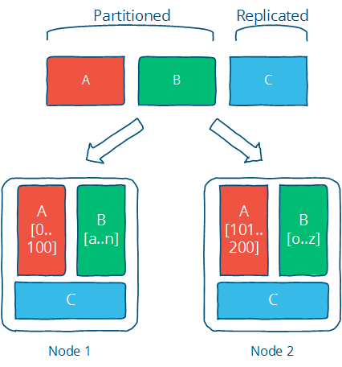
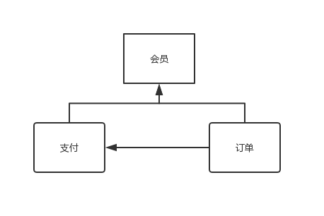
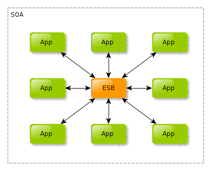
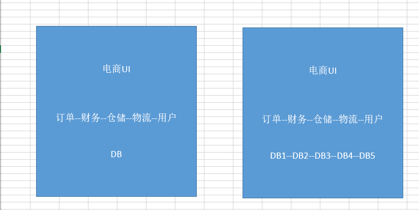
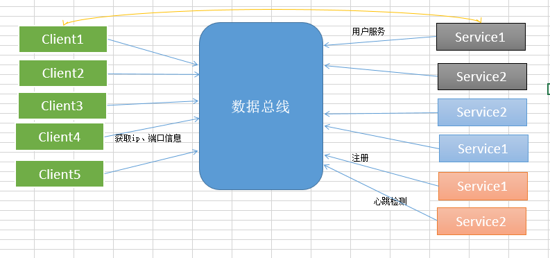
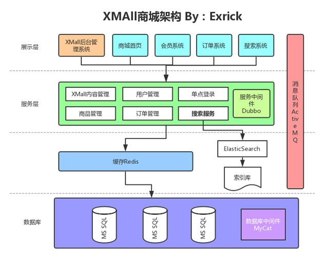

# 分布式系统

## 什么是分布式系统？

　分布式系统是由一组通过网络进行通信、为了完成共同的任务而协调工作的计算机节点组成的系统。分布式系统的出现是为了用廉价的、普通的机器完成单个计算机无法完成的计算、存储任务。其目的是**利用更多的机器，处理更多的数据**。

　　首先需要明确的是，只有当**单个节点的处理能力无法满足日益增长的计算、存储任务**的时候，且**硬件的提升（加内存、加磁盘、使用更好的CPU）高昂到得不偿失**的时候，**应用程序也不能进一步优化**的时候，我们才需要考虑分布式系统。因为，**分布式系统要解决的业务问题本身就是和单机系统一样的**，而由于分布式系统多节点、通过网络通信的拓扑结构，会引入很多单机系统没有的问题，为了解决这些问题又会引入更多的机制、协议，带来更多的问题。

　　在很多文章中，主要讲分布式系统分为分布式计算（computation）与分布式存储（storage）。计算与存储是相辅相成的，计算需要数据，要么来自实时数据（流数据），要么来自存储的数据；而计算的结果也是需要存储的。在操作系统中，对计算与存储有非常详尽的讨论，分布式系统只不过将这些理论推广到多个节点罢了。

　　那么分布式系统怎么将任务分发到这些计算机节点呢，很简单的思想，分而治之，即分片（**partition）**。对于计算，那么就是对计算任务进行切换，每个节点算一些，最终汇总就行了，这就是MapReduce的思想；对于存储，更好理解一下，每个节点存一部分数据就行了。当数据规模变大的时候，Partition是唯一的选择，同时也会带来一些好处：

　　（1）提升性能和并发，操作被分发到不同的分片，相互独立

　　（2）提升系统的可用性，即使部分分片不能用，其他分片不会受到影响

　　理想的情况下，有分片就行了，但事实的情况却不大理想。原因在于，**分布式系统中有大量的节点，且通过网络通信，单个节点的故障（进程crash、断电、磁盘损坏）是个小概率事件，但整个系统的故障率会随节点的增加而指数级增加**，**网络通信也可能出现断网、高延迟的情况**。在这种一定会出现的“异常”情况下，分布式系统还是需要继续稳定的对外提供服务，即需要较强的容错性。最简单的办法，就是冗余或者复制集（**Replication**），也可以叫做**集群**，即**多个节点负责同一个任务**，最为常见的就是分布式存储中，多个节点复杂存储同一份数据，以此增强可用性与可靠性。同时，Replication也会带来性能的提升，比如数据的locality可以减少用户的等待时间。

　　下面这种来自[Distributed systems for fun and profit  ](http://book.mixu.net/distsys/)的图形象生动说明了Partition与Replication是如何协作的。 

　　

　　**Partition和Replication是解决分布式系统问题的一记组合拳**，很多具体的问题都可以用这个思路去解决。但**这并不是银弹，往往是为了解决一个问题，会引入更多的问题**，比如为了可用性与可靠性保证，引用了冗余（复制集）。有了冗余，各个副本间的一致性问题就变得很头疼，一致性在系统的角度和用户的角度又有不同的等级划分。如果要保证强一致性，那么会影响可用性与性能，在一些应用（比如电商、搜索）是难以接受的。如果是最终一致性，那么就需要处理数据冲突的情况。CAP、FLP这些理论告诉我们，**在分布式系统中，没有最佳的选择，都是需要权衡，做出最合适的选择。**

## 分布式系统的产生的问题及解决方案

　　假设这是一个对外提供服务的大型分布式系统，用户连接到系统，做一些操作，产生一些需要存储的数据，那么在这个过程中，会遇到哪些组件、理论与协议呢？

- **负载均衡**：用户使用Web、APP、SDK，通过HTTP、TCP连接到系统。在分布式系统中，为了高并发、高可用，一般都是多个节点提供相同的服务。那么，第一个问题就是具体选择哪个节点来提供服务，这个就是负载均衡（load balance）。负载均衡的思想很简单，但使用非常广泛，在分布式系统、大型网站的方方面面都有使用，或者说，**只要涉及到多个节点提供同质的服务，就需要负载均衡。**
- **分布式缓存，NoSQL**：通过负载均衡找到一个节点，接下来就是真正处理用户的请求，请求有可能简单，也有可能很复杂。简单的请求，比如**读取数据，那么很可能是有缓存的，即分布式缓存，如果缓存没有命中，那么需要去数据库拉取数据**。对于复杂的请求，可能会调用到系统中其他的服务。
- **RPC**：承上，假设服务A需要调用服务B的服务，首先两个节点需要通信，网络通信都是建立在TCP/IP协议的基础上，但是，每个应用都手写socket是一件冗杂、低效的事情，因此需要应用层的封装，因此有了HTTP、FTP等各种应用层协议。当系统愈加复杂，提供大量的http接口也是一件困难的事情。因此，有了更进一步的抽象，那就是**RPC（remote produce call），使得远程调用就跟本地过程调用一样方便，屏蔽了网络通信等诸多细节，增加新的接口也更加方便**。
- **分布式事务**：一个请求可能包含诸多操作，即在服务A上做一些操作，然后在服务B上做另一些操作。比如简化版的网络购物，在订单服务上发货，在账户服务上扣款。这两个操作需要保证原子性，要么都成功，要么都不操作。这就涉及到分布式事务的问题，**分布式事务是从应用层面保证一致性**：某种守恒关系。
- **注册中心**：上面说道一个请求包含多个操作，其实就是涉及到多个服务，分布式系统中有大量的服务，每个服务又是多个节点组成。那么一个服务怎么找到另一个服务（的某个节点呢）？通信是需要地址的，怎么获取这个地址，最简单的办法就是配置文件写死，或者写入到数据库，但这些方法在节点数据巨大、节点动态增删的时候都不大方便，这个时候就**需要服务注册与发现**：提供服务的节点向一个协调中心注册自己的地址，使用服务的节点去协调中心拉取地址。从上可以看见，协调中心提供了中心化的服务：以一组节点提供类似单点的服务，使用非常广泛，比如命令服务、分布式锁。协调中心最出名的就是chubby，zookeeper。
- **消息队列**：回到用户请求这个点，**请求操作会产生一些数据、日志，通常为信息，其他一些系统可能会对这些消息感兴趣**，比如个性化推荐、监控等，这里就抽象出了两个概念，**消息的生产者与消费者**。那么生产者怎么讲消息发送给消费者呢，RPC并不是一个很好的选择，因为RPC肯定得指定消息发给谁，但实际的情况是生产者并不清楚、也不关心谁会消费这个消息，这个时候消息队列就出马了。简单来说，**生产者只用往消息队列里面发就行了，队列会将消息按主题（topic）分发给关注这个主题的消费者**。消息队列起到了异步处理、应用解耦的作用。
- **分布式计算**：上面提到，用户操作会产生一些数据，这些数据忠实记录了用户的操作习惯、喜好，是各行各业最宝贵的财富。比如各种推荐、广告投放、自动识别。这就催生了**分布式计算平台**，比如Hadoop，Storm等，用来**处理这些海量的数据**。
- **分布式存储**：最后，用户的操作完成之后，用户的数据需要持久化，但数据量很大，大到按个节点无法存储，那么这个时候就需要**分布式存储：将数据进行划分放在不同的节点上，同时，为了防止数据的丢失，每一份数据会保存多分。**传统的关系型数据库是单点存储，为了在应用层透明的情况下分库分表，会引用额外的代理层。而对于NoSql，一般天然支持分布式。

### 各种解决方案对应的技术

- 负载均衡：

　　　　**Nginx**：高性能、高并发的web服务器；功能包括负载均衡、反向代理、静态内容缓存、访问控制；工作在应用层

　　　　LVS： Linux virtual server，基于集群技术和Linux操作系统实现一个高性能、高可用的服务器；工作在网络层

- webserver：

　　　　**Java：Tomcat**，Apache，Jboss

　　　　Python：gunicorn、uwsgi、twisted、webpy、tornado

- service：　　

　　　　**SOA、微服务、spring boot**，django

- 容器：

　　　　**docker**，kubernetes

- cache：

　　　　memcache、**redis**等

- 协调中心：

　　　　**zookeeper**、etcd等

　　　　zookeeper使用了Paxos协议Paxos是强一致性，高可用的去中心化分布式。zookeeper的使用场景非常广泛，之后细讲。

- rpc框架：

　　　　grpc、**dubbo**、brpc

　　　　dubbo是阿里开源的Java语言开发的高性能RPC框架，在阿里系的诸多架构中，都使用了dubbo + spring boot

- 消息队列：

　　　　**kafka、rabbitMQ、rocketMQ**、QSP

　　　　消息队列的应用场景：异步处理、应用解耦、流量削锋和消息通讯

- 实时数据平台：

　　　　storm、akka

- 离线数据平台：

　　　　hadoop、spark

　　　　PS: apark、akka、kafka都是scala语言写的，看到这个语言还是很牛逼的

- dbproxy：

　　　　cobar也是阿里开源的，在阿里系中使用也非常广泛，是关系型数据库的sharding + replica 代理

- db：

　　　　**mysql**、oracle、MongoDB、HBase

- 搜索：

　　　　elasticsearch、solr

- 日志：

　　　　rsyslog、elk、flume

## CAP 定理的含义

**分布式系统的最大难点，就是各个节点的状态如何同步**。CAP 定理是这方面的基本定理，也是理解分布式系统的起点。

### 一、分布式系统的三个指标

1998年，加州大学的计算机科学家 Eric Brewer 提出，分布式系统有三个指标。

> - Consistency
> - Availability
> - Partition tolerance

它们的第一个字母分别是 C、A、P。

Eric Brewer 说，这三个指标不可能同时做到。这个结论就叫做 CAP 定理。

### 二、Partition tolerance

先看 Partition tolerance，中文叫做"分区容错"。

大多数分布式系统都分布在多个子网络。每个子网络就叫做一个区（partition）。**分区容错的意思是，区间通信可能失败**。比如，一台服务器放在中国，另一台服务器放在美国，这就是两个区，它们之间可能无法通信。

上图中，G1 和 G2 是两台跨区的服务器。G1 向 G2 发送一条消息，G2 可能无法收到。系统设计的时候，必须考虑到这种情况。

一般来说，分区容错无法避免，因此可以认为 CAP 的 P 总是成立。CAP 定理告诉我们，剩下的 C 和 A 无法同时做到。

### 三、Consistency

Consistency 中文叫做"一致性"。意思是，写操作之后的读操作，必须返回该值。举例来说，某条记录是 v0，用户向 G1 发起一个写操作，将其改为 v1。

接下来，用户的读操作就会得到 v1。这就叫一致性。

问题是，用户有可能向 G2 发起读操作，由于 G2 的值没有发生变化，因此返回的是 v0。G1 和 G2 读操作的结果不一致，这就不满足一致性了。

**为了保持一致性，让 G2 也能变为 v1，就要在 G1 写操作的时候，让 G1 向 G2 发送一条消息，要求 G2 也改成 v1。**

这样的话，用户向 G2 发起读操作，也能得到 v1。

### 四、Availability

Availability 中文叫做"可用性"，意思是**只要收到用户的请求，服务器就必须给出回应。**

用户可以选择向 G1 或 G2 发起读操作。不管是哪台服务器，只要收到请求，就必须告诉用户，到底是 v0 还是 v1，否则就不满足可用性。

### 五、Consistency 和 Availability 的矛盾

**一致性和可用性，为什么不可能同时成立？答案很简单，因为可能通信失败（即出现分区容错）。**

如果保证 G2 的一致性，那么 G1 必须在写操作时，锁定 G2 的读操作和写操作。只有数据同步后，才能重新开放读写。**锁定期间，G2 不能读写，没有可用性。**

**如果保证 G2 的可用性，那么势必不能锁定 G2，所以一致性不成立。**

综上所述，**G2 无法同时做到一致性和可用性。**系统设计时只能选择一个目标。如果追求一致性，那么无法保证所有节点的可用性；如果追求所有节点的可用性，那就没法做到一致性。

### 六、在什么场合，可用性高于一致性？

举例来说，发布一张网页到 CDN，多个服务器有这张网页的副本。后来发现一个错误，需要更新网页，这时只能每个服务器都更新一遍。

一般来说，网页的更新不是特别强调一致性。短时期内，一些用户拿到老版本，另一些用户拿到新版本，问题不会特别大。当然，所有人最终都会看到新版本。所以，这个场合就是可用性高于一致性。

## 分布式系统举例

到底分布式系统从开发到上线是怎么一回事呢？

拿一个典型的电商项目举例，项目明显可以划分为几个不同的业务，从三种不同的业务举例说明：订单业务，支付业务，会员业务。依赖关系显然如下：

 

1. 把这三个项目分给三个项目组进行开发
2. 开发测试完成后分别打成war包，部署在三台不同的机器上的JVM上的TOMCAT服务器上，就形成了分布式架构

# SOA架构

## 什么是SOA架构？

> A service-oriented architecture is essentially **a collection of services**. These services **communicate with each other**. The communication can involve either **simple data passing** or it could **involve two or more services coordinating some activity**. **Some means of connecting services to each other is needed.**

### Services

If a service-oriented architecture is to be effective, we need a clear understanding of the term service. 

**A service is something interesting, reusable and atomic that is offered by one system to other applications willing to make a good use of it, but it’s never exposed directly in a point-to-point manner.**

If a given functionality of a system fulfills these 3 requirements, that is, if it’s:

- **I** nteresting
- **R** eusable
- **A** tomic

then there’s a very good chance it could and should be exposed as a service to other systems, though **never directly.**

**Exposing a service is precisely like exposing an API in one part of code to another. The only difference is that you’re not dealing with submodules of a single system, you’re operating on a level of an entire environment of disparate systems.**

### ESB

**The job of ESB is to expose and invoke services of the integrated systems.** That way, in most cases, only one access method, one interface, needs to be defined between each system and the ESB.

So if, like in the diagram above, you have 8 systems, there will be 16 interfaces (one in each direction) to create, maintain, manage and take care of.

Without an ESB you’d have 56 interfaces to think of and deal with (assuming each systems system talks with each other).

40 interfaces less means less time wasted and more money saved. That’s one of the reasons why your Fridays will be less strained.

This fact alone should make you strongly consider introducing an ESB.

### SOA的应用场景

在分布式系统上，又会出现新的问题：**当一个庞大项目的子项目足够多，项目之间的相互依赖将非常凌乱。**SOA解决多服务凌乱问题。

通过一个系统我们看一下架构的演变过程：

1. **单节点 到 分布式**：当我们的项目比较小时，我们只有一个系统，把他们写到一起打成一个war包，放在物理服务器上的JVM上的TOMCAT上，但是随着业务的内容增大，访问量增大，我们不得不通过拆分业务逻辑，搭建成分布式系统。

2. **分布式系统的SOA架构**：随着系统的子项目越来越多，项目开始变得非常复杂，**我们不得不进一步对系统的性能进行提升，我们将多个模块拆分为多个服务，UI层直接通过AJAX（json数据体）或者SOAP（XML数据体）请求所需服务，多个服务之间通过RPC互相调用**。

## SOA架构的好处和缺陷

- 更彻底的前后端分离：
  - 后端不用再写前端，只要写好API文档就行，里面指明每个请求路径可以提供哪些服务。
  - 前端不用再管后端代码，只要看API文档就可以知道每个请求是如何工作的，只需要在前端代码中写上对所需服务的请求路径就可以使用这个服务，彻底地把后端透明化。
- 后端多种不同的服务开发之间的解耦，只要看看所需服务暴露的接口文档就能正确调用所需服务。

服务之间的耦合度依然很高，不能够独立开发、独立部署、独立测试，服务之间的相互调用关系很明显。

## SOA Q&A

### SOA架构和分布式系统的关系？

SOA架构只是分布式系统的一种软件布局形式或者说理念罢了，并没有脱离分布式系统。

这就好像一座房子里的家具用一种特有风格来摆设，但是无论家具怎么摆设，房子的结构是不会变的。

### SOA全部都是关于XML，SOAP和Web服务的吗？

是的，这是某些人希望你这样相信的。

XML，SOAP和web服务有他们各自的用途，但是就像其他东西一样，他们也可能被滥用。

**SOA是一个关于干净的，可管理的架构。具体的某个服务用或者不用SOAP，其实是与SOA无关的。**作为一个架构方法，即使你完全没有SOAP服务在上面，SOA依然是有效的。比如一个建筑师在设计一栋漂亮的建筑，他们真的跟油漆工人采用什么颜色的油漆来处理内饰没太大关系。

所以不是这样的。 **SOA不是关于XML，SOAP和web服务的，这些都能在SOA里面使用，但不是SOA的主体。**

## SOA架构举例

[xmall](https://github.com/Exrick/xmall)这个项目是很典型的SOA架构。

- **展示层调用后端提供的服务**：当使用展示层的电商UI进行一个下订单的任务时，展示层通过数据总线（AJAX（json数据体）或者SOAP（XML数据体）），分别调用对应的服务即可。

- **服务之间的相互调用**：服务层之间通过RPC进行互相调用。

# 微服务架构

> SOA架构只是分布式系统的一种软件布局形式或者说理念罢了，并没有脱离分布式系统。
>
> 这就好像一座房子里的家具用一种特有风格来摆设，但是无论家具怎么摆设，房子的结构是不会变的。

同样的，**微服务架构只是分布式系统的一种软件布局形式或者说理念罢了，并没有脱离分布式系统。**

## 什么是微服务架构？

> In short, the microservice architectural style is an approach to developing a single application as a **suite of small services**, each **running in its own process** and communicating with lightweight mechanisms, often an HTTP resource API. These services are **built around business capabilities** and **independently deployable** by fully automated deployment machinery. There is a **bare minimum of centralized management** of these services, which may be written in different programming languages and use different data storage technologies.

[请看博文](https://martinfowler.com/articles/microservices.html)。

再自己总结几点：

- 原子化的服务：每种服务独立提供一种服务，划分的粒度更细，和其他的服务最小依赖，有自己的数据库。
- 集群下的每种服务使用相同的数据库。
- 服务之间交流用RESTful风格：HTTP+JSON进行数据交换，这也是能摆脱RPC和能专注在DevOps的原因。

## 微服务架构和SOA架构的区别

| **SERVICE-ORIENTED ARCHITECTURE**                            | **MICROSERVICES ARCHITECTURE**                               |
| ------------------------------------------------------------ | ------------------------------------------------------------ |
| Maximizes application service reusability                    | Focused on **decoupling**                                    |
| 系统的变化需要修改整体结构（修改ESB）                        | A systematic change is to **create a new service**           |
| DevOps and Continuous Delivery are becoming popular, but are not mainstream | Strong focus on **DevOps and Continuous Delivery**（因为使用RESTful通讯，不担心语言问题） |
| Focused on business functionality reuse                      | More importance on the concept of “bounded context”          |
| For communication it uses Enterprise Service Bus (ESB)       | For communication uses less elaborate and simple messaging systems |
| Supports multiple message protocols                          | Uses lightweight protocols such as HTTP, REST or Thrift APIs |
| Use of a common platform for all services deployed to it     | Application Servers are not really used, it’s common to use cloud platforms（还是要归功于RESTful） |
| Use of containers (such as Docker) is less popular           | Containers work very well with microservices                 |
| SOA services share the data storage                          | Each microservice can have an independent data storage       |
| Common governance and standards                              | Relaxed governance, with greater focus on teams collaboration and freedom of choice（DevOps） |

I’ll get into more detail in some of the aspects shown in the table above and further explain the differences:

- **Development** – In both architectures, services can be developed in different programming languages and tools, which brings technology diversity into the development team. The development can be organized within multiple teams, however, in SOA, each team needs to know about the common communication mechanism. On the other hand, with microservices, the services can operate and be deployed independently of other services. So, it is easier to deploy new versions of microservices frequently or scale a service independently. 
- **“Bounded Context”** - **SOA encourages sharing of components, whereas microservices try to minimize on sharing through “bounded context.”** A bounded context refers to the coupling of a component and its data as a single unit with minimal dependencies. **As SOA relies on multiple services to fulfill a business request, systems built on SOA are likely to be slower than microservices.**
- **Communication** - In SOA, the ESB could become a single point of failure which impacts the entire system. Since every service is communicating through the ESB, if one of the services slows down, it could clog up the ESB with requests for that service. On the other hand, microservices are much better in error tolerance. For example, if one microservice has a memory fault, then only that microservice will be affected. All the other microservices will continue to handle requests regularly.
- **Interoperability -** SOA promotes the use of multiple heterogeneous protocols through its messaging middleware component. Microservices attempt to simplify the architecture pattern by reducing the number of choices for integration. So, if you want to integrate several systems using different protocols in a heterogeneous environment, you need to consider SOA. If all your services could be accessed through the same remote access protocol, then microservices are a better option for you.
- **Size** - Last but not least, the main difference between SOA and microservices lies in the size and scope. The prefix “micro” in microservices refers to the granularity of the internal components, meaning they have to be significantly smaller than what SOA tends to be. Service components within microservices generally have a single purpose and they do that one thing really well. On the other hand, in SOA services usually include much more business functionality, and they are often implemented as complete subsystems.

## 微服务架构举例

[**piggymetrics**](https://github.com/sqshq/piggymetrics)项目是典型的microservice架构，关于更多阐述可以去看README

PiggyMetrics was decomposed into three core microservices. All of them are independently deployable applications, organized around certain business domains.

