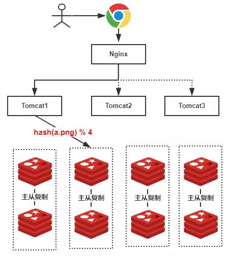
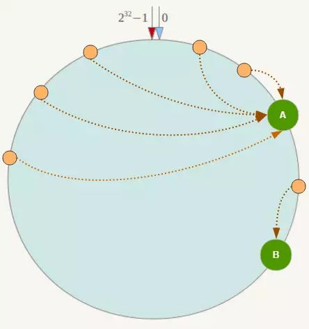
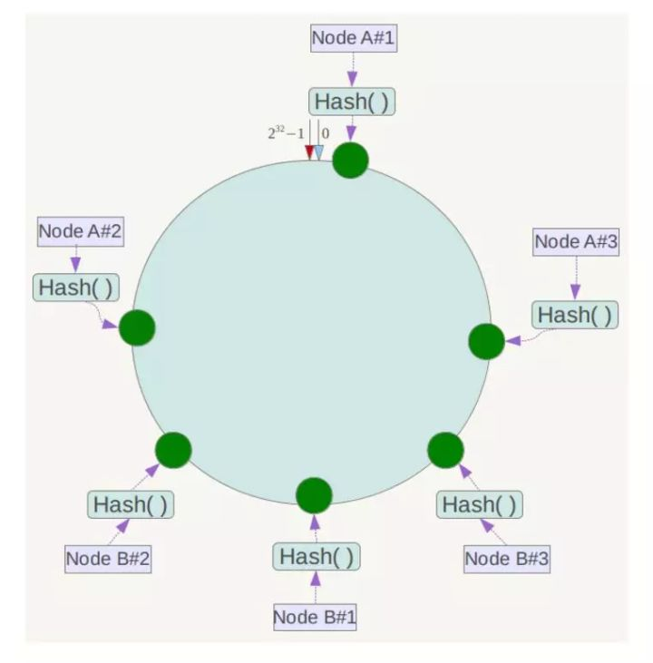
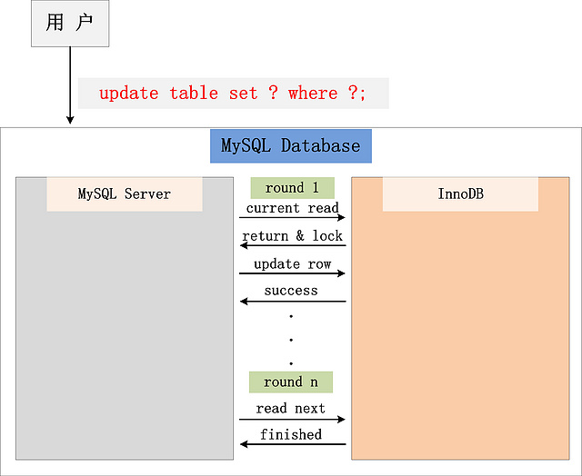
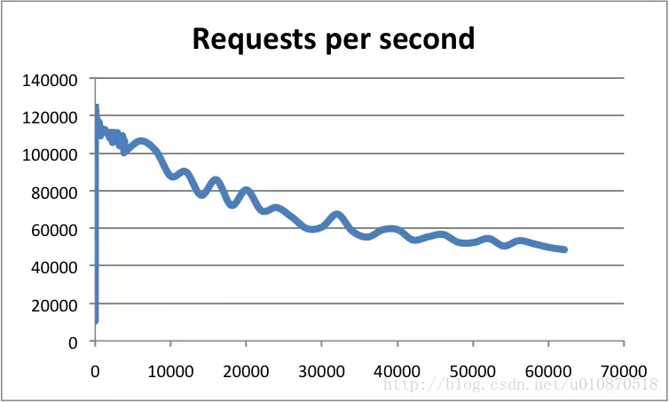
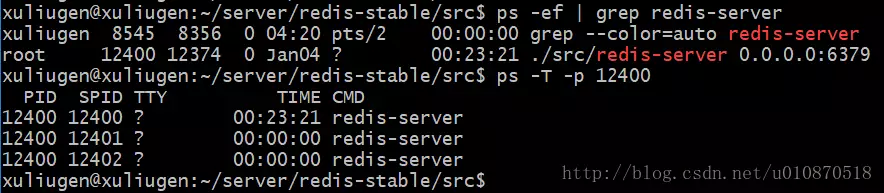
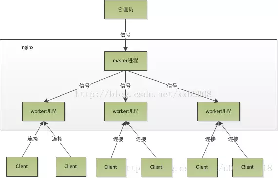
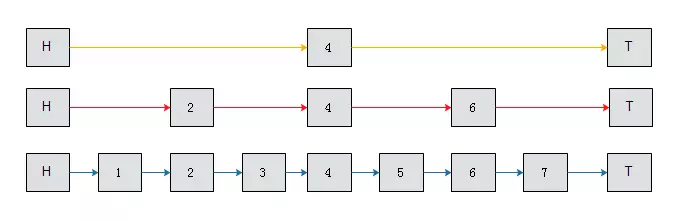
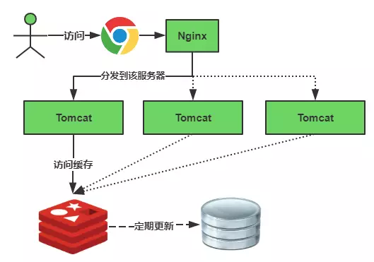
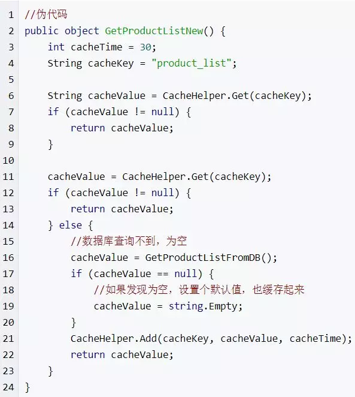

# offer

## JVM

### 概念

#### 内存泄漏 和 内存溢出

- **内存泄露**：指程序中动态分配内存给一些临时对象，但是对象不会被GC所回收，始终占用内存。即**被分配的对象可达但已无用**。
- **内存溢出**：指程序运行过程中**无法申请到足够的内存**而导致JVM的OOM。

### 实现

#### try catch finally

finally会在return执行之后，返回之前执行。

JVM对他们的实现是，复制每个finally块到每个控制流的最后，保证会执行到。

try catch由方法的异常表执行字节码跳转。

### 运行时内存模型 和 JVM ERROR

需要强调的是**模型与实现的区别**。本节内容只是jvm specification中规定的JAVA虚拟机实现应该遵循的内存模型，如果**需要交代具体实现，必须会特殊说明**。


#### 线程私有内存

##### 程序计数器PC

程序计数器是一块较小的内存空间，可以看作是当前线程所执行的字节码的行号指示器。**字节码解释器工作时通过改变这个计数器的值来选取下一条需要执行的字节码指令，分支、循环、跳转、异常处理、线程恢复等功能都需要依赖这个计数器来完。**

**为了线程切换后能恢复到正确的执行位置**，每条线程都需要有一个独立的程序计数器，各线程之间计数器互不影响，独立存储，我们称这类内存区域为“线程私有”的内存。

程序计数器是唯一一个不会出现OutOfMemoryError的内存区域，它的生命周期和线程相同。

##### 虚拟机栈

栈帧：和方法调用是一对一的关系。

- 局部变量表：编译器可知的各种数据类型（boolean、byte、char、short、int、float、long、double）、对象引用（reference类型）。

- 操作数栈：

  > Each frame (§2.6) contains a last-in-first-out (LIFO) stack known as its operand stack. The maximum depth of the operand stack of a frame is determined at compile-time and is supplied along with the code for the method associated with the frame (§4.7.3).

**局部变量表和操作数栈的交互即是本栈帧对应方法的字节码的执行。**

**StackOverFlowError：** 若Java虚拟机栈的内存大小不允许动态扩展，那么当线程请求栈的深度超过当前Java虚拟机栈的最大深度的时候，就抛出StackOverFlowError异常。

**OutOfMemoryError：** 若 Java 虚拟机栈的内存大小允许动态扩展，且当线程请求栈时内存用完了，无法再动态扩展了，此时抛出OutOfMemoryError异常。

##### 本地方法栈

同虚拟机栈一样会抛出OOM & SOF。

#### 线程共享内存

##### 堆

存放对象实例。超过最大值会OOM。

##### 方法区

存放对象类型相关的信息。

> It stores per-class structures such as the run-time constant pool, field and method data, and the code for methods and constructors, including the special methods used in class and interface initialization <clinit> and in instance initialization <init>.

超过方法区内存限制将抛出OOM。

**hotspot VM JDK8之后对方法区的实现：Metaspace**

Java 8 彻底将永久代 (PermGen) 移除出了 HotSpot JVM，将其原有的数据迁移至 Java Heap 或 Metaspace。

1. 永久代为什么被移出HotSpot JVM了？
   在 HotSpot JVM 中，永久代中用于**存放类和方法的元数据以及常量池**，比如Class和Method。每当一个类初次被加载的时候，它的元数据都会放到永久代中。永久代是有大小限制的，如果加载的类太多，经常导致永久代内存溢出 java.lang.OutOfMemoryError: PermGen ， JVM 的开发者希望这一块内存可以更灵活地被管理，不要再经常出现这样的 OOM。

2. Metaspace物理位置
   JDK 8 开始把类的元数据放到本地堆内存(native heap)中，这一块区域就叫 Metaspace，中文名叫元空间。

3. 优点
   OOM问题将不复存在，因为默认的类的元数据分配只受物理内存大小的限制。

   让 Metaspace 变得无限大显然是不现实的，因此我们也要限制 Metaspace 的大小：

   `-XX:MaxMetaspaceSize`

   > By default, the size isn’t limited. The amount of metadata for an application **depends on the application itself, other running applications, and the amount of memory available on the system**.

4. GC
   如果Metaspace的空间占用达到了`-XX:MaxMetaspaceSize`设定的最大值，那么就会触发GC来收集死亡对象和类的加载器。根据JDK 8的特性，G1和CMS都会很好地收集Metaspace区（一般都伴随着Full GC）。

   为了减少垃圾回收的频率及时间，控制吞吐量，对Metaspace进行适当的监控和调优是非常有必要的。如果在Metaspace区发生了频繁的Full GC，那么可能表示存在内存泄露或Metaspace区的空间太小了。

##### 直接内存

NIO（基于Buffer和Channel的非阻塞IO方式）使用Native函数直接分配对外内存。

可能导致各个内存区之和超过物理内存限制从而OOM。

### 对象的内存布局


其中对象头32位还是64位与虚拟机是多少位有关。


#### Mark Word

Mark Word是一个复用的数据结构。在不同的对象状态下，其存储的数据也不尽相同。


### 垃圾收集

#### 可达性分析算法

通过一系列成为GC roots的对象作为起始点，从这些节点开始向下搜索，搜索过的路径成为引用链，当一个对象没有任何引用链相连，证明这个对象不可用。

#### 垃圾收集算法

| 算法 | 标记清除                                                     | 复制算法                                                     | 标记整理                                             |
| ---- | :----------------------------------------------------------- | :----------------------------------------------------------- | ---------------------------------------------------- |
| 描述 | 将不用的对象标记，然后清除其所在空间。                       | 将内存按容量划分为大小相等的两块，每次使用一块。内存区满就把存活的对象复制到另外一块。 | 每次GC让存活对象向一端移动，然后清理掉边界外的内存。 |
| 优点 | 简单                                                         | 没有碎片问题，实现简单                                       |                                                      |
| 缺点 | 效率低，产生大量的内存碎片，内存碎片多了就无法存储大对象，不得不提前GC | 内存代价高                                                   |                                                      |

#### 分代回收算法

1. 对象优先在Eden中分配

2. 大对象直接进入老年代

3. 长期存活对象直接进入老年代

   对象动态年龄判定，在经历15次MinorGC后进入老年代


#### 垃圾收集器

| 收集器                | 串行、并行or并发 | 新生代/老年代 | 算法               | 目标         | 适用场景                                  |
| --------------------- | ---------------- | ------------- | ------------------ | ------------ | ----------------------------------------- |
| **Serial**            | 串行             | 新生代        | 复制算法           | 响应速度优先 | 单CPU环境下的Client模式                   |
| **Serial Old**        | 串行             | 老年代        | 标记-整理          | 响应速度优先 | 单CPU环境下的Client模式、CMS的后备预案    |
| **ParNew**            | 并行             | 新生代        | 复制算法           | 响应速度优先 | 多CPU环境时在Server模式下与CMS配合        |
| **Parallel Scavenge** | 并行             | 新生代        | 复制算法           | 吞吐量优先   | 在后台运算而不需要太多交互的任务          |
| **Parallel Old**      | 并行             | 老年代        | 标记-整理          | 吞吐量优先   | 在后台运算而不需要太多交互的任务          |
| **CMS**               | 并发             | 老年代        | 标记-清除          | 响应速度优先 | 集中在互联网站或B/S系统服务端上的Java应用 |
| **G1**                | 并发             | both          | 标记-整理+复制算法 | 响应速度优先 | 面向服务端应用，将来替换CMS               |

##### CMS收集器

**CMS（Concurrent Mark Sweep）**收集器是一种以**获取最短回收停顿时间**为目标的收集器，它非常符合那些集中在互联网站或者B/S系统的服务端上的Java应用，这些应用都非常重视服务的响应速度。从名字上（“Mark Sweep”）就可以看出它是基于**“标记-清除”**算法实现的。

CMS收集器工作的整个流程分为以下4个步骤：

- **初始标记（CMS initial mark）**：仅仅只是标记一下GC Roots能直接关联到的对象，速度很快，需要“Stop The World”。
- **并发标记（CMS concurrent mark）**：进行**GC Roots Tracing**的过程，在整个过程中耗时最长。
- **重新标记（CMS remark）**：为了修正并发标记期间因用户程序继续运作而导致标记产生变动的那一部分对象的标记记录，这个阶段的停顿时间一般会比初始标记阶段稍长一些，但远比并发标记的时间短。此阶段也需要“Stop The World”。
- **并发清除（CMS concurrent sweep）**

由于整个过程中耗时最长的并发标记和并发清除过程收集器线程都可以与用户线程一起工作，所以，从总体上来说，CMS收集器的内存回收过程是与用户线程一起并发执行的。通过下图可以比较清楚地看到CMS收集器的运作步骤中并发和需要停顿的时间：


**优点**

**并发收集**、**低停顿**：标记和清理都是并发的，STW的初始标记和重新标记时间很短。

**缺点**

- **并发GC，因而对CPU资源非常敏感** 
- **标记-清除算法导致的空间碎片**

##### G1垃圾收集器

G1垃圾收集算法主要应用在多CPU大内存的服务中，在**满足高吞吐量的同时，尽可能的满足垃圾回收时的暂停时间**，该设计主要针对如下应用场景：

- 垃圾收集线程和应用线程并发执行，和CMS一样
- 不希望牺牲太多的吞吐性能
- 可预测的GC暂停时间，在一个长度M ms的时间片中，消耗在GC上的时间不得超过N ms

###### 堆内存结构

1、以往的垃圾回收算法，如CMS，使用的堆内存结构如下：


- 新生代：eden space + 2个survivor
- 老年代：old space
- 持久代：1.8之前的perm space
- 元空间：1.8之后的metaspace

这些space必须是地址连续的空间。

2、**在G1算法中，采用了另外一种完全不同的方式组织堆内存**，堆内存被划分为多个大小相等的内存块（Region），每个Region是逻辑连续的一段内存，结构如下：


每个Region被标记了E、S、O和H，说明每个Region在运行时都充当了一种角色，其中H是以往算法中没有的，它代表Humongous，这表示这些Region存储的是巨型对象（humongous object，H-obj），当新建对象大小超过Region大小一半时，直接在新的一个或多个连续Region中分配，并标记为H。

**Region**

堆内存中一个Region的大小可以通过`-XX:G1HeapRegionSize`参数指定，大小区间只能是1M、2M、4M、8M、16M和32M，总之是2的幂次方，如果G1HeapRegionSize为默认值，则在堆初始化时计算Region的实际大小，具体实现如下：


默认把堆内存按照2048份均分，最后得到一个合理的大小。

###### GC模式

G1中提供了三种模式垃圾回收模式，young gc、mixed gc 和 full gc，在不同的条件下被触发。

**young gc**

发生在年轻代的GC算法，一般对象（除了巨型对象）都是在eden region中分配内存，当所有eden region被耗尽无法申请内存时，就会触发一次young gc，这种触发机制和之前的young gc差不多，执行完一次young gc，活跃对象会被拷贝到survivor region或者晋升到old region中，空闲的region会被放入空闲列表中，等待下次被使用。

| 参数                    | 含义                                |
| ----------------------- | ----------------------------------- |
| -XX:MaxGCPauseMillis    | 设置G1收集过程目标时间，默认值200ms |
| -XX:G1NewSizePercent    | 新生代最小值，默认值5%              |
| -XX:G1MaxNewSizePercent | 新生代最大值，默认值60%             |

**mixed gc**

当越来越多的对象晋升到老年代old region时，为了避免堆内存被耗尽，虚拟机会触发一个混合的垃圾收集器，即mixed gc，该算法并不是一个old gc，除了回收整个young region，还会回收一部分的old region，这里需要注意：是一部分老年代，而不是全部老年代，可以选择哪些old region进行收集，从而可以对垃圾回收的耗时时间进行控制。

那么mixed gc什么时候被触发？

先回顾一下cms的触发机制，如果添加了以下参数：

```
`-XX:CMSInitiatingOccupancyFraction=``80` `-XX:+UseCMSInitiatingOccupancyOnly`
```

当老年代的使用率达到80%时，就会触发一次cms gc。相对的，mixed gc中也有一个阈值参数 `-XX:InitiatingHeapOccupancyPercent`，当老年代大小占整个堆大小百分比达到该阈值时，会触发一次mixed gc.

mixed gc的执行过程有点类似cms，主要分为以下几个步骤：

1. initial mark: 初始标记过程，整个过程STW，标记了从GC Root可达的对象
2. concurrent marking: 并发标记过程，整个过程gc collector线程与应用线程可以并行执行，标记出GC Root可达对象衍生出去的存活对象，并收集各个Region的存活对象信息
3. remark: 最终标记过程，整个过程STW，标记出那些在并发标记过程中遗漏的，或者内部引用发生变化的对象
4. clean up: 垃圾清除过程，如果发现一个Region中没有存活对象，则把该Region加入到空闲列表中

**full gc**

如果对象内存分配速度过快，mixed gc来不及回收，导致老年代被填满，就会触发一次full gc，G1的full gc算法就是单线程执行的serial old gc，会导致异常长时间的暂停时间，需要进行不断的调优，尽可能的避免full gc.

#### Metaspace

如果Metaspace的空间占用达到了设定的最大值，那么就会触发GC来收集死亡对象和类的加载器。G1和CMS都会很好地收集Metaspace区（一般都伴随着Full GC）。

## 并发

### 关键字

#### 乐观锁和悲观锁

##### 悲观锁

假设最坏的情况，每次去拿数据的时候都认为别人会修改，所以每次在拿数据的时候都会上锁，这样别人想拿这个数据就会阻塞直到它拿到锁。**共享资源每次只给一个线程使用，其它线程阻塞，用完后再把资源转让给其它线程**。

- `synchronized`和`ReentrantLock`等独占锁
- 行锁，表锁，读锁，写锁，间隙锁

##### 乐观锁

假设最好的情况，每次去拿数据的时候都认为别人不会修改，所以不会上锁，但是在更新的时候会判断一下在此期间别人有没有去更新这个数据。**乐观锁适用于多读的应用类型，这样可以提高吞吐量**。

应用：

- CAS算法：Atomic类
- 版本号机制：Mysql的快照读
- tryLock 和 自旋锁

#### synchronized 和 volatile

|      | synchronized                                                 | volatile                                                     |
| ---- | ------------------------------------------------------------ | ------------------------------------------------------------ |
| 原理 | 编译为class文件之后会形成monitorenter和monitorexit字节码指令，锁定传入的对象引用，以其作为锁（this，其他的引用，或this.getClass()） | CPU指令                                                      |
| 作用 | 保证当前线程访问代码的独占，确保被操作状态的原子性和可见性   | 将缓存及时刷新到内存和禁止指令重排序的作用，因此只能确保可见性 |

#### BIO 和 NIO

- BIO是阻塞IO，进行IO的线程会一直阻塞到数据IO完毕才结束，一个线程只能处理一个流的I/O事件。

- NIO是非阻塞IO，原理是轮询机制，Linux下底层实现用的是epoll。
  - poll/select：只能无差别轮询所有流，需要找出能读出数据，或者写入数据的流，对他们进行操作。
  - epoll：轮询得到的流都是可处理的流，没有可处理的流时将会阻塞。

### JUC包

#### ConcurrentHashMap

1. hash计算是依赖于put(key, val)中的key的，毕竟key值决定了这个键值对的存储位置和查找方式。如果传入的key值是null，hash为0，否则调用key.hashCode()并将低16位与高16位异或（保证高位的特征被利用上了）。
2. 

#### hashmap线程不安全的表现

- put get 操作不是线程安全的：是非原子操作。
- 扩容不是线程安全的：可能有多个线程同时扩容。

#### ReentrantLock

与内置锁相比的功能点：显式

- 可中断阻塞
- 可尝试获取锁
- 可实现公平锁
- 可以绑定多个Condition

#### CAS

1. CAS底层在`Hotspot`源码的`Unsafe.cpp`中实现，Linux的X86下主要是通过cmpxchg这个指令在CPU级完成CAS操作的。
2. 简述：若内存位置与预期原值匹配则处理器将该位置更新为新值。否则不做操作。
3. Atomic类全都用到了CAS
4. 优点：非阻塞的同步机制，性能好，可伸缩性好（当增加计算资源CPU内存磁盘存储容量和IO带宽时，程序的处理能力相应增加），活跃性好（不会出现饥饿和死锁）
5. 缺点：
   - **ABA问题**：在CAS操作时，带上版本号，每修改一次，版本号+1，之后比较原值的时候还要比较版本号
   - **循环时间长开销大**：自旋CAS如果长时间不成功，会给CPU带来非常大的执行开销
   - **只能保证一个共享变量的原子操作**：使用锁或者利用`AtomicReference类`把多个共享变量合并成一个共享变量来操作。


#### AQS

AQS是ReentrantLock的实现。

1. 锁状态。state = 0，未被获取；state > 1，被获取。
2. 线程的阻塞和解除阻塞。AQS 中采用了 LockSupport.park(thread) 来挂起线程，用 unpark 来唤醒线程。
3. 阻塞队列。AQS 用的是一个 FIFO 的队列，就是一个链表，每个 node 都持有后继节点的引用。

首先，第一个线程调用 reentrantLock.lock()，翻到最前面可以发现，tryAcquire(1) 直接就返回 true 了，结束。只是设置了 state=1，连 head 都没有初始化，更谈不上什么阻塞队列了。要是线程 1 调用 unlock() 了，才有线程 2 来，那世界就太太太平了，完全没有交集嘛，那我还要 AQS 干嘛。

如果线程 1 没有调用 unlock() 之前，线程 2 调用了 lock(), 想想会发生什么？

线程 2 会初始化 head（new Node()），同时线程 2 也会插入到阻塞队列并挂起 (注意看这里是一个 for 循环，而且设置 head 和 tail 的部分是不 return 的，只有入队成功才会跳出循环)

首先，是线程 2 初始化 head 节点，此时 head==tail, waitStatus==0


然后线程 2 入队：


同时我们也要看此时节点的 waitStatus，我们知道 head 节点是线程 2 初始化的，此时的 waitStatus 没有设置， java 默认会设置为 0，但是到 shouldParkAfterFailedAcquire 这个方法的时候，线程 2 会把后门节点，也就是 head 的waitStatus设置为 -1。

那线程 2 节点此时的 waitStatus 是多少呢，由于没有设置，所以是 0；

如果线程 3 此时再进来，直接插到线程 2 的后面就可以了，此时线程 3 的 waitStatus 是 0，到 shouldParkAfterFailedAcquire 方法的时候把后门节点线程 2 的 waitStatus 设置为 -1。


这里可以简单说下 waitStatus 中 SIGNAL(-1) 状态的意思，Doug Lea 注释的是：代表后继节点需要被唤醒。也就是说这个 waitStatus 其实代表的不是自己的状态，而是后继节点的状态，我们知道，每个 node 在入队的时候，都会把后门节点的状态改为 SIGNAL，然后阻塞，等待被后门唤醒。这里涉及的是两个问题：有线程取消了排队、唤醒操作。

### 锁的分类和优化

#### 重量级锁

JVM使用操作系统的互斥量mutex实现的锁

#### 自旋锁

JDK1.6引入了自适应的自旋锁。

自旋等待避免了线程切换的开销，但当且仅当自旋时间小于线程切换时间才有效果。

自适应是指按照该锁之前的自旋时间和线程执行时间来判断自旋次数。

#### 锁消除

JVM对一些代码上要求同步，但是被检测到不存在共享状态竞争的锁进行消除。

实现：JIT即时编译器逃逸分析技术，判断当前线程栈上SLOT数据都不会逃逸而被其他线程访问到，就可以认为他们是线程私有的，无需加锁。

#### 锁粗化

一段代码如要重复加上和释放同一个锁，JVM会扩展锁的锁定区域（如果不违背代码语义）来减少锁定开销。

#### 轻量级锁

- 目的：在同一时刻没有线程竞争锁时，减少传统重量级锁（JVM使用操作系统的互斥量mutex实现的锁）的使用。

- 使用依据：“对于绝大部分锁，在整个同步代码块内都不存在竞” 的经验法则。

- 实现：**使用CAS操作消除重量级锁同步使用的互斥量。**

  （1）在代码进入同步块的时候，如果同步对象锁状态为无锁状态（锁标志位为“01”状态，是否为偏向锁为“0”），虚拟机首先将在当前线程的栈帧中建立一个名为锁记录（Lock Record）的空间，用于存储锁对象目前的Mark Word的拷贝。

  （2）拷贝对象头中的Mark Word复制到锁记录中。

  （3）拷贝成功后，虚拟机将使用**CAS操作**尝试将对象的Mark Word更新为指向Lock Record的指针。如果更新成功，则执行步骤（3），否则执行步骤（4）。

  （4）CAS成功。该线程就拥有该对象的锁，将对象Mark Word的锁标志位设置为“00”，即表示此对象处于轻量级锁定状态。

  （5）CAS失败。检查对象的Mark Word是否指向当前线程的栈帧，如果是就说明当前线程重入该对象的锁，可以直接进入同步块继续执行。

  （6）否则，说明多个线程竞争锁，轻量级锁就要膨胀为重量级锁，锁标志的状态值变为“10”，Mark Word中存储的就是指向重量级锁（互斥量）的指针，当前线程使用自旋来获取锁，后面等待锁的线程也要进入阻塞状态。

- 优点和缺点：满足经验法则的前提下提升性能；多个线程同时竞争锁时降低性能。

#### 偏向锁

目的：数据在无竞争时，消除代码中的同步需求。

实现：

​	（1）确认为可偏向状态。访问Mark Word中偏向锁的标识是否设置成1 && 锁标志位是否为01。

　　（2）如果为可偏向状态，则测试线程ID是否指向当前线程，如果是，进入步骤（5），否则进入步骤（3）。

　　（3）如果线程ID并未指向当前线程，则通过CAS操作尝试写入当前线程ID。如果竞争成功，则将Mark Word中线程ID设置为当前线程ID，然后执行（5）；如果竞争失败，执行（4）。

　　（4）如果CAS获取偏向锁失败，则表示有竞争。当到达全局安全点（safepoint）时获得偏向锁的线程被挂	起，偏向锁升级为轻量级锁，然后被阻塞在安全点的线程继续往下执行同步代码。

　　（5）执行同步代码。

**偏向锁的释放：**

　　偏向锁的撤销在上述第四步骤中有提到。**偏向锁只有遇到其他线程尝试竞争偏向锁时，持有偏向锁的线程才会释放锁，线程不会主动去释放偏向锁**。偏向锁的撤销，需要等待全局安全点（在这个时间点上没有字节码正在执行），它会首先暂停拥有偏向锁的线程，判断锁对象是否处于被锁定状态，撤销偏向锁后恢复到未锁定（标志位为“01”）或轻量级锁（标志位为“00”）的状态。

缺点：如果某个对象的锁会被很多不同线程访问，偏向模式就是多余的。

### 线程池

#### 线程池参数

- `corePoolSize`：核心线程数

  - 核心线程会**一直存活**，即便没有任务需要执行

  - **当线程数小于核心线程数时，即使有线程空闲，线程池也会优先创建新线程处理**
  - 设置allowCoreThreadTimeout=true（默认false）时，核心线程会超时关闭

- `maximumPoolSize` ：最大线程数

  - 当线程数>=corePoolSize，且任务队列已满时，线程池会创建新线程来处理任务

  - 当线程数=maxPoolSize，且任务队列已满时，线程池会拒绝处理任务而抛出异常

- `keepAliveTime`：线程空闲时间

  当线程空闲时间达到keepAliveTime时，线程会退出，直到线程数量=corePoolSize

- `rejectedExecutionHandler`：任务拒绝处理器

  两种情况会拒绝处理任务：

  - 队列已满，线程数已经达到maxPoolSize，会拒绝新任务
  - 当线程池被调用shutdown()后，会等待线程池里的任务执行完毕，再shutdown。如果在调用shutdown()和线程池真正shutdown之间提交任务，会拒绝新任务

  线程池会调用rejectedExecutionHandler来处理这个任务。如果没有设置默认是AbortPolicy，会抛出异常。ThreadPoolExecutor类有几个内部实现类来处理这类情况：

  - AbortPolicy 丢弃任务，抛运行时异常

  - CallerRunsPolicy 执行任务
  - DiscardPolicy 忽视，什么都不会发生
  - DiscardOldestPolicy 从队列中踢出最先进入队列（最后一个执行）的任务

#### **原理**

线程池按以下行为执行任务：

1. 当线程数小于核心线程数corePoolSize时，创建线程。
2. 当线程数大于等于核心线程数，且任务队列未满时，将任务放入任务队列。
3. 当线程数大于等于核心线程数，且任务队列已满
   1. 若线程数小于最大线程数，创建线程
   2. 若线程数等于最大线程数，抛出异常，拒绝任务

#### SynchronousQueue

当一个线程往队列中写入一个元素时，写入操作不会立即返回，需要等待另一个线程来将这个元素拿走；同理，当一个读线程做读操作的时候，同样需要一个相匹配的写线程的写操作。

因为SynchronousQueue没有存储功能，因此put和take会阻塞，直到有另一个线程已经准备好参与到交付过程中。仅当有足够多的消费者，并且总是有一个消费者准备好获取交付的工作时，才适合使用同步队列。

### 线程安全机制

| 线程安全机制 | 互斥（阻塞）同步                                             | 非阻塞同步                   | 线程封闭                |
| ------------ | ------------------------------------------------------------ | ---------------------------- | ----------------------- |
| 技术         | synchronized，volatile，Lock，Semaphore，CyclicBarrier，CountDownLatch | CAS，Atomic类                | ThreadLocal，无状态的类 |
| 优点         |                                                              |                              |                         |
| 缺点         | 阻塞或者唤醒一个线程，都需要OS从用户态切换到内核态，切换上下文的开销可能比一般的setter getter开销更大 | 只能是一个状态变量的原子操作 | 无法真正意义的并发      |


### 线程

原理：Java线程1：1映射到操作系统原生线程（内核线程、轻量级进程）之上。因此阻塞或者唤醒一个线程，都需要OS从用户态切换到内核态，切换上下文的开销可能比一般的setter getter开销更大。

### TODO:死锁的原因，如何避免


## 计算机网络

### TCP和UDP区别

|            | TCP            | UDP        |
| ---------- | -------------- | ---------- |
| 是否连接   | 面向连接       | 面向非连接 |
| 传输可靠性 | 可靠的         | 不可靠的   |
| 应用场合   | 传输大量的数据 | 少量数据   |
| 速度       | 慢             | 快         |

###  TCP

#### 从IP讲起

IP 协议定义了一套自己的地址规则，称为 IP 地址。它实现了路由功能，允许某个局域网的 A 主机，向另一个局域网的 B 主机发送消息。


路由器就是基于 IP 协议。局域网与局域网之间要靠路由器连接。

路由的原理很简单。市场上所有的路由器，背后都有很多网口，要接入多根网线。路由器内部有一张**路由表**，规定了 A 段 IP 地址走出口一，B 段地址走出口二，……通过这套”指路牌”，实现了数据包的转发。


**本机的路由表注明了不同 IP 目的地的数据包**，要发送到哪一个网口（interface）。

**IP 协议只是一个地址协议，并不保证数据包的完整**。如果路由器丢包（比如缓存满了，新进来的数据包就会丢失），就需要发现丢了哪一个包，以及如何重新发送这个包。这就要依靠 TCP 协议。

简单说，**TCP 协议的作用是，保证数据通信的可靠性，防止丢包，在此基础上尽量提高传输性能**。

#### TCP 数据包的大小

以太网数据包（packet）的大小是固定的，最初是1518字节，后来增加到1522字节。其中， 1500 字节是负载（payload），22字节是头信息（head）。
IP 数据包在以太网数据包的负载里面，它也有自己的头信息，最少需要20字节，所以 IP 数据包的负载最多为1480字节。


（图片说明：IP 数据包在以太网数据包里面，TCP 数据包在 IP 数据包里面。）
TCP 数据包在 IP 数据包的负载里面。它的头信息最少也需要20字节，因此 TCP 数据包的最大负载是 1480 - 20 = 1460 字节。由于 IP 和 TCP 协议往往有额外的头信息，所以 TCP 负载实际为1400字节左右。
因此，一条1500字节的信息需要两个 TCP 数据包。HTTP/2 协议的一大改进， 就是压缩 HTTP 协议的头信息，使得一个 HTTP 请求可以放在一个 TCP 数据包里面，而不是分成多个，这样就提高了速度。


（图片说明：以太网数据包的负载是1500字节，TCP 数据包的负载在1400字节左右。）

#### TCP 数据包的编号（SEQ）

一个包1400字节，那么一次性发送大量数据，就必须分成多个包。比如，一个 10MB 的文件，需要发送7100多个包。
发送的时候，TCP 协议为每个包编号（sequence number，简称 SEQ），以便接收的一方按照顺序还原。万一发生丢包，也可以知道丢失的是哪一个包。
第一个包的编号是一个随机数。为了便于理解，这里就把它称为1号包。假定这个包的负载长度是100字节，那么可以推算出下一个包的编号应该是101。这就是说，每个数据包都可以得到两个编号：自身的编号，以及下一个包的编号。接收方由此知道，应该按照什么顺序将它们还原成原始文件。


（图片说明：当前包的编号是45943，下一个数据包的编号是46183，由此可知，这个包的负载是240字节。）

#### TCP 数据包的组装

收到 TCP 数据包以后，**组装还原是操作系统完成的**。应用程序不会直接处理 TCP 数据包。
对于应用程序来说，不用关心数据通信的细节。除非线路异常，收到的总是完整的数据。应用程序需要的数据放在 TCP 数据包里面，有自己的格式（比如 HTTP 协议）。
**TCP 并没有提供任何机制，表示原始文件的大小，这由应用层的协议来规定**。比如，HTTP 协议就有一个头信息Content-Length，表示信息体的大小。对于操作系统来说，就是持续地接收 TCP 数据包，将它们按照顺序组装好，一个包都不少。
**操作系统不会去处理 TCP 数据包里面的数据。一旦组装好 TCP 数据包，就把它们转交给应用程序。**TCP 数据包的目的端口参数指定了转交给哪个监听该端口的应用程序。系统根据它将组装好的数据转交给相应的应用程序。


（图片说明：上图中，21端口是 FTP 服务器，25端口是 SMTP 服务，80端口是 Web 服务器。）
应用程序收到组装好的原始数据，以浏览器为例，就会根据 HTTP 协议的Content-Length字段正确读出一段段的数据。这也意味着，一次 TCP 通信可以包括多个 HTTP 通信。

#### TCP报文首部组成


1. 源端口和目的端口，各占2个字节，分别写入源端口和目的端口；
2. 序号，占4个字节，**TCP连接中传送的字节流中的每个字节都按顺序编号**。例如，一段报文的序号字段值是 301 ，而携带的数据共有100字段，显然下一个报文段（如果还有的话）的数据序号应该从401开始；
3. 确认号，占4个字节，**是期望收到对方下一个报文的第一个数据字节的序号**。例如，B收到了A发送过来的报文，其序列号字段是501，而数据长度是200字节，这表明B正确的收到了A发送的到序号700为止的数据。因此，B期望收到A的下一个数据序号是701，于是B在发送给A的确认报文段中把确认号置为701；
4. 数据偏移，占4位，它指出TCP报文的数据距离TCP报文段的起始处有多远；
5. 保留，占6位，保留今后使用，但目前应都位0；
6. 紧急URG，当URG=1，表明紧急指针字段有效。告诉系统此报文段中有紧急数据；
   确认ACK，仅当ACK=1时，确认号字段才有效。TCP规定，在连接建立后所有报文的传输都必须把ACK置1；
   推送PSH，当两个应用进程进行交互式通信时，有时在一端的应用进程希望在键入一个命令后立即就能收到对方的响应，这时候就将PSH=1；
   复位RST，当RST=1，表明TCP连接中出现严重差错，必须释放连接，然后再重新建立连接；
   同步SYN，在连接建立时用来同步序号。当SYN=1，ACK=0，表明是连接请求报文，若同意连接，则响应报文中应该使SYN=1，ACK=1；
   终止FIN，用来释放连接。当FIN=1，表明此报文的发送方的数据已经发送完毕，并且要求释放；
7. 窗口，占2字节，窗口大小的内容实际上是接收端接收数据缓冲区的剩余大小；
8. 检验和，占2字节，校验首部和数据这两部分；
9. 紧急指针，占2字节，指出本报文段中的紧急数据的字节数；

#### TCP连接的建立（三次握手）


**最开始的时候，客户端和服务器都是处于CLOSED状态。主动打开连接的为客户端，被动打开连接的是服务器。**

1. TCP服务器进程先创建传输控制块TCB，时刻准备接受客户进程的连接请求，此时服务器就进入了LISTEN（监听）状态；
   TCP客户进程也是先创建传输控制块TCB，然后向服务器发出连接请求报文，这是报文首部中的同部位SYN=1，同时本地生成一个初始序列号 seq=x ，此时，TCP客户端进程进入了 SYN-SENT（同步已发送状态）状态。TCP规定，**SYN=1的报文段不能携带数据，但需要消耗掉一个序号**。
2. TCP服务器收到请求报文后，如果同意连接，则发出确认报文。确认报文中应该 ACK=1，SYN=1，确认号是ack=x+1，同时也要为自己初始化一个序列号 seq=y，此时，TCP服务器进程进入了SYN-RCVD（同步收到）状态。TCP规定，**SYN=1, ACK=1 的报文也不能携带数据，但同样要消耗一个序号**。
3. TCP客户进程收到确认后，还要向服务器给出确认。确认报文的ACK=1，ack=y+1，自己的序列号seq=x+1，此时，TCP连接建立，客户端进入ESTABLISHED（已建立连接）状态。TCP规定，**ACK=1 的报文段可以携带数据，但是如果不携带数据则不消耗序号。**
4. 当服务器收到客户端的确认后也进入ESTABLISHED状态，此后双方就可以开始通信了。

**为什么TCP客户端最后还要发送一次确认呢？**

- 一句话，**防止已经失效的连接请求报文突然又传送到了服务器，从而产生错误**。

  如果使用的是两次握手建立连接，假设有这样一种场景，客户端发送了第一个请求连接并且没有丢失，只是因为在网络结点中滞留的时间太长了，由于TCP的客户端迟迟没有收到确认报文，以为服务器没有收到，此时重新向服务器发送这条报文，此后客户端和服务器经过两次握手完成连接，传输数据，然后关闭连接。此时此前滞留的那一次请求连接，网络通畅了到达了服务器，这个报文本该是失效的，但是，两次握手的机制将会让客户端和服务器再次建立连接，这将导致不必要的错误和资源的浪费。

  如果采用的是三次握手，就算是那一次失效的报文传送过来了，服务端接受到了那条失效报文并且回复了确认报文，但是客户端不会再次发出确认。由于服务器收不到确认，就知道客户端并没有请求连接。


#### TCP连接的释放（四次挥手）


**最开始的时候，客户端和服务器都是处于ESTABLISHED状态，然后客户端主动关闭，服务器被动关闭。**

1. 客户端进程发出连接释放报文，并且停止发送数据。释放数据报文首部，FIN=1，其序列号为seq=u（等于前面已经传送过来的数据的最后一个字节的序号加1），此时，客户端进入FIN-WAIT-1（终止等待1）状态。 TCP规定，FIN报文段即使不携带数据，也要消耗一个序号。
2. 服务器收到连接释放报文，发出确认报文，ACK=1，ack=u+1，并且带上自己的序列号seq=v，此时，服务端就进入了CLOSE-WAIT（关闭等待）状态。**TCP服务器通知高层的应用进程，客户端向服务器方向的连接被释放。此时服务器处于半关闭状态，即客户端已经没有数据要发送了，但是服务器可能还要向客户端发送数据，客户端依然要接受**。这个状态还要持续一段时间，也就是整个CLOSE-WAIT状态持续的时间。
3. 客户端收到服务器的确认请求后，此时，客户端就进入FIN-WAIT-2（终止等待2）状态，**等待服务器发送连接释放报文（在这之前还需要接受服务器发送的最后的数据）**。
4. **服务器将最后的数据发送完毕后，就向客户端发送连接释放报文**，FIN=1，ack=u+1，由于在半关闭状态，服务器很可能又发送了一些数据，假定此时的序列号为seq=w，此时，服务器就进入了LAST-ACK（最后确认）状态，等待客户端的确认。
5. 客户端收到服务器的连接释放报文后，必须发出确认，ACK=1，ack=w+1，而自己的序列号是seq=u+1，此时，**客户端就进入了TIME-WAIT（时间等待）状态。注意此时TCP连接还没有释放，必须经过2 * MSL（最长报文段寿命）的时间后，当客户端撤销相应的TCB后，才进入CLOSED状态。**
6. **服务器只要收到了客户端发出的确认，立即进入CLOSED状态。**同样，撤销TCB后，就结束了这次的TCP连接。可以看到，**服务器结束TCP连接的时间要比客户端早一些**。

**为什么客户端最后还要等待2MSL？**

- MSL（Maximum Segment Lifetime），TCP允许不同的实现可以设置不同的MSL值。

  第一，**保证客户端发送的最后一个ACK报文能够到达服务器，因为这个ACK报文可能丢失**。站在服务器的角度看来，我已经发送了FIN+ACK报文请求断开了，客户端还没有给我回应，应该是我发送的请求断开报文它没有收到，于是服务器又会重新发送一次，而客户端就能在这个2MSL时间段内收到这个重传的报文，接着给出回应报文，并且会重启2MSL计时器。

  第二，**防止类似与“三次握手”中提到了的“已经失效的连接请求报文段”出现在本连接中。**客户端发送完最后一个确认报文后，在这个2MSL时间中，就可以使本连接持续的时间内所产生的所有报文段都从网络中消失。这样新的连接中不会出现旧连接的请求报文。

**为什么建立连接是三次握手，关闭连接确是四次挥手呢？**

- 建立连接的时候， 服务器在LISTEN状态下，收到建立连接请求的SYN报文后，把ACK和SYN放在一个报文里发送给客户端。

  而关闭连接时，**服务器收到对方的FIN报文时，仅仅表示对方不再发送数据了但是还能接收数据，而自己也未必全部数据都发送给对方了**。所以己方可以立即关闭，也可以发送一些数据给对方后，再发送FIN报文给对方来表示同意现在关闭连接，因此，己方ACK和FIN一般都会分开发送，从而导致多了一次。

**如果已经建立了连接，但是客户端突然出现故障了怎么办？**

- TCP还设有一个保活计时器，显然，客户端如果出现故障，服务器不能一直等下去，白白浪费资源。服务器每收到一次客户端的请求后都会重新复位这个计时器，时间通常是设置为2小时，若两小时还没有收到客户端的任何数据，服务器就会发送一个探测报文段，以后每隔75秒发送一次。若一连发送10个探测报文仍然没反应，服务器就认为客户端出了故障，接着就关闭连接。


#### 可靠性

TCP协议保证数据传输可靠性的方式有：

**校验和**

发送方：在发送数据之前计算检验和，并进行校验和的填充。 
接收方：收到数据后，对数据以同样的方式进行计算，求出校验和，与发送方的进行比对。

**序列号与确认应答**


1. 序号，占4个字节，**TCP连接中传送的字节流中的每个字节都按顺序编号**。例如，一段报文的序号字段值是 301 ，而携带的数据共有100字段，显然下一个报文段（如果还有的话）的数据序号应该从401开始；
2. 确认号，占4个字节，**是期望收到对方下一个报文的第一个数据字节的序号**。例如，B收到了A发送过来的报文，其序列号字段是501，而数据长度是200字节，这表明B正确的收到了A发送的到序号700为止的数据。因此，B期望收到A的下一个数据序号是701，于是B在发送给A的确认报文段中把确认号置为701；
3. 确认应答：TCP传输的过程中，每次接收方收到数据后，都会对传输方进行确认应答。也就是发送ACK报文。这个**ACK报文当中带有对应的确认序列号**，告诉发送方，接收到了哪些数据，下一次的数据从哪里发。

**超时重传**

在进行TCP传输时，由于确认应答与序列号机制，也就是说发送方发送一部分数据后，都会等待接收方发送的ACK报文，并解析ACK报文，判断数据是否传输成功。如果发送方发送完数据后，迟迟没有等到接收方的ACK报文，这该怎么办呢？而没有收到ACK报文的原因可能是什么呢？

首先，发送方没有介绍到响应的ACK报文原因可能有两点：

1. 网络原因全体丢包，接收方未接受到任何数据。
2. 接收方接收到了发送方的数据，但响应的ACK报文由于网络原因丢包。

超时重传机制解决了这个问题：**发送方在发送完数据后等待一个时间，时间到达没有接收到ACK报文，那么对刚才发送的数据进行重新发送。**

1. 第一个原因，接收方将在收到二次重发的数据后，便进行ACK应答。

2. 第二个原因，接收方将在收到二次重发的数据后，发现已经已存在（判断依据是序列号，因此序列号还有去除重复数据的作用），直接丢弃，仍旧发送ACK应答。

那么发送方发送完毕后等待的时间是多少呢？如果这个等待的时间过长，那么会影响TCP传输的整体效率，如果等待时间过短，又会导致频繁的发送重复的包。如何权衡？

由于TCP传输时保证能够在任何环境下都有一个高性能的通信，因此**最大超时时间是动态计算的**。

> 在Linux中（BSD Unix和Windows下也是这样）超时以500ms为一个单位进行控制，每次判定超时重发的超时时间都是500ms的整数倍。重发一次后，仍未响应，那么等待2*500ms的时间后，再次重传。等待4*500ms的时间继续重传。以一个指数的形式增长。累计到一定的重传次数，TCP就认为网络或者对端出现异常，强制关闭连接。

**连接管理**

- 三次握手与四次挥手的过程。

**流量控制**

接收端在接收到数据后，对其进行处理。如果发送端的发送速度太快，导致接收端的结束缓冲区很快的填充满了。此时如果发送端仍旧发送数据，那么接下来发送的数据都会丢包，继而导致丢包的一系列连锁反应，超时重传呀什么的。

**TCP根据接收端对数据的处理能力，决定发送端的发送速度，这就是流量控制机制。**

在TCP协议的报头信息当中，有一个16位字段的窗口大小。在介绍这个窗口大小时我们知道，**窗口大小的内容实际上是接收端接收数据缓冲区的剩余大小。**这个数字越大，证明接收端接收缓冲区的剩余空间越大，网络的吞吐量越大。**接收端会在确认应答发送ACK报文时，将自己的即时窗口大小填入，并跟随ACK报文一起发送过去。**而发送方根据ACK报文里的窗口大小的值的改变进而改变自己的发送速度。如果接收到窗口大小的值为0，那么发送方将停止发送数据。并定期的向接收端发送窗口探测数据段，让接收端把窗口大小告诉发送端。 


注：16位的窗口大小最大能表示65535个字节（64K），但是TCP的窗口大小最大并不是64K。在TCP首部中40个字节的选项中还包含了一个窗口扩大因子M，实际的窗口大小就是16为窗口字段的值左移M位。每移一位，扩大两倍。

**拥塞控制**

1. 引言

​       **计算机网络中的带宽、交换结点中的缓存和处理机等，都是网络的资源。在某段时间，若对网络中某一资源的需求超过了该资源所能提供的可用部分，网络的性能就会变坏。这种情况就叫做拥塞。**

​       拥塞控制就是**防止过多的数据注入网络中**，这样可以使网络中的路由器或链路不致过载。**拥塞控制是一个全局性的过程，和流量控制不同，流量控制指点对点通信量的控制。**

2. 慢开始与拥塞避免

​       发送方维持一个叫做**拥塞窗口cwnd（congestion window）**的状态变量。拥塞窗口的大小取决于网络的拥塞程度，并且动态地在变化。**发送方让自己的发送窗口等于拥塞窗口，另外考虑到接受方的接收能力，发送窗口可能小于拥塞窗口。**

​       慢开始算法的思路就是，不要一开始就发送大量的数据，先探测一下网络的拥塞程度，也就是说由小到大逐渐增加拥塞窗口的大小。

​       这里用报文段的个数的拥塞窗口大小举例说明慢开始算法，实时拥塞窗口大小是以字节为单位的。如下图：


​       当然收到单个确认但此确认多个数据报的时候就加相应的数值。所以一次传输轮次之后拥塞窗口就加倍。这就是乘法增长，和后面的拥塞避免算法的加法增长比较。

​       为了防止cwnd增长过大引起网络拥塞，还需设置一个慢开始门限ssthresh状态变量。ssthresh的用法如下：

**当cwnd<ssthresh时，使用慢开始算法。**

**当cwnd>ssthresh时，改用拥塞避免算法。**

**当cwnd=ssthresh时，慢开始与拥塞避免算法任意。**

​       **拥塞避免算法让拥塞窗口缓慢增长，即每经过一个往返时间RTT就把发送方的拥塞窗口cwnd加1，而不是加倍。这样拥塞窗口按线性规律缓慢增长。**

​       无论是在**慢开始阶段**还是在**拥塞避免阶段**，只要发送方判断网络出现拥塞（其根据就是没有收到确认，虽然没有收到确认可能是其他原因的分组丢失，但是因为无法判定，所以都当做拥塞来处理），就把慢开始门限设置为出现拥塞时的发送窗口大小的一半。

​      **再次提醒这里只是为了讨论方便而将拥塞窗口大小的单位改为数据报的个数，实际上应当是字节。**

3. 快重传和快恢复

​       **快重传要求接收方在收到一个失序的报文段后就立即发出重复确认（为的是使发送方及早知道有报文段没有到达对方）而不要等到自己发送数据时捎带确认。**快重传算法规定，**发送方只要一连收到三个重复确认就应当立即重传对方尚未收到的报文段，而不必继续等待设置的重传计时器时间到期。**如下图：


快重传配合使用的还有快恢复算法，有以下两个要点:

①**当发送方连续收到三个重复确认时，就执行“乘法减小”算法，把ssthresh门限减半。**但是接下去并不会去执行慢开始算法。

②**考虑到如果网络出现拥塞的话就不会收到好几个重复的确认，所以发送方现在认为网络可能没有出现拥塞。**所以此时不执行慢开始算法，而是**将cwnd设置为ssthresh的大小，然后执行拥塞避免算法。**如下图：


### HTTP

#### 响应码

- 200 - 请求成功
- 301 - 资源（网页等）被永久转移到其它URL
- 404 - 请求的资源（网页等）不存在
- 500 - 内部服务器错误

| 分类 | 分类描述                                       |
| :--- | :--------------------------------------------- |
| 1**  | 信息，服务器收到请求，需要请求者继续执行操作   |
| 2**  | 成功，操作被成功接收并处理                     |
| 3**  | 重定向，需要进一步的操作以完成请求             |
| 4**  | 客户端错误，请求包含语法错误或无法完成请求     |
| 5**  | 服务器错误，服务器在处理请求的过程中发生了错误 |

### 短连接和长连接

#### 从HHTP开始

在HTTP/1.0中默认使用短连接。也就是说，客户端和服务器每进行一次HTTP操作，就建立一次连接，任务结束就中断连接。当客户端浏览器访问的某个HTML或其他类型的Web页中包含有其他的Web资源（如JavaScript文件、图像文件、CSS文件等），每遇到这样一个Web资源，浏览器就会重新建立一个HTTP会话。

而从HTTP/1.1起，默认使用长连接，用以保持连接特性。使用长连接的HTTP协议，会在响应头加入这行代码：

```
Connection:keep-alive
```

在使用长连接的情况下，当一个网页打开完成后，客户端和服务器之间用于传输HTTP数据的TCP连接不会关闭，客户端再次访问这个服务器时，会继续使用这一条已经建立的连接。Keep-Alive不会永久保持连接，它有一个保持时间，可以在不同的服务器软件（如Apache）中设定这个时间。实现长连接需要客户端和服务端都支持长连接。

**HTTP协议的长连接和短连接，实质上是TCP协议的长连接和短连接。**

#### TCP角度的短连接

当网络通信时采用TCP协议时，在真正的读写操作之前，客户端与服务器端之间必须建立一个连接，当读写操作完成后，双方不再需要这个连接时可以释放这个连接。连接的建立依靠“三次握手”，而释放则需要“四次握手”，所以**每个连接的建立都是需要资源消耗和时间消耗的。**

模拟一下TCP短连接的情况：client向server发起连接请求，server接到请求，然后双方建立连接。client向server发送消息，server回应client，然后一次请求就完成了。这时候双方任意都可以发起close操作，不过一般都是client先发起close操作。上述可知，短连接一般只会在 client/server间传递一次请求操作。

短连接的优点是：管理起来比较简单，存在的连接都是有用的连接，不需要额外的控制手段。

#### TCP角度的长连接

我们再模拟一下长连接的情况：client向server发起连接，server接受client连接，双方建立连接，client与server完成一次请求后，它们之间的连接并不会主动关闭，后续的读写操作会继续使用这个连接。

**服务器应用提供TCP连接的保活功能**。如果客户端已经消失而连接未断开，则会使得服务器上保留一个半开放的连接，而服务器又在等待来自客户端的数据，此时服务器将永远等待客户端的数据。**保活功能就是试图在服务端器端检测到这种半开放的连接。**

如果一个给定的连接在保活定时器设定内没有任何动作，服务器就向客户发送一个探测报文段，根据客户端主机响应探测4个客户端状态：

- **客户主机依然正常运行，且可达服务器**。说明客户的TCP响应正常，**服务器将保活定时器复位。**
- **客户端不能响应TCP** (客户主机已经崩溃，并且关闭或者正在重新启动, 或者服务器不可达)。服务端将无法收到客户端对探测的响应。服务器总共发送10个这样的探测，每个间隔75秒。若服务器没有收到任何一个响应，它就认为客户端已经关闭并终止连接。
- 客户端崩溃并已经重新启动。服务器将收到一个对其保活探测的响应，这个响应是一个复位，使得服务器终止这个连接。

### 浏览器输入URL发生了什么

#### 一、DNS域名解析

我们在浏览器输入网址，其实就是要向服务器请求我们想要的页面内容，所有浏览器首先要确认的是域名所对应的服务器在哪里。将域名解析成对应的服务器IP地址这项工作，是由DNS服务器来完成的。

客户端收到你输入的域名地址后，它首先去找本地的hosts文件，检查在该文件中是否有相应的域名、IP对应关系，如果有，则向其IP地址发送请求，如果没有，再去找DNS服务器。一般用户很少去编辑修改hosts文件。


浏览器客户端向本地DNS服务器发送一个含有域名www.cnblogs.com的DNS查询报文。本地DNS服务器把查询报文转发到根DNS服务器，根DNS服务器注意到其com后缀，于是向本地DNS服务器返回comDNS服务器的IP地址。本地DNS服务器再次向comDNS服务器发送查询请求，comDNS服务器注意到其www.cnblogs.com后缀并用负责该域名的权威DNS服务器的IP地址作为回应。最后，本地DNS服务器将含有www.cnblogs.com的IP地址的响应报文发送给客户端。

从客户端到本地服务器属于递归查询，而DNS服务器之间的交互属于迭代查询。

正常情况下，本地DNS服务器的缓存中已有comDNS服务器的地址，因此请求根域名服务器这一步不是必需的。

#### 二、建立TCP链接

『三次握手』

#### 三、发送HTTP请求

与服务器建立了连接后，就可以向服务器发起请求了。这里我们先看下请求报文的结构（如下图）：


请求报文
在浏览器中查看报文首部（以google浏览器为例）：


#### 四、服务器处理请求

服务器端收到请求后由http服务器处理请求。web服务器解析用户请求，知道了需要调度哪些资源文件，再通过相应的这些资源文件处理用户请求和参数，并调用数据库信息，最后将结果通过web服务器返回给浏览器客户端。


#### 五、返回响应结果

在HTTP里，有请求就会有响应，哪怕是错误信息。这里我们同样看下响应报文的组成结构：


响应报文

在响应结果中都会有个一个HTTP状态码，比如我们熟知的200、301、404、500等。通过这个状态码我们可以知道服务器端的处理是否正常，并能了解具体的错误。

状态码由3位数字和原因短语组成。根据首位数字，状态码可以分为五类：


状态码类别

#### 六、关闭TCP连接

#### 七、浏览器解析HTML

#### 八、浏览器渲染

最后浏览器绘制各个节点，将页面展示给用户。


## 操作系统

### 内存管理(广义)

包括内存管理和虚拟内存管理。

- 内存管理(狭义) : 内存管理概念、交换与覆盖、连续分配管理方式和非连续分配管理方式（分页管理方式、分段管理方式、段页式管理方式）。

- 虚拟内存管理 : 虚拟内存概念、请求分页管理方式、页面置换算法、页面分配策略、工作集和抖动。

#### 内存管理(狭义)

#### 虚拟内存管理


## 算法

### TOPK

有个大文件，记录形式为：用户昵称 背单词的次数。查找里面10个背单词数量最的人。如果文件1t，内存只有2g怎么做？

#### 堆排序

循环加入多个堆，取出找出每个堆中的TOPK，保存。最后将N个堆中的K个加入新的堆，取出K个。

#### MAPREDUCE

TOPK问题下REDUCE中取出的数据条目数必须是K，不然无法汇总结果。极端情况下可能所有的最终结果都来自一个REDUCE。

### MAPREDUCE

**MapReduce简介**

1. MapReduce是一种分布式计算模型，是Google提出的，主要用于搜索领域，解决海量数据的计算问题。
2. MR有两个阶段组成：Map和Reduce，用户只需实现map()和reduce()两个函数，即可实现分布式计算。

 **MapReduce原理**


 

 **MapReduce的执行步骤：**

0、split（**Hadoop接管**）

- 在进行map计算之前，map reduce会根据输入文件计算输入分片（input split），每个输入分片（input split）针对一个map任务，**输入分片（input split）存储的并非数据本身，而是一个分片长度和一个记录数据的位置的数组。**
- 输入分片（input split）往往和hdfs的block（块）关系很密切，假如我们设定hdfs的块的大小是64mb，如果我们输入有三个文件，大小分别是3mb、65mb和127mb，那么mapreduce会把3mb文件分为一个输入分片（input split），65mb则是两个输入分片（input split）而127mb也是两个输入分片（input split），换句话说我们如果在map计算前做输入分片调整，例如合并小文件，那么就会有5个map任务将执行，而且每个map执行的数据大小不均，这个也是mapreduce优化计算的一个关键点。

1、Map用户函数

　　1.1 每一行解析成一个<k, v>。

 		**<0,hello you>   <10,hello me>**

　　1.2 对上一步产生的<k, v>进行处理，转换为新的<k,v>输出。

​		**<hello,1> <you,1>  <hello,1> <me,1>**

　　1.3（**Hadoop接管**） 对上一步输出的<k,v>进行分区，Map ~ shuffle= M：N传送给shuffle，分区过程中其实也包含排序。

2、shuffle（**Hadoop接管**）

 对上一步输出的<k,v>进行分区，Map ~ shuffle= M：N传送给shuffle，分区过程中其实也包含排序。

​	2.1 排序：对不同分区中的数据按照k进行排序。

​		排序后：**<hello,1> <hello,1> <me,1> <you,1>** 

​	2.2 分组（group）：把相同key的所有value放到一个集合中。

​		分组后：**<hello,{1,1}><me,{1}><you,{1}>**

​	2.3 shuffle ~ Reduce = 1：1传送。

- **在Hadoop MapReduce中，框架会确保reduce收到的输入数据是根据key排序、分组过的。**

3、Reduce用户函数

　　2.1 接收的是shuffle排序，分组后的数据，实现自己的业务逻辑。

​		**<hello,{1,1}><me,{1}><you,{1}>** 处理后：**<hello,2> <me,1> <you,1>**

　　2.3 对reduce输出的<k,v>写到HDFS中。


### Morris Traversal

通常，实现二叉树的前序（preorder）、中序（inorder）、后序（postorder）遍历有两个常用的方法：一是递归(recursive)，二是使用栈实现的迭代版本(stack+iterative)。这两种方法都是O(n)的空间复杂度（递归本身占用stack空间或者用户自定义的stack）。

Morris Traversal与前两种方法的不同在于该方法只需要O(1)空间，而且同样可以在O(n)时间内完成。

思考：

- 如果需要O(1)的空间，必须是只使用一个或者少数几个节点引用来遍历二叉树。
- 和使用栈结构相比，最困难的一点在于如何返回上层节点。
- 拿先序遍历（左根右）举例，**如果能够设计出一个“后门”，使得每次在遍历完当前结点的左子树之后，直接跳转回当前结点，就解决了上面的问题。**
- 因为三种遍历方式不变的是左右的顺序，因此可以在左子树遍历的最后一个节点开后门，很容易就能想到应该使这个节点的子节点为当前结点，就可以实现。

#### 一、中序遍历


#### 二、前序遍历


#### 三、后序遍历

**后续遍历稍显复杂，需要建立一个临时节点dump，令其左孩子是root。**并且还需要一个子过程，就是倒序输出某两个节点之间路径上的各个节点。


### 一致性Hash算法

解决了利用hash做负载均衡或者缓存时的高可用问题.

问题描述：

可想而知，如果我们使用Hash的方式，每一张图片在进行分库的时候都可以定位到特定的服务器，示意图如下：



上图中，假设我们查找的是”a.png”，由于有4台服务器（排除从库），因此公式为`hash(a.png) % 4 = 2` ，可知定位到了第2号服务器，这样的话就不会遍历所有的服务器，大大提升了性能！

上述的方式虽然提升了性能，我们不再需要对整个Redis服务器进行遍历！但是，使用上述Hash算法进行缓存时，会出现一些缺陷，主要体现在**服务器数量变动的时候，所有缓存的位置都要发生改变**！

试想一下，如果4台缓存服务器已经不能满足我们的缓存需求，那么我们应该怎么做呢？很简单，多增加几台缓存服务器不就行了！假设：我们增加了一台缓存服务器，那么缓存服务器的数量就由4台变成了5台。那么原本`hash(a.png) % 4 = 2` 的公式就变成了`hash(a.png) % 5 = ？` ， 可想而知这个结果肯定不是2的，这种情况带来的结果就是当服务器数量变动时，所有缓存的位置都要发生改变！换句话说，当服务器数量发生改变时，所有缓存在一定时间内是失效的，当应用无法从缓存中获取数据时，则会向后端数据库请求数据（还记得上一篇的《[缓存雪崩](http://link.zhihu.com/?target=http%3A//mp.weixin.qq.com/s%3F__biz%3DMzI1NDQ3MjQxNA%3D%3D%26mid%3D2247485464%26idx%3D1%26sn%3D8d690fc6f878aadf75977aa7e76cfd08%26chksm%3De9c5f1a9deb278bf512d8b40c30240d0168cdf2cf02142ee913bc11ec39637ca380a4dad524b%26scene%3D21%23wechat_redirect)》吗？）！

同样的，假设4台缓存中突然有一台缓存服务器出现了故障，无法进行缓存，那么我们则需要将故障机器移除，但是如果移除了一台缓存服务器，那么缓存服务器数量从4台变为3台，也是会出现上述的问题！

所以，我们应该想办法不让这种情况发生，但是由于上述Hash算法本身的缘故，使用取模法进行缓存时，这种情况是无法避免的，为了解决这些问题，Hash一致性算法（一致性Hash算法）诞生了！

一致性Hash算法在服务节点太少时，容易因为节点分部不均匀而造成数据倾斜（被缓存的对象大部分集中缓存在某一台服务器上）问题，例如系统中只有两台服务器，其环分布如下：



此时必然造成大量数据集中到Node A上，而只有极少量会定位到Node B上。为了解决这种数据倾斜问题，一致性Hash算法引入了虚拟节点机制，即对每一个服务节点计算多个哈希，每个计算结果位置都放置一个此服务节点，称为虚拟节点。具体做法可以在服务器IP或主机名的后面增加编号来实现。

例如上面的情况，可以为每台服务器计算三个虚拟节点，于是可以分别计算 “Node A#1”、“Node A#2”、“Node A#3”、“Node B#1”、“Node B#2”、“Node B#3”的哈希值，于是形成六个虚拟节点：



同时数据定位算法不变，只是多了一步虚拟节点到实际节点的映射，例如定位到“Node A#1”、“Node A#2”、“Node A#3”三个虚拟节点的数据均定位到Node A上。这样就解决了服务节点少时数据倾斜的问题。在实际应用中，通常将虚拟节点数设置为32甚至更大，因此即使很少的服务节点也能做到相对均匀的数据分布。


## 设计模式


## 数据库

### 数据库引擎及比较

| Feature                 | InnoDB | MyISAM |
| ----------------------- | ------ | ------ |
| **Clustered indexes**   | Yes    | No     |
| **Data caches**         | Yes    | No     |
| **Foreign key support** | Yes    | No     |
| **Locking granularity** | Row    | Table  |
| **MVCC**                | Yes    | No     |
| **Transactions**        | Yes    | No     |
| **Storage limits**      | 64TB   | 256TB  |

### 索引原理和实现

操作系统从磁盘读取数据到内存时是以磁盘块（block）为基本单位的，位于同一个磁盘块中的数据会被一次性读取出来。

InnoDB存储引擎中有页（Page）的概念，页是其磁盘管理的最小单位。InnoDB默认每个页的大小为16KB：

```
mysql> show variables like 'innodb_page_size';
```

B-Tree：每个节点中不仅包含数据的key值，还有data值。而每一个页的存储空间是有限的，如果data较大时将会导致每个节点（即一个页）能存储的key的数量小，B-Tree的深度大，增大查询时的磁盘I/O次数。


在B+Tree中，所有数据记录节点都是按照键值大小顺序存放在同一层的叶子节点上，而非叶子节点上只存储key值信息，这样可以大大加大每个节点存储的key值数量，降低B+Tree的高度。


B+Tree的高度一般都在2~4层。InnoDB存储引擎**根节点常驻内存**，也就是说查找某一键值的行记录时最多只需要1~3次磁盘I/O操作。

数据库中的B+Tree索引可以分为聚集索引（clustered index）和辅助索引（secondary index）。

- 聚集索引的B+Tree中的非叶子结点存放的是主键上的索引，叶子节点存放的是整张表的行记录数据。
- 辅助索引的叶子节点存储相应行数据的聚集索引键，即主键。
- 辅助索引来查询数据：先遍历辅助索引找到主键，然后再通过主键在聚集索引中找到完整的行记录数据。

### 事务

#### 什么是数据库事务

CURD复合原子操作。

#### 数据库事务的性质ACID

原子性(atomicity)
一个事务必须被视为一个不可分割的最小工作单元，整个事务中的所有操作要么全部提交成功，要么全部失败回滚。
一致性(consistency)
数据库总是从一个一致性的状态转换到另外一个一致性的状态，满足业务的一致性约束。
隔离性(isolation)
通常来说，一个事务所做的修改在最终提交以前，对其他事务是不可见的。
持久性(durability)
一且事务提交，则其所傲的修改就会永久保存到数据库中。此时即使系统崩溃，修改的数据也不会丢失。

#### 隔离级别


- 脏读：事务可以读取其他事务尚未提交的数据。破坏了AI
- 不可重复读：在一个事务内两次SELECT查询相同的数据结果不同。
- 幻读：一个事务插入了新行，当另一个事务的DML操作涉及到该范围的数据行时，会失败，因为幻行被加锁。

#### MVCC：Snapshot Read vs Current Read

- **MVCC的快照读利用版本号解决了不可重复读的问题，但并没有解决幻读。**
- **MVCC的当前读解决了幻读问题，解决方法是GAP锁。**

MySQL InnoDB存储引擎，实现的是基于多版本的并发控制协议MVCC (Multi-Version Concurrency Control) (注：与MVCC相对的，是基于锁的并发控制，Lock-Based Concurrency Control)。MVCC最大的好处：读不加锁，读写不冲突。在读多写少的OLTP (online transaction processing)应用中，极大的增加了系统的并发性能。

在MVCC并发控制中，读操作可以分成两类：快照读 (snapshot read)与当前读 (current read)。

**快照读：**读取的是记录的可见版本 (历史版本)，不用加锁。简单的select操作，属于快照读，不加锁。

- select * from table where ?;

**当前读：**读取的是记录的最新版本，当前读返回的记录都会加上锁，保证其他事务不会再并发修改这条记录。特殊的读操作，插入/更新/删除操作，属于当前读，需要加锁。

- select * from table where ? lock in share mode;
- select * from table where ? for update;
- insert into table values (…);
- update table set ? where ?;
- delete from table where ?;

所有以上的语句，都属于当前读，读取记录的最新版本。并且，读取之后，还需要保证其他并发事务不能修改当前记录，对读取记录加锁。其中，除了第一条语句，对读取记录加S锁 (共享锁)外，其他的操作，都加的是X锁 (排它锁)。



从图中，可以看到，一个Update操作的具体流程。当Update SQL被发给MySQL后，MySQL Server会根据where条件，读取第一条满足条件的记录，然后InnoDB引擎会将第一条记录返回，并加锁 (current read)。待MySQL Server收到这条加锁的记录之后，会再发起一个Update请求，更新这条记录。一条记录操作完成，再读取下一条记录，直至没有满足条件的记录为止。因此，Update操作内部，就包含了一个当前读。同理，Delete操作也一样。Insert操作会稍微有些不同，简单来说，就是Insert操作可能会触发Unique Key的冲突检查，也会进行一个当前读。

**注**：根据上图的交互，针对一条当前读的SQL语句，InnoDB与MySQL Server的交互，是一条一条进行的，因此，加锁也是一条一条进行的。先对一条满足条件的记录加锁，返回给MySQL Server，做一些DML操作；然后在读取下一条加锁，直至读取完毕。

#### 数据库如何实现串行化

```MYSQL
mysql> set global transaction isolation level read committed; //全局的

mysql> set session transaction isolation level read committed; //当前会话
```

### 锁

#### **事务中的加锁是每执行一条语句就加一层锁，直到事务结束释放所有锁。**

#### 判断事务中DML操作的加锁：

- **前提一：**id列是不是主键？

- **前提二：**当前系统的隔离级别是什么？

- **前提三：**id列如果不是主键，那么id列上有索引吗？

- **前提四：**id列上如果有二级索引，那么这个索引是唯一索引吗？

- **前提五：**SQL的执行计划是什么？索引扫描？全表扫描？

`delete from t1 where id = 10;  `  在不同组合下的加锁：

- **组合五：**id列是主键，RR隔离级别


- **组合六：**id列是二级唯一索引，RR隔离级别


- **组合七：**id列是二级非唯一索引，RR隔离级别


为了保证两次当前读返回一致的记录，那就需要在第一次当前读与第二次当前读之间，其他的事务不会插入新的满足条件的记录并提交。GAP锁不会出现幻读的关键。GAP锁锁住的位置，也不是记录本身，而是两条记录之间的GAP。所谓幻读，就是同一个事务，连续做两次当前读 (例如：select * from t1 where id = 10 for update;)，那么这两次当前读返回的是完全相同的记录 (记录数量一致，记录本身也一致)，第二次的当前读，不会比第一次返回更多的记录 。

- **组合八：**id列上没有索引，RR隔离级别

  

- **组合九：**Serializable隔离级别

  Serializable隔离级别，影响的是`select * from t1 where id = 10;` 这条SQL，在RC，RR隔离级别下，都是快照读，不加锁。但是在Serializable隔离级别，SQL1会加读锁，也就是说快照读不复存在，MVCC并发控制降级为Lock-Based CC。

- **一条复杂的SQL**

  

  - **Index key：**pubtime > 1 and puptime < 20。此条件，用于确定SQL在idx_t1_pu索引上的查询范围。
  - **Index Filter：**userid = ‘hdc’ 。此条件，可以在idx_t1_pu索引上进行过滤，但不属于Index Key。

  - **Table Filter：**comment is not NULL。此条件，在idx_t1_pu索引上无法过滤，只能在聚簇索引上过滤。

  

  在Repeatable Read隔离级别下，针对一个复杂的SQL，首先需要提取其where条件。Index Key确定的范围，需要加上GAP锁；Index Filter过滤条件，在5.6后支持了Index Condition Pushdown，则在index上过滤，不满足Index Filter的记录不用加X锁(图中，用红色箭头标出的X锁，是否要加，视是否支持ICP而定)；Table Filter过滤条件，无论是否满足，都需要加X锁。


## Linux

### 命令行


## 框架和中间件

### DOCKER

#### 什么是docker

Docker 项目的目标是**实现轻量级的操作系统虚拟化解决方案**。

Docker 的基础是 Linux 容器（LXC）等技术，在 LXC 的基础上进行了进一步的封装，**让用户不需要去关心容器的管理，使得操作更为简便。用户操作 Docker 的容器就像操作一个快速轻量级的虚拟机一样简单。**

- Docker是在操作系统层面上实现虚拟化，直接复用本地主机的操作系统。
- 传统方式则是在硬件层面实现。

#### Docker引擎

docker引擎是一个c/s结构的应用：


- Server是一个常驻进程
- REST API 实现了client和server间的交互协议
- CLI 实现容器和镜像的管理，为用户提供统一的操作界面

#### Docker构架

Docker使用C/S架构，Client 通过接口与Server进程通信实现容器的构建，运行和发布。

client和server可以运行在同一台集群，也可以通过跨主机实现远程通信。


#### 核心概念

镜像(image)

- Docker 镜像（Image）就是一个只读的模板。例如：一个镜像可以包含一个完整的操作系统环境，里面仅安装了 Apache 或用户需要的其它应用程序。**镜像可以用来创建 Docker 容器，一个镜像可以创建很多容器。**Docker 提供了一个很简单的机制来创建镜像或者更新现有的镜像，用户甚至可以直接从其他人那里下载一个已经做好的镜像来直接使用。

- 镜像（Image）就是一堆只读层（read-only layer）的统一视角，也许这个定义有些难以理解，看看下面这张图：
  

  右边我们看到了多个只读层，它们重叠在一起。除了最下面一层，其它层都会有一个指针指向下一层。这些层是Docker内部的实现细节，并且能够在docker宿主机的文件系统上访问到。统一文件系统（Union File System）技术能够将不同的层整合成一个文件系统，为这些层提供了一个统一的视角，这样就隐藏了多层的存在，在用户的角度看来，只存在一个文件系统。

仓库(repository)

- **仓库（Repository）是集中存放镜像文件的场所。**有时候会把仓库和仓库注册服务器（Registry）混为一谈，并不严格区分。实际上，仓库注册服务器上往往存放着多个仓库，每个仓库中又包含了多个镜像，每个镜像有不同的标签（tag）。

- 仓库分为公开仓库（Public）和私有仓库（Private）两种形式。最大的公开仓库是 Docker Hub，存放了数量庞大的镜像供用户下载。国内的公开仓库包括 时速云 、网易云 等，可以提供大陆用户更稳定快速的访问。当然，用户也可以在本地网络内创建一个私有仓库。

- 当用户创建了自己的镜像之后就可以使用 push 命令将它上传到公有或者私有仓库，这样下次在另外一台机器上使用这个镜像时候，只需要从仓库上 pull 下来就可以了。

- **Docker 仓库的概念跟 Git 类似，注册服务器可以理解为 GitHub 这样的托管服务。**

容器(container)

- Docker 利用容器（Container）来运行应用。容器是从镜像创建的运行实例。它可以被启动、开始、停止、删除。每个容器都是相互隔离的、保证安全的平台。可以把容器看做是一个简易版的 Linux 环境（包括root用户权限、进程空间、用户空间和网络空间等）和运行在其中的应用程序。
- 容器的定义和镜像几乎一模一样，也是一堆层的统一视角，唯一区别在于容器的最上面那一层是可读可写的。
- 
- 一个运行态容器被定义为一个可读写的统一文件系统加上隔离的进程空间和包含其中的进程。下面这张图片展示了一个运行中的容器。
- 
- 正是文件系统隔离技术使得Docker成为了一个非常有潜力的虚拟化技术。一个容器中的进程可能会对文件进行修改、删除、创建，这些改变都将作用于可读写层。


### ZOOKEEPER

#### 抽象模型

Zookeeper提供一个多层级的节点命名空间（节点称为znode），每个节点都用一个以斜杠（/）分隔的路径表示，而且每个节点都有父节点（根节点除外），非常类似于文件系统。例如，/foo/doo这个表示一个znode，它的父节点为/foo，父父节点为/，而/为根节点没有父节点。**与文件系统不同的是，这些节点都可以设置关联的数据**，而文件系统中只有文件节点可以存放数据而目录节点不行。Zookeeper为了保证高吞吐和低延迟，**在内存中维护了这个树状的目录结构**，因此**Zookeeper不能用于存放大量的数据，每个节点的存放数据上限为1M**。

而为了保证高可用，zookeeper需要以集群形态来部署，这样只要集群中大部分机器是可用的（能够容忍一定的机器故障），那么zookeeper本身仍然是可用的。**客户端在使用zookeeper时，需要知道集群机器列表，通过与集群中的某一台机器建立TCP连接来使用服务**，客户端使用这个TCP链接来发送请求、获取结果、获取监听事件以及发送心跳包。如果这个连接异常断开了，客户端可以连接到另外的机器上。


### REDIS

#### 简介

Redis是一个开源的内存中的数据结构存储系统，它可以用作：**缓存，消息中间件，分布式锁**。

它支持多种类型的数据结构，其中常见的数据结构类型有：String、List、Set、Hash、ZSet这5种。

Redis 内置了复制（Replication），LUA脚本（Lua scripting）， LRU驱动事件（LRU eviction），事务（Transactions） 和不同级别的磁盘持久化（Persistence），并通过 Redis哨兵（Sentinel）和自动分区（Cluster）提供高可用性（High Availability）。

Redis也提供了持久化的选项，这些选项可以**让用户将自己的数据保存到磁盘上面进行存储**。根据实际情况，可以每隔一定时间将数据集导出到磁盘（快照），或者追加到命令日志中（AOF只追加文件），他会在执行写命令时，将被执行的写命令复制到硬盘里面。

数据库的工作模式按存储方式可分为：硬盘数据库和内存数据库。Redis 将数据储存在内存里面，读写数据的时候都不会受到硬盘 I/O 速度的限制，所以速度极快。

#### Redis到底有多快

Redis采用的是基于内存的采用的是**单进程单线程**模型的 **KV 数据库**，**由C语言编写**，官方提供的数据是可以达到100000+的QPS（每秒内查询次数）。这个数据不比采用单进程多线程的同样基于内存的 KV 数据库 Memcached 差！



**横轴是连接数，纵轴是QPS**。此时，这张图反映了一个数量级，希望大家在面试的时候可以正确的描述出来．

#### Redis为什么这么快

1、完全基于内存，绝大部分请求是纯粹的内存操作，非常快速。数据存在内存中，类似于HashMap，HashMap的优势就是查找和操作的时间复杂度都是O(1)；

2、数据结构简单，对数据操作也简单，Redis中的数据结构是专门进行设计的；

3、**单线程避免了不必要的上下文切换和竞争条件，也不存在多进程或者多线程导致的切换而消耗 CPU，不用去考虑各种锁的问题，不存在加锁释放锁操作，没有因为可能出现死锁而导致的性能消耗；**

4、使用**多路I/O复用模型，非阻塞IO**；

5、使用底层模型不同，它们之间底层实现方式以及与客户端之间通信的应用协议不一样，Redis直接自己构建了VM 机制 ，因为一般的系统调用系统函数的话，会浪费一定的时间去移动和请求；

以上几点都比较好理解，下边我们针对多路 I/O 复用模型进行简单的探讨：

（1）多路 I/O 复用模型

多路I/O复用模型是利用 select、poll、epoll 可以同时监察多个流的 I/O 事件的能力，在空闲的时候，会把当前线程阻塞掉，当有一个或多个流有 I/O 事件时，就从阻塞态中唤醒，于是程序就会轮询一遍所有的流（epoll 是只轮询那些真正发出了事件的流），并且只依次顺序的处理就绪的流，这种做法就避免了大量的无用操作。

**这里“多路”指的是多个网络连接，“复用”指的是复用同一个线程。**采用多路 I/O 复用技术可以让单个线程高效的处理多个连接请求（尽量减少网络 IO 的时间消耗），且 Redis 在内存中操作数据的速度非常快，也就是说内存内的操作不会成为影响Redis性能的瓶颈，主要由以上几点造就了 Redis 具有很高的吞吐量。

#### 为什么Redis是单线程的？

官方FAQ表示，因为Redis**是基于内存的操作，CPU不是Redis的瓶颈，Redis的瓶颈最有可能是机器内存的大小或者网络带宽**。既然单线程容易实现，而且CPU不会成为瓶颈，那就顺理成章地采用单线程的方案了（毕竟采用多线程会有很多麻烦！）。

**使用单线程的方式是无法发挥多核CPU 性能，不过我们可以通过在单机开多个Redis 实例来完善！**

**警告1**：这里我们一直在强调的单线程，只是**在处理我们的网络请求的时候只有一个线程来处理**，一个正式的Redis Server运行的时候肯定是不止一个线程的，这里需要大家明确的注意一下！例如Redis进行持久化的时候会以子进程或者子线程的方式执行（具体是子线程还是子进程待读者深入研究）；例如我在测试服务器上查看Redis进程，然后找到该进程下的线程：



ps命令的“-T”参数表示显示线程（Show threads, possibly with SPID column.）“SID”栏表示线程ID，而“CMD”栏则显示了线程名称。


以下也是你应该知道的几种模型，祝你的面试一臂之力！

1、单进程多线程模型：MySQL、Memcached、Oracle（Windows版本）；

2、多进程模型：Oracle（Linux版本）；

3、Nginx有两类进程，一类称为Master进程(相当于管理进程)，另一类称为Worker进程（实际工作进程）。启动方式有两种：

（1）单进程启动：此时系统中仅有一个进程，该进程既充当Master进程的角色，也充当Worker进程的角色。

（2）多进程启动：此时系统有且仅有一个Master进程，至少有一个Worker进程工作。

（3）Master进程主要进行一些全局性的初始化工作和管理Worker的工作；事件处理是在Worker中进行的。




#### 持久化

Redis 的持久化机制有两种,第一种是快照,第二种是 AOF 日志。

#### 跳表



结构类似于B+树, 只不过更适合在内存中(内存能快速地跳跃地址进行访问, 是个适合链表存在的地方, 但是磁盘不行)

所以跟B+树相比, 两种数据结构都有自己适应的地方. 

查找和插入是二分法, 因此很明显的都是O(logn)复杂度

#### LRU

页面置换算法Least Recently Used，内存不够的场景下，淘汰掉最不经常使用的数据。

##### LRU原理

假设内存只能容纳3个页大小，按照 7 0 1 2 0 3 0 4 的次序访问页。**假设内存按照栈的方式来描述访问时间，在上面的，是最近访问的，在下面的是，最远时间访问的，LRU就是这样工作的。**


但是如果让我们自己设计一个基于 LRU 的缓存，这样设计可能问题很多，这段内存按照访问时间进行了排序，会有大量的内存拷贝操作，所以性能肯定是不能接受的。

那么如何设计一个LRU缓存，使得放入和移除都是 O(1) 的，我们需要把访问次序维护起来，但是不能通过内存中的真实排序来反应，有一种方案就是使用双向链表。

##### 基于 HashMap 和 双向链表实现 LRU

整体的设计思路是，可以使用 HashMap 存储 key，这样可以做到 save 和 get key的时间都是 O(1)，而 HashMap 的 Value 指向双向链表实现的 LRU 的 Node 节点，如图所示。


LRU 存储是基于双向链表实现的，下面的图演示了它的原理。其中 head 代表双向链表的表头，tail 代表尾部。首先预先设置 LRU 的容量，如果存储满了，可以通过 O(1) 的时间淘汰掉双向链表的尾部，每次新增和访问数据，都可以通过 O(1)的效率把新的节点增加到对头，或者把已经存在的节点移动到队头。

下面展示了，预设大小是 3 的，LRU存储的在存储和访问过程中的变化。为了简化图复杂度，图中没有展示 HashMap部分的变化，仅仅演示了上图 LRU 双向链表的变化。我们对这个LRU缓存的操作序列如下：

save("key1", 7)

save("key2", 0)

save("key3", 1)

save("key4", 2)

get("key2")

save("key5", 3)

get("key2")

save("key6", 4)

相应的 LRU 双向链表部分变化如下：

s = sav

##### Redis的LRU实现

如果按照HashMap和双向链表实现，需要额外的存储存放 next 和 prev 指针，牺牲比较大的存储空间，显然是不划算的。所以Redis采用了一个近似的做法，就是随机取出若干个key，然后按照访问时间排序后，淘汰掉最不经常使用的，具体分析如下：

为了支持LRU，Redis 2.8.19中使用了一个全局的LRU时钟，`server.lruclock`，定义如下，

```cpp
#define REDIS_LRU_BITS 24
unsigned lruclock:REDIS_LRU_BITS; /* Clock for LRU eviction */
```

默认的LRU时钟的分辨率是1秒，可以通过改变`REDIS_LRU_CLOCK_RESOLUTION`宏的值来改变，Redis会在`serverCron()`中调用`updateLRUClock`定期的更新LRU时钟，更新的频率和hz参数有关，默认为`100ms`一次

Redis支持和LRU相关淘汰策略包括，

- `volatile-lru` 设置了过期时间的key参与近似的lru淘汰策略
- `allkeys-lru` 所有的key均参与近似的lru淘汰策略

Redis会基于`server.maxmemory_samples`配置选取固定数目的key，然后比较它们的lru访问时间，然后淘汰最近最久没有访问的key，maxmemory_samples的值越大，Redis的近似LRU算法就越接近于严格LRU算法，但是相应消耗也变高，对性能有一定影响，样本值默认为5。

### NginX

#### Nginx负载均衡的4种方案配置

 1、轮询
 轮询即Round Robin，根据Nginx配置文件中的顺序，依次把客户端的Web请求分发到不同的后端服务器上
 2、最少连接 least_conn;
 Web请求会被转发到连接数最少的服务器上。
 3、IP地址哈希 ip_hash;
 前述的两种负载均衡方案中，同一客户端连续的Web请求可能会被分发到不同的后端服务器进行处理，因此如果涉及到会话Session，那么会话会比较复杂。常见的是基于数据库的会话持久化。要克服上面的难题，可以**使用基于请求的IP地址哈希的负载均衡方案**。这样的话，**同一客户端连续的Web请求都会被分发到同一服务器进行处理。**
 4、基于权重 weight
 **基于权重的负载均衡即Weighted Load Balancing，这种方式下，我们可以配置Nginx把请求更多地分发到高配置的后端服务器上，把相对较少的请求分发到低配服务器。**


## 分布式

### 概念

高性能：响应速度快

高可用：有请求就必须有响应

### 缓存

#### 一、缓存雪崩

缓存雪崩我们可以简单的理解为：**由于原有缓存失效，新缓存未到期间**(例如：我们设置缓存时采用了相同的过期时间，在同一时刻出现大面积的缓存过期)，**所有原本应该访问缓存的请求都去查询数据库了，而对数据库CPU和内存造成巨大压力，严重的会造成数据库宕机**。从而形成一系列连锁反应，造成整个系统崩溃。

缓存正常从Redis中获取，示意图如下：



缓存失效时的雪崩效应对底层系统的冲击非常可怕！大多数系统设计者考虑用**加锁**或者**队列**的方式保证来保证不会有大量的线程对数据库一次性进行读写，从而避免失效时大量的并发请求落到底层存储系统上。

还有一个简单方案就是将缓存失效时间分散开，比如我们可以在原有的失效时间基础上增加一个随机值，比如1-5分钟随机，这样每一个缓存的过期时间的重复率就会降低，就很难引发集体失效的事件。

以下简单介绍两种实现方式：

（1）碰到这种情况，一般并发量不是特别多的时候，使用最多的解决方案是**加锁排队, 阻塞队列**

加锁排队只是为了减轻数据库的压力，并没有提高系统吞吐量。假设在高并发下，缓存重建期间key是锁着的，这是过来1000个请求999个都在阻塞的。同样会导致用户等待超时，这是个治标不治本的方法！

**注意**：加锁排队的解决方式是分布式下环境的并发问题，有可能还要解决**分布式锁**的问题；**线程还会被阻塞，用户体验很差**！因此，在真正的高并发场景下很少使用！

（2）还有一个解决办法解决方案是：给每一个缓存数据增加相应的缓存标记，记录缓存的是否失效，如果缓存标记失效，则更新数据缓存

解释说明：

1、缓存标记：记录缓存数据是否过期，如果过期会触发通知另外的线程在后台去更新实际key的缓存；

2、缓存数据：它的过期时间比缓存标记的时间延长1倍，例：标记缓存时间30分钟，数据缓存设置为60分钟。 这样，当缓存标记key过期后，实际缓存还能把旧数据返回给调用端，直到另外的线程在后台更新完成后，才会返回新缓存。

关于缓存崩溃的解决方法，这里提出了三种方案：使用锁或队列、设置过期标志更新缓存、为key设置不同的缓存失效时间，还有一各被称为“二级缓存”的解决方法，有兴趣的读者可以自行研究。

#### 二、缓存穿透

缓存穿透是指用户查询数据，在数据库没有，自然在缓存中也不会有。这样就导致用户查询的时候，在缓存中找不到，每次都要去数据库再查询一遍，然后返回空（相当于进行了两次无用的查询）。这样请求就绕过缓存直接查数据库，这也是经常提的缓存命中率问题。

有很多种方法可以有效地解决缓存穿透问题，最常见的则是采用**布隆过滤器**，将所有可能存在的数据哈希到一个足够大的bitmap中，一个一定不存在的数据会被这个bitmap拦截掉，从而避免了对底层存储系统的查询压力。

另外也有一个更为简单粗暴的方法，如果一个查询返回的数据为空（不管是数据不存在，还是系统故障），我们仍然把这个空结果进行缓存，但它的过期时间会很短，最长不超过五分钟。通过这个直接设置的默认值存放到缓存，这样第二次到缓冲中获取就有值了，而不会继续访问数据库，这种办法最简单粗暴！



把空结果，也给缓存起来，这样下次同样的请求就可以直接返回空了，即可以避免当查询的值为空时引起的缓存穿透。同时也可以单独设置个缓存区域存储空值，对要查询的key进行预先校验，然后再放行给后面的正常缓存处理逻辑。

#### 三、缓存预热

缓存预热这个应该是一个比较常见的概念，相信很多小伙伴都应该可以很容易的理解，缓存预热就是系统上线后，将相关的缓存数据直接加载到缓存系统。这样就可以避免在用户请求的时候，先查询数据库，然后再将数据缓存的问题！用户直接查询事先被预热的缓存数据！

解决思路：

1、直接写个缓存刷新页面，上线时手工操作下；

2、数据量不大，可以在项目启动的时候自动进行加载；

3、定时刷新缓存；

#### 四、缓存更新

除了缓存服务器自带的缓存失效策略之外（Redis默认的有6中策略可供选择），我们还可以根据具体的业务需求进行自定义的缓存淘汰，常见的策略有两种：

（1）定时去清理过期的缓存；

（2）当有用户请求过来时，再判断这个请求所用到的缓存是否过期，过期的话就去底层系统得到新数据并更新缓存。

两者各有优劣，第一种的缺点是维护大量缓存的key是比较麻烦的，第二种的缺点就是每次用户请求过来都要判断缓存失效，逻辑相对比较复杂！具体用哪种方案，大家可以根据自己的应用场景来权衡。

#### 五、缓存降级

当访问量剧增、服务出现问题（如响应时间慢或不响应）或非核心服务影响到核心流程的性能时，仍然需要保证服务还是可用的，即使是有损服务。系统可以根据一些关键数据进行自动降级，也可以配置开关实现人工降级。

降级的最终目的是保证核心服务可用，即使是有损的。而且有些服务是无法降级的（如加入购物车、结算）。

在进行降级之前要对系统进行梳理，看看系统是不是可以丢卒保帅；从而梳理出哪些必须誓死保护，哪些可降级；比如可以参考日志级别设置预案：

（1）一般：比如有些服务偶尔因为网络抖动或者服务正在上线而超时，可以自动降级；

（2）警告：有些服务在一段时间内成功率有波动（如在95~100%之间），可以自动降级或人工降级，并发送告警；

（3）错误：比如可用率低于90%，或者数据库连接池被打爆了，或者访问量突然猛增到系统能承受的最大阀值，此时可以根据情况自动降级或者人工降级；

（4）严重错误：比如因为特殊原因数据错误了，此时需要紧急人工降级。

### 分布式事务

#### 分布式系统的一致性

一致性就是数据保持一致，在分布式系统中，可以理解为集群中多个节点中数据的值是一模一样的，也可以理解为不同节点的数据是满足某种一致性约束的。

而一致性又可以分为强一致性与弱一致性。

- 强一致性可以理解为在任意时刻，所有节点中的数据是一致的。**同一时间点**，你在节点A中获取到key1的值与在节点B中获取到key1的值应该都是一致的。
- 弱一致性包含很多种不同的实现，目前分布式系统中广泛实现的是最终一致性。

所谓最终一致性，就是不保证在任意时刻任意节点上的同一份数据都是相同的，但是随着时间的迁移，不同节点上的相关（一样的或者有一致性约束的）数据总是在向趋同的方向变化。也可以简单的理解为在一段时间后，节点间的数据会最终达到一致状态。

##### 举例：CDN的最终一致性

> 发布一张网页到 CDN，多个服务器有这张网页的副本。后来发现一个错误，需要更新网页，这时只能每个服务器都更新一遍。
>
> 一般来说，网页的更新不是特别强调一致性。短时期内，一些用户拿到老版本，另一些用户拿到新版本，问题不会特别大。当然，所有人最终都会看到新版本。所以，这个场合就是可用性高于一致性。

#### 分布式锁，如何添加，放在什么位置

##### 为什么需要分布式锁？

分布式系统多进程分布在不同机器上，**原单机部署下针对单进程多线程的并发控制锁策略失效**。需要一种跨JVM的互斥机制来控制共享资源的访问，实现最终一致性。

##### 分布式锁和单机锁的区别

- 单机下的单进程（一个JVM）多线程锁是**多线程的**。分布式锁是**多进程的**。
- 多线程由于可以共享堆内存，因此可以**简单的采取为进程分配的内存作为标记存储位置**。而多进程之间不在同一台物理机上，因此**需要将标记存储在一个所有进程都能看到的地方**。

##### 什么是分布式锁？

**分布式锁利用第三方共享存储的锁来实现锁机制。**

- 当在分布式模型下，数据只有一份（或有限制），此时需要**利用锁的技术控制某一时刻修改数据的进程数**。
- **不仅需要保证进程可见，还需要考虑进程与锁之间的网络问题（网络的延时和不可靠）**。
- **分布式锁还是可以将标记存在内存，只是该内存不是某个进程分配的内存而是公共内存。**

##### 分布式锁的实现？

- 基于数据库实现分布式锁； 
- 基于缓存（Redis等）实现分布式锁；
- 基于Zookeeper实现分布式锁；

##### 基于数据库的实现

利用RDBMS表列的唯一性约束，在调用方法时插入方法名，调用结束后删除方法名，就可以实现简陋的分布式锁。

问题：

1、因为是基于数据库实现的，**数据库的可用性和性能将直接影响分布式锁的可用性及性能**，所以，**数据库需要双机部署、数据同步、主备切换**；

2、**不具备可重入的特性**，因为同一个线程在释放锁之前，行数据一直存在，无法再次成功插入数据，所以，需要在表中新增一列，用于记录当前获取到锁的机器和线程信息，在再次获取锁的时候，先查询表中机器和线程信息是否和当前机器和线程相同，若相同则直接获取锁；

3、**没有锁失效机制，因为有可能出现成功插入数据后，服务器宕机了，对应的数据没有被删除**，当服务恢复后一直获取不到锁，所以，需要在表中新增一列，用于记录失效时间，并且需要有定时任务清除这些失效的数据；

4、**不具备阻塞锁特性，获取不到锁直接返回失败**，所以需要优化获取逻辑，循环多次去获取。

##### 基于Redis的实现方式

命令介绍：

- `SETNX key value`

时间复杂度： O(1)

只在键 `key` 不存在的情况下， 将键 `key` 的值设置为 `value` 。

若键 `key` 已经存在， 则 `SETNX` 命令不做任何动作。

`SETNX` 是『SET if Not eXists』(如果不存在，则 SET)的简写。

返回值：命令在设置成功时返回 `1` ， 设置失败时返回 `0` 。

代码示例：

```
redis> EXISTS job                # job 不存在
(integer) 0

redis> SETNX job "programmer"    # job 设置成功
(integer) 1

redis> SETNX job "code-farmer"   # 尝试覆盖 job ，失败
(integer) 0

redis> GET job                   # 没有被覆盖
"programmer"
```

- `expire`：expire key timeout：为key设置一个超时时间，单位为second，超过这个时间锁会自动释放，避免死锁。

- `delete`：delete key：删除key

实现思想：

（1）获取锁的时候，使用setnx加锁，并使用expire命令为锁添加一个超时时间，超过该时间则自动释放锁，锁的value值为一个随机生成的UUID，通过此在释放锁的时候进行判断。

（2）释放锁的时候，通过UUID判断是不是该锁，若是该锁，则执行delete进行锁释放。

代码：

```JAVA
public class RedisDistributedLock {

    private static final String LOCK_SUCCESS = "OK";
    private static final Long RELEASE_SUCCESS = 1L;

    /**
     * 尝试获取分布式锁
     * @param jedis Redis客户端
     * @param lockKey 锁
     * @param requestId 请求标识
     * @param expireTime 超期时间
     * @return 是否获取成功
     */
    public static boolean tryLock(Jedis jedis, String lockKey, String requestId, int expireTime) {

        SetParams params = new SetParams();
        //仅当key不存在时设置key
        params.nx();
        params.ex(expireTime);
        String result = jedis.set(lockKey, requestId, params);

        return LOCK_SUCCESS.equals(result);
    }

    /**
     * 释放分布式锁
     * @param jedis Redis客户端
     * @param lockKey 锁
     * @param requestId 请求标识
     * @return 是否释放成功
     */
    public static boolean unlock(Jedis jedis, String lockKey, String requestId) {
        String script = "if redis.call('get', KEYS[1]) == ARGV[1] then return redis.call('del', KEYS[1]) else return 0 end";
        Object result = jedis.eval(script, Collections.singletonList(lockKey), Collections.singletonList(requestId));

        return RELEASE_SUCCESS.equals(result);
    }
```

##### 基于Zookeeper实现分布式锁

实现基础：

1. 有序节点：假如当前有一个父节点为/lock，我们可以在这个父节点下面创建子节点；zookeeper提供了一个可选的有序特性，例如我们可以创建子节点“/lock/node-”并且指明有序，那么zookeeper在生成子节点时会根据当前的子节点数量自动添加整数序号，也就是说如果是第一个创建的子节点，那么生成的子节点为/lock/node-0000000000，下一个节点则为/lock/node-0000000001，依次类推。
2. 临时节点：客户端可以建立一个临时节点，在会话结束或者会话超时后，zookeeper会自动删除该节点。
3. 事件监听：在读取数据时，我们可以同时对节点设置事件监听，当节点数据或结构变化时，zookeeper会通知客户端。当前zookeeper有如下四种事件：1）节点创建；2）节点删除；3）节点数据修改；4）子节点变更。

算法流程，假设锁空间的根节点为/lock：

1. 客户端连接zookeeper，并在/lock下创建**临时的**且**有序的**子节点，第一个客户端对应的子节点为/lock/lock-0000000000，第二个为/lock/lock-0000000001，以此类推。
2. 客户端获取/lock下的子节点列表，判断自己创建的子节点是否为当前子节点列表中**序号最小**的子节点，如果是则认为获得锁，否则**监听刚好在自己之前一位的子节点删除消息**，获得子节点变更通知后重复此步骤直至获得锁；
3. 执行业务代码；
4. 完成业务流程后，删除对应的子节点释放锁。

##### 几种分布式锁实现的比较

从理解的难易程度角度（从易到难）
数据库 > 缓存 > Zookeeper

从实现的复杂性角度（从难到易）
Zookeeper >= 缓存 > 数据库

从性能角度（从高到低）
缓存 > Zookeeper >= 数据库

从可靠性角度（从高到低）
Zookeeper > 缓存 > 数据库