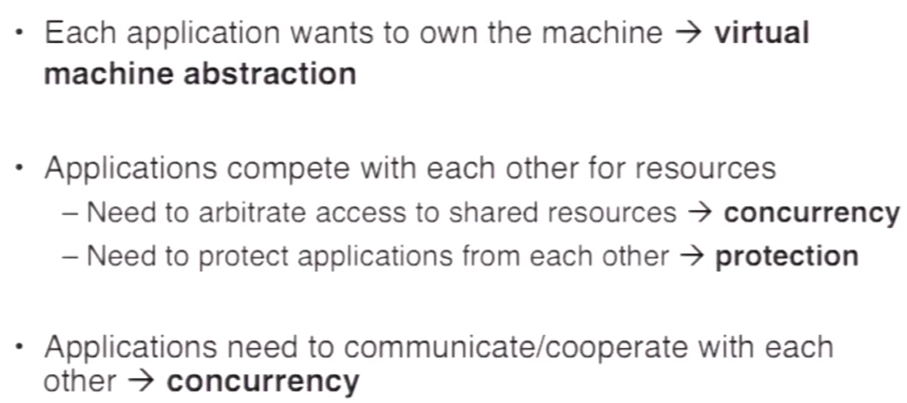

操作系统

根据 [Berkeley CS 162 Operating Systems](https://www.youtube.com/playlist?list=PLRdybCcWDFzCag9A0h1m9QYaujD0xefgM) YouTube网课做的笔记。

## 线程与进程

### 线程

执行单元。

- 没有自己的内存，与其他线程共享进程的内存。

- 有自己的栈，PC 与寄存器。

- 在地址空间内运行，却没有自己的地址空间。	

**上面的特性符合了JVM中线程的特性**

### 单线程编程 vs. 多线程编程

#### 单线程编程

- 同时只有一个线程在运行

  MSDOS，批处理(batch)

- 编程简单，只有一个线程在同一时间访问资源

- 不适用于GUI，因此不适用于PC，因为GUI有很多部件，都要维持着供用户使用，所以单线程显然很难完成

#### 多线程编程

- 所有现代操作系统都是抢占式（pre-emptive）多线程

#### 多线程编程的挑战

### 进程

资源分配与程序执行的单元。

- 有自己的内存（地址空间）
- 其他的系统资源，如 fd（file descriptor）
- 封装了多个线程来共享进程资源

**每个应用程序实例包含了一个或者多个进程**

### 上下文切换

### 线程共享内存

### 超线程 (hyper thread)

为什么当代处理器很多是四核八线程的？因为超线程技术允许在一个物理CPU核心上运行两个或多个线程。

- 超线程架构的CPU核心在硬件层面上提供了额外的线程所需的PC，寄存器，所以可以同时运行多个线程。

- CPU核心数量是不变的，但是线程切换的速度显然提升了。

超线程技术是否给程序加速是相当主观的，需要考虑技术的使用场景。

- 假设两个线程当前执行的代码都是内存访问密集的，一个线程在等待从内存某处取数据，这个时候切换到另外一个线程，另外一个线程也会开始等待从内存某处取数据，这样超线程技术并没有给此时的程序运行提速很多。

- 假设两个线程当前执行的代码，一个是内存访问密集的，另外一个是运算密集的，一个线程在等待从内存某处取数据，这个时候切换到另外一个线程，另外一个线程开始高度使用CPU来进行运算，这样超线程技术会给此时的程序运行提速很多。

超线程的上下文切换开销很高，而且容易造成缓存冲突。

