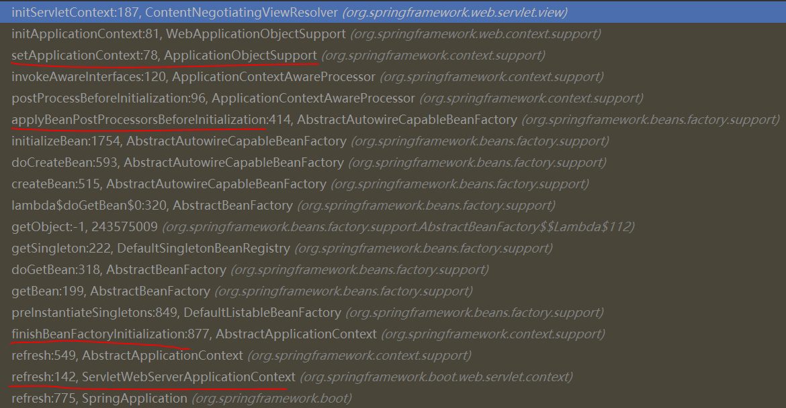

# Spring Boot 笔记


## WebMvcAutoConfiguration

The auto-configuration adds the following features on top of Spring’s defaults:
• Inclusion of ContentNegotiatingViewResolver and BeanNameViewResolver beans.
• Support for serving static resources, including support for WebJars (covered later in this  document)).
• Automatic registration of Converter, GenericConverter, and Formatter beans.
• Support for HttpMessageConverters (covered later in this document).
• Automatic registration of MessageCodesResolver (covered later in this document).
• Static index.html support.
• Custom Favicon support (covered later in this document).
• Automatic use of a ConfigurableWebBindingInitializer bean (covered later in this document).

这些配置都在org.springframework.boot.autoconfigure.web.servlet.WebMvcAutoConfiguration这个Configuration中

### ContentNegotiatingViewResolver

1. 这个Bean主要是组合所有加入容器中的ViewResolver，来适配所有的ViewResolver#resolveViewName()方法

2. 这个Bean在WebMvcAutoConfiguration中的配置如下：

```java
@Bean
@ConditionalOnBean(ViewResolver.class)
@ConditionalOnMissingBean(name = "viewResolver", value = ContentNegotiatingViewResolver.class)
public ContentNegotiatingViewResolver viewResolver(BeanFactory beanFactory) {
   ContentNegotiatingViewResolver resolver = new ContentNegotiatingViewResolver();
   resolver.setContentNegotiationManager(
         beanFactory.getBean(ContentNegotiationManager.class));
   // ContentNegotiatingViewResolver uses all the other view resolvers to locate
   // a view so it should have a high precedence
   resolver.setOrder(Ordered.HIGHEST_PRECEDENCE);
   return resolver;
}
```

由IOC容器原理可以知道，在容器启动时会初始化所有SingletonBean，可见笔记 ：Bean创建：解析、注册Bean definition -> 利用Bean definition实例化Bean、为Bean注入属性值、初始化Bean（调用初始化方法）

因为这个ContentNegotiatingViewResolver继承了ApplicationContextAware，所以会在自定义初始化方法之前，实例化之后，调用其setApplicationContext方法

上述方法有如下的调用栈和被执行的栈顶源码：



```java
@Override
protected void initServletContext(ServletContext servletContext) {
  
	//从ApplicationContext中获取所有ViewResolver.class
   Collection<ViewResolver> matchingBeans =
         BeanFactoryUtils.beansOfTypeIncludingAncestors(obtainApplicationContext(), ViewResolver.class).values();
   if (this.viewResolvers == null) {
      this.viewResolvers = new ArrayList<>(matchingBeans.size());
      for (ViewResolver viewResolver : matchingBeans) {
         if (this != viewResolver) {
            this.viewResolvers.add(viewResolver);
         }
      }
   }
   else {
      for (int i = 0; i < this.viewResolvers.size(); i++) {
         ViewResolver vr = this.viewResolvers.get(i);
         if (matchingBeans.contains(vr)) {
            continue;
         }
         String name = vr.getClass().getName() + i;
         obtainApplicationContext().getAutowireCapableBeanFactory().initializeBean(vr, name);
      }
   }
   AnnotationAwareOrderComparator.sort(this.viewResolvers);
   this.cnmFactoryBean.setServletContext(servletContext);
}
```

**发现其实ContentNegotiatingViewResolver自己会在被初始化时机扫描所有容器中的所有ViewResolver并加入到自己的viewResolvers域中，当然除了自己本身**

ContentNegotiatingViewResolver毕竟是一个ViewResolver，当WebMvc需要视图解析器时，会调用它的resolveViewName方法，而在这个方法中ContentNegotiatingViewResolver实现了来适配容器中所有的ViewResolver#resolveViewName()的目的，所以最后只需要这一个ContentNegotiatingViewResolver就够了

```java
@Override
@Nullable
public View resolveViewName(String viewName, Locale locale) throws Exception {
   RequestAttributes attrs = RequestContextHolder.getRequestAttributes();
   Assert.state(attrs instanceof ServletRequestAttributes, "No current ServletRequestAttributes");
   List<MediaType> requestedMediaTypes = getMediaTypes(((ServletRequestAttributes) attrs).getRequest());
   if (requestedMediaTypes != null) {
        //使用viewResolvers域中的所有解析器解析出视图，加入到candidateViews中
      List<View> candidateViews = getCandidateViews(viewName, locale, requestedMediaTypes);
        //找到最合适的视图
      View bestView = getBestView(candidateViews, requestedMediaTypes, attrs);
      if (bestView != null) {
         return bestView;
      }
   }

   String mediaTypeInfo = logger.isDebugEnabled() && requestedMediaTypes != null ?
         " given " + requestedMediaTypes.toString() : "";
   if (this.useNotAcceptableStatusCode) {
      if (logger.isDebugEnabled()) {
         logger.debug("Using 406 NOT_ACCEPTABLE" + mediaTypeInfo);
      }
      return NOT_ACCEPTABLE_VIEW;
   }
   else {
      logger.debug("View remains unresolved" + mediaTypeInfo);
      return null;
   }
}
```


