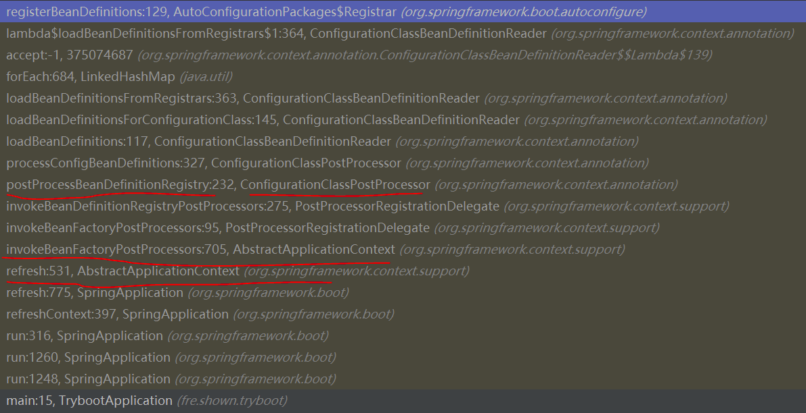
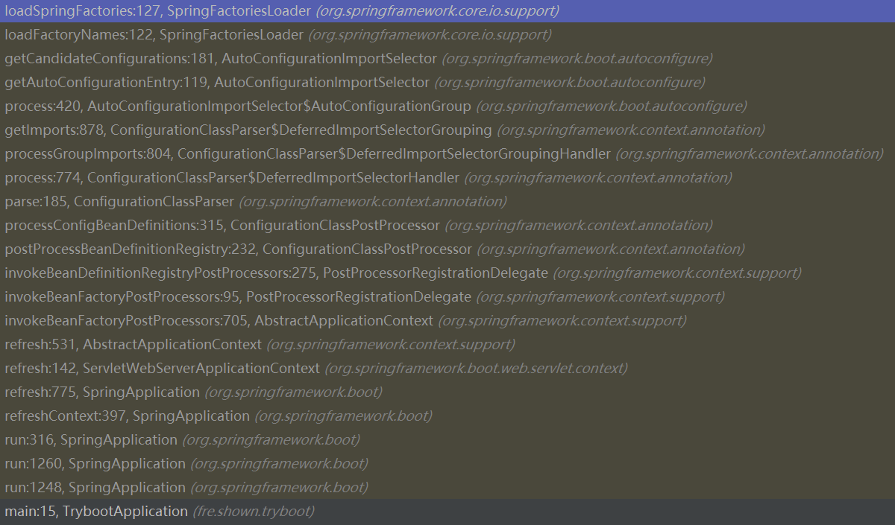
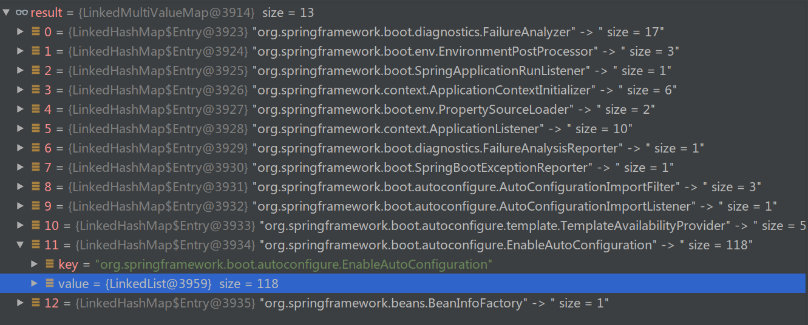
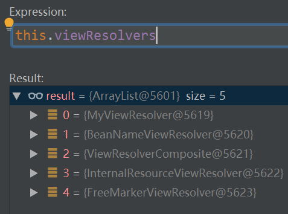
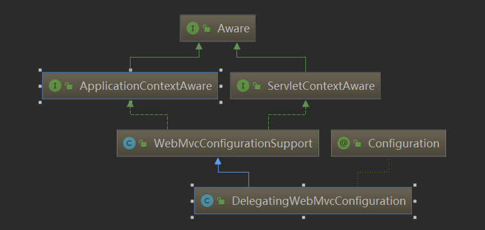
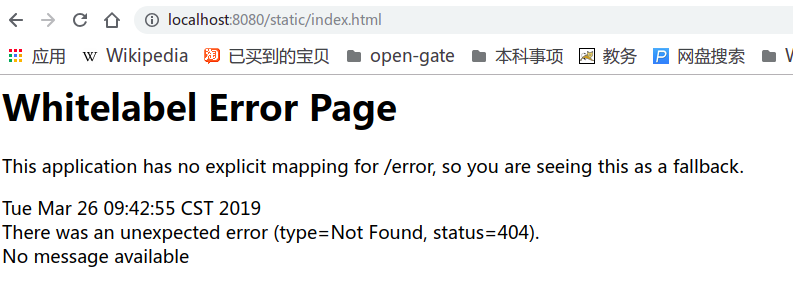
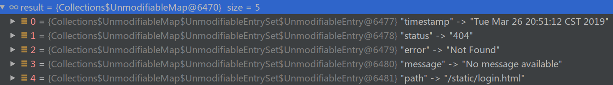
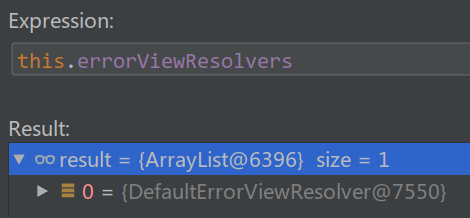

# Spring Boot 笔记

## Spring Boot 自动配置: 以 Mvc 为例

### `@SpringBootApplication`

在启动一个Spring项目时，会在项目启动入口类中写一个`main`方法，并用`@SpringBootApplication`注解标注：

```JAVA
@SpringBootApplication
public class TrybootApplication {
    public static void main(String[] args) {
        SpringApplication.run(TrybootApplication.class, args);
    }
}
```

看看这个注解的Javadoc 和 源码:

> Indicates a configuration class that **declares one or more @Bean methods (@SpringBootConfiguration)** and also **triggers auto-configuration (@EnableAutoConfiguration)** and component scanning . This is a convenience annotation that is equivalent to declaring **@Configuration, @EnableAutoConfiguration and @ComponentScan.**

```JAVA
@SpringBootConfiguration
@EnableAutoConfiguration
@ComponentScan(excludeFilters = {
      @Filter(type = FilterType.CUSTOM, classes = TypeExcludeFilter.class),
      @Filter(type = FilterType.CUSTOM, classes = AutoConfigurationExcludeFilter.class) })
public @interface SpringBootApplication {...}
```

1. `@SpringBootConfiguration`其实就只是一个`@Configuration`标注, 作用是让Spring Boot的入口类里面也可以写配置.

```JAVA
// Indicates that the annotated class provides Spring Boot application @Configuration.
// 因此TrybootApplication里面也可以写@Bean配置, 因为他是一个@Configuration
@Configuration
public @interface SpringBootConfiguration {
}

```

2. `@ComponentScan`开启了类路径下的包扫描
3. `@EnableAutoConfiguration`开启了自动配置, 下面来看一看这个东西

```JAVA
@AutoConfigurationPackage //只是做了简单的引入: @Import(AutoConfigurationPackages.Registrar.class)
@Import(AutoConfigurationImportSelector.class)
public @interface EnableAutoConfiguration {
   String ENABLED_OVERRIDE_PROPERTY = "spring.boot.enableautoconfiguration";
   /**
    * Exclude specific auto-configuration classes such that they will never be applied.
    * @return the classes to exclude
    */
   Class<?>[] exclude() default {};
   /**
    * Exclude specific auto-configuration class names such that they will never be
    * applied.
    * @return the class names to exclude
    * @since 1.3.0
    */
   String[] excludeName() default {};
}
```

`@EnableAutoConfiguration`引入了: 

1. `AutoConfigurationPackages.Registrar`:  是一个`ImportBeanDefinitionRegistrar`  to store the base package from the importing configuration.

2. `AutoConfigurationImportSelector`: 是一个`DeferredImportSelector` to handle auto-configuration.  **能够决定`@Import`最终要引入什么自动配置类, 和自动配置相关**

所以下面重点看:`AutoConfigurationPackages.Registrar`和`AutoConfigurationImportSelector`


#### `AutoConfigurationPackages.Registrar`

> 关于`ImportBeanDefinitionRegistrar`参考Evernote上Spring AOP的一篇笔记 [@EnableAspectJAutoProxy](evernote:///view/9590842/s34/51139bd5-2d92-4a5d-b8ac-6a8311391f4a/51139bd5-2d92-4a5d-b8ac-6a8311391f4a/)

`AutoConfigurationPackages$Register#registerBeanDefinitions` 中的调用栈:



可以看出`AutoConfigurationPackages$Register#registerBeanDefinitions`也是在`ConfigurationClassPostProcessor`执行时被调用的

最后发现`AutoConfigurationPackages.Registrar`用于注册`@SpringBootApplication`标注的类所在包的包名

```JAVA
@Override
public void AutoConfigurationPackages$Registrar#registerBeanDefinitions(AnnotationMetadata metadata, BeanDefinitionRegistry registry) {

    //registers a bean which stores client side configuration package list for reference later.
    //解析出被@SpringBootApplication标注的类所在的包和子包
    //之后注册一个Bean, 保存这些包信息
    //包名可以通过静态方法AutoConfigurationPackages.get()获取
   register(registry, new PackageImport(metadata).getPackageName());
}
```


#### `AutoConfigurationImportSelector`

起主要作用的源码:

```JAVA
@Override
public void AutoConfigurationImportSelector$AutoConfigurationGroup#process(AnnotationMetadata annotationMetadata, DeferredImportSelector deferredImportSelector) {
   Assert.state(
         deferredImportSelector instanceof AutoConfigurationImportSelector,
         () -> String.format("Only %s implementations are supported, got %s",
               AutoConfigurationImportSelector.class.getSimpleName(),
               deferredImportSelector.getClass().getName()));
    //
   AutoConfigurationEntry autoConfigurationEntry = ((AutoConfigurationImportSelector) deferredImportSelector)
         .getAutoConfigurationEntry(getAutoConfigurationMetadata(),
               annotationMetadata);
   this.autoConfigurationEntries.add(autoConfigurationEntry);
   for (String importClassName : autoConfigurationEntry.getConfigurations()) {
      this.entries.putIfAbsent(importClassName, annotationMetadata);
   }
}
```

调用栈和源码能够告诉从哪里取出来这些类名：



```JAVA
// The location to look for factories.
// Can be present in multiple JAR files.
public static final String FACTORIES_RESOURCE_LOCATION = "META-INF/spring.factories";

private static Map<String, List<String>> loadSpringFactories(@Nullable ClassLoader classLoader) {
   MultiValueMap<String, String> result = cache.get(classLoader);
   if (result != null) {
      return result;
   }
   try {
       //从FACTORIES_RESOURCE_LOCATION获取资源和系统资源
      Enumeration<URL> urls = (classLoader != null ?
            classLoader.getResources(FACTORIES_RESOURCE_LOCATION) :
            ClassLoader.getSystemResources(FACTORIES_RESOURCE_LOCATION));
       
      result = new LinkedMultiValueMap<>();
      while (urls.hasMoreElements()) {
         URL url = urls.nextElement();
         UrlResource resource = new UrlResource(url);
         Properties properties = PropertiesLoaderUtils.loadProperties(resource);
         for (Map.Entry<?, ?> entry : properties.entrySet()) {
            String factoryClassName = ((String) entry.getKey()).trim();
            for (String factoryName : StringUtils.commaDelimitedListToStringArray((String) entry.getValue())) {
               result.add(factoryClassName, factoryName.trim());
            }
         }
      }
       
	// 扫描所有类路径下的 META-INF/spring.factories之后，把对应的类和需要的组件绑定起来加入到缓存中
     // 下次这个方法再被调用, 如果缓存中有将直接从缓存中取出
      cache.put(classLoader, result);
      return result;
   }
   catch (IOException ex) {
      throw new IllegalArgumentException("Unable to load factories from location [" +
            FACTORIES_RESOURCE_LOCATION + "]", ex);
   }
}
```

最后就可以知道，扫描的是所有类路径下的 META-INF/spring.factories .

**其实最后是从缓存中取出，为什么走缓存呢？**

通过在调用栈最上层打断点就可以发现，整个应用 (Spring Boot Application) 在执行到构造方法的阶段就执行过一次`SpringFactoriesLoader#loadSpringFactories`方法, 且factoryClass参数传入的是`org.springframework.context.ApplicationContextInitializer`

**有且只有这一次走到了下面的try代码块, 会把扫描到的所有类路径下的`META-INF/spring.factories`中的工厂类和其所需组件都加入result(一个LinkedMultiValueMap)，并加入缓存，所以之后再取就是从缓存中取出来了**

```JAVA
public static List<String> loadFactoryNames(Class<?> factoryClass, @Nullable ClassLoader classLoader) {
   String factoryClassName = factoryClass.getName();
    // 根据工厂类类名加载所需组件，本例中传入的是 EnableAutoConfiguration.class.getName()
   return loadSpringFactories(classLoader).getOrDefault(factoryClassName, Collections.emptyList());
}
```

如图所示, 走缓存出来的结果(直接返回): 

```JAVA
   if (result != null) {
      return result;
   }
```



------

举几个被加入的组件的例子: 

1. org.springframework.boot.autoconfigure.web.servlet.HttpEncodingAutoConfiguration 用来配置HTTP编码
2. org.springframework.boot.autoconfigure.http.HttpProperties 封装配置的所有属性
3. org.springframework.boot.autoconfigure.web.servlet.WebMvcAutoConfiguration 用来配置WebMvc
4. org.springframework.boot.autoconfigure.web.servlet.WebMvcProperties 封装配置的所有属性

另外注意: 

- 自动配置类由于添加了很多@Conditional限定条件，所以在一定条件下才会生效
- 可以通过在`application.yml`中启用`debug: true`打开 `CONDITIONS EVALUATION REPORT` 来查看哪些配置类生效


### `WebMvcAutoConfiguration`做了些什么

- The auto-configuration adds the following features on top of Spring’s defaults:
  - Inclusion of `ContentNegotiatingViewResolver` and `BeanNameViewResolver` beans.
  - Support for serving static resources, including support for WebJars (covered [later in this document](https://docs.spring.io/spring-boot/docs/2.1.3.RELEASE/reference/htmlsingle/#boot-features-spring-mvc-static-content))).
  - Automatic registration of `Converter`, `GenericConverter`, and `Formatter` beans.
  - Support for `HttpMessageConverters` (covered [later in this document](https://docs.spring.io/spring-boot/docs/2.1.3.RELEASE/reference/htmlsingle/#boot-features-spring-mvc-message-converters)).
  - Automatic registration of `MessageCodesResolver` (covered [later in this document](https://docs.spring.io/spring-boot/docs/2.1.3.RELEASE/reference/htmlsingle/#boot-features-spring-message-codes)).
  - Static `index.html` support.
  - Custom `Favicon` support (covered [later in this document](https://docs.spring.io/spring-boot/docs/2.1.3.RELEASE/reference/htmlsingle/#boot-features-spring-mvc-favicon)).
  - Automatic use of a `ConfigurableWebBindingInitializer` bean (covered [later in this document](https://docs.spring.io/spring-boot/docs/2.1.3.RELEASE/reference/htmlsingle/#boot-features-spring-mvc-web-binding-initializer)).

这些配置都在org.springframework.boot.autoconfigure.web.servlet.WebMvcAutoConfiguration这个Configuration组件中，下面具体分析Spring Boot中的视图解析器 `ContentNegotiatingViewResolver`

------

#### `ContentNegotiatingViewResolver`

1. 这个Bean作用是组合所有加入容器中的`ViewResolver`，来适配容器中所有的`ViewResolver#resolveViewName()`方法
2. 这个Bean在`WebMvcAutoConfiguration`中的配置如下：

```java
@Bean
@ConditionalOnBean(ViewResolver.class)
@ConditionalOnMissingBean(name = "viewResolver", value = ContentNegotiatingViewResolver.class)
public ContentNegotiatingViewResolver viewResolver(BeanFactory beanFactory) {
   ContentNegotiatingViewResolver resolver = new ContentNegotiatingViewResolver();
   resolver.setContentNegotiationManager(
         beanFactory.getBean(ContentNegotiationManager.class));
   // ContentNegotiatingViewResolver uses all the other view resolvers to locate
   // a view so it should have a high precedence
   resolver.setOrder(Ordered.HIGHEST_PRECEDENCE);
   return resolver;
}
```

3. 由IOC容器原理可以知道，在容器启动时会初始化所有的 Singleton Bean，过程为：
   - 解析、注册Bean definition
   - 利用Bean definition实例化Bean
   - 利用Bean definition为Bean注入属性值
   - 初始化Bean（调用初始化方法）
4. 因为这个`ContentNegotiatingViewResolver`继承了`ApplicationContextAware`，所以会在自定义初始化方法之前，实例化之后，调用其`ApplicationContextAware#setApplicationContext()`方法
5. 上述方法有如下的调用栈和被执行的栈顶源码：


```java
@Override
protected void initServletContext(ServletContext servletContext) {
  
	//从ApplicationContext中获取所有是ViewResolver.class的Bean
   Collection<ViewResolver> matchingBeans =
         BeanFactoryUtils.beansOfTypeIncludingAncestors(obtainApplicationContext(), ViewResolver.class).values();
   if (this.viewResolvers == null) {
      this.viewResolvers = new ArrayList<>(matchingBeans.size());
      for (ViewResolver viewResolver : matchingBeans) {
         if (this != viewResolver) {
            this.viewResolvers.add(viewResolver);
         }
      }
   }
   else {
      for (int i = 0; i < this.viewResolvers.size(); i++) {
         ViewResolver vr = this.viewResolvers.get(i);
         if (matchingBeans.contains(vr)) {
            continue;
         }
         String name = vr.getClass().getName() + i;
         obtainApplicationContext().getAutowireCapableBeanFactory().initializeBean(vr, name);
      }
   }
   AnnotationAwareOrderComparator.sort(this.viewResolvers);
   this.cnmFactoryBean.setServletContext(servletContext);
}
```

6. **发现其实`ContentNegotiatingViewResolver`自己会在被初始化时机扫描所有容器中的所有`ViewResolver`并加入到自己的`viewResolvers`域中，当然除了自己本身**

7. `ContentNegotiatingViewResolver`毕竟是一个`ViewResolver`，当`WebMvc`需要视图解析器时，会调用它的`resolveViewName`方法，而在这个方法中`ContentNegotiatingViewResolver`遍历调用了自己的`viewResolvers`域的所有`ViewResolver#resolveViewName()`，所以在解析视图时只需要调用这一个`ViewResolver`即`ContentNegotiatingViewResolver`的方法就够了

```java
@Override
@Nullable
public View resolveViewName(String viewName, Locale locale) throws Exception {
   RequestAttributes attrs = RequestContextHolder.getRequestAttributes();
   Assert.state(attrs instanceof ServletRequestAttributes, "No current ServletRequestAttributes");
   List<MediaType> requestedMediaTypes = getMediaTypes(((ServletRequestAttributes) attrs).getRequest());
   if (requestedMediaTypes != null) {
        //使用viewResolvers域中的所有解析器解析出视图，加入到candidateViews中
      List<View> candidateViews = getCandidateViews(viewName, locale, requestedMediaTypes);
        //找到最合适的视图
      View bestView = getBestView(candidateViews, requestedMediaTypes, attrs);
      if (bestView != null) {
         return bestView;
      }
   }

   String mediaTypeInfo = logger.isDebugEnabled() && requestedMediaTypes != null ?
         " given " + requestedMediaTypes.toString() : "";
   if (this.useNotAcceptableStatusCode) {
      if (logger.isDebugEnabled()) {
         logger.debug("Using 406 NOT_ACCEPTABLE" + mediaTypeInfo);
      }
      return NOT_ACCEPTABLE_VIEW;
   }
   else {
      logger.debug("View remains unresolved" + mediaTypeInfo);
      return null;
   }
}
```

8. 配置自定义的`ViewResolver`

   ```JAVA
   @Component
   public class MyViewResolver implements ViewResolver {
       @Override
       public View resolveViewName(String viewName, Locale locale) throws Exception {
           return null;
       }
   }
   ```

   只需要这样就可以了，在上面的代码中打一个断点就能发现自定义的`ViewResolver`已经被加入到`ContentNegotiatingViewResolver#viewResolvers`之中了，可以发挥自己的解析视图的功能

   

其实其他的所有配置也一样，只需要在容器中加入自定义配置的类就可以工作了。


### Spring Boot 中的 Mvc 配置原理

由上面的例子可以看出，如果想在在Spring Boot 中加入用户自定义配置，只需要把组件加入到容器中就行了

- 如果这个配置是单个配置类决定的，自定义配置会覆盖Spring Boot自动配置
- 如果像`ViewResolver`一样可以由多个类来决定，那么Spring Boot也会使用到自定义组件

为什么可以这样呢？在学Spring Mvc的时候是这么配置的：

```java
@Configuration
@EnableWebMvc
@ComponentScan(basePackages = {"shown.controller"})
public class ServletConfig implements WebMvcConfigurer {

    @Override
    public void configureDefaultServletHandling(DefaultServletHandlerConfigurer configurer) {
        configurer.enable();
    }

    @Bean
    public ViewResolver viewResolver() {

        InternalResourceViewResolver resolver =
                new InternalResourceViewResolver();
        resolver.setPrefix("/WEB-INF/view/");
        resolver.setSuffix(".jsp");
        resolver.setExposeContextBeansAsAttributes(true);
        return resolver;
    }
}
```

通过`@EnableWebMvc` Java doc 可知：

- `@EnableWebMvc`将会开启mvc模块的配置，使用`WebMvcConfigurationSupport`中提供的web Mvc默认配置
- 如果想要自定义配置，应继承`WebMvcConfigurer`，它当中的方法会覆盖`WebMvcConfigurationSupport`默认配置

下面看一下源码和继承关系：

```JAVA
@Import(DelegatingWebMvcConfiguration.class)
public @interface EnableWebMvc {
}
```



```JAVA
// A subclass of WebMvcConfigurationSupport that detects and delegates to all beans of type WebMvcConfigurer allowing them to customize the configuration provided by WebMvcConfigurationSupport. This is the class actually imported by @EnableWebMvc.

@Configuration
public class DelegatingWebMvcConfiguration extends WebMvcConfigurationSupport {

	private final WebMvcConfigurerComposite configurers = new WebMvcConfigurerComposite();


	@Autowired(required = false)
	public void setConfigurers(List<WebMvcConfigurer> configurers) {
		if (!CollectionUtils.isEmpty(configurers)) {
			this.configurers.addWebMvcConfigurers(configurers);
		}
	}
    
    ...
}
```

从源码和继承关系以及``DelegatingWebMvcConfiguration`Java doc中可以得到：

1. `@EnableWebMvc`通过`@Import`引入`DelegatingWebMvcConfiguration`来进行mvc默认配置的原因是，`DelegatingWebMvcConfiguration`继承了`WebMvcConfigurationSupport`

2. `@Configuration`类可以通过继承`WebMvcConfigurer`并重写方法来实现对默认配置的覆盖的原因是，容器中所有`WebMvcConfigurer`组件都会被加入到`DelegatingWebMvcConfiguration`域中，并调用其中自定义的配置方法，这也**体现出`DelegatingWebMvcConfiguration`的代理作用**

   

转过来看一下Spring Boot 的`WebMvcAutoConfiguration$WebMvcAutoConfigurationAdapter`和

`WebMvcAutoConfiguration$EnableWebMvcConfiguration`

```java
	// Defined as a nested config to ensure WebMvcConfigurer is not read when not
	// on the classpath
	@Configuration
	@Import(EnableWebMvcConfiguration.class)
	@EnableConfigurationProperties({ WebMvcProperties.class, ResourceProperties.class })
	@Order(0)
	public static class WebMvcAutoConfigurationAdapter
			implements WebMvcConfigurer, ResourceLoaderAware {
    }
```

```JAVA
// Configuration equivalent to @EnableWebMvc.
	@Configuration
	public static class EnableWebMvcConfiguration extends DelegatingWebMvcConfiguration {
    }
```

可以发现：

- `WebMvcAutoConfigurationAdapter`继承了`WebMvcConfigurer`并引入了相当于`@EnableWebMvc`注解的`EnableWebMvcConfiguration`

- 因为`EnableWebMvcConfiguration`继承了`DelegatingWebMvcConfiguration`，Java doc 才说其与`@EnableWebMvc`等效


### 自定义配置 mvc 或者完全覆盖 MVC

- 如果想要自定义部分的配置，只需要加入相对应的组件，或者写自己的`WebMvcConfigurer`并加入到容器中。可以参考官方文档。
  - If you want to keep Spring Boot MVC features and you want to add additional [MVC configuration](https://docs.spring.io/spring/docs/5.1.5.RELEASE/spring-framework-reference/web.html#mvc) (interceptors, formatters, view controllers, and other features), you can add your own `@Configuration` class of type `WebMvcConfigurer` but **without** `@EnableWebMvc`. If you wish to provide custom instances of `RequestMappingHandlerMapping`, `RequestMappingHandlerAdapter`, or `ExceptionHandlerExceptionResolver`, you can declare a `WebMvcRegistrationsAdapter` instance to provide such components.


- 如果需要完全接管 mvc 配置，参考官方文档。
  - If you want to take complete control of Spring MVC, you can add your own `@Configuration` annotated with `@EnableWebMvc`.

为什么自定义的 `@EnableWebMvc`加上`@Configuration`可以完全接管 MVC？看一下源码就很明白了

```
@Configuration
@ConditionalOnWebApplication(type = Type.SERVLET)
@ConditionalOnClass({ Servlet.class, DispatcherServlet.class, WebMvcConfigurer.class })
@ConditionalOnMissingBean(WebMvcConfigurationSupport.class)
public class WebMvcAutoConfiguration {
}
```

`@ConditionalOnMissingBean(WebMvcConfigurationSupport.class)`是在`BeanDefinition`注册之后，所有单例Bean实例化之前进行判断的。


## Spring Boot 集成 Freemarker

### 如何用Freemarker表示项目的contextPath?

首先在配置文件中加入 

spring.freemarker.request-context-attribute=request

然后在模板文件中可以这样使用

var url='${request.contextPath}/public/wxmember/save';


## Spring Boot 错误处理机制(/error)

### 默认的错误处理机制: `ErrorMvcAutoConfiguration`

如果一个请求发过来, Spring Boot 在处理过程中出现了错误, 如4XX, 5XX, 程序代码抛出Exception等等, Spring Boot会直接把请求forward到/error(由`server.error.path`设置). 先看看/error默认返回的结果

#### 默认错误页面



#### 自动配置的组件

1. `DefaultErrorAttributes` : 为`basicErrorController`提供错误的一些信息. 功能提供方式如下: 

   ```JAVA
   public interface ErrorAttributes {
   
   	/**
   	 * Returns a {@link Map} of the error attributes. The map can be used as the model of
   	 * an error page {@link ModelAndView}, or returned as a {@link ResponseBody}.
   	 * @param webRequest the source request
   	 * @param includeStackTrace if stack trace elements should be included
   	 * @return a map of error attributes
   	 */
   	Map<String, Object> getErrorAttributes(WebRequest webRequest,
   			boolean includeStackTrace);
   
   	/**
   	 * Return the underlying cause of the error or {@code null} if the error cannot be
   	 * extracted.
   	 * @param webRequest the source request
   	 * @return the {@link Exception} that caused the error or {@code null}
   	 */
   	Throwable getError(WebRequest webRequest);
   
   }
   ```

   从Javadoc轻易看出返回的`DefaultErrorAttributes#getErrorAttributes`返回的信息: 
   timestamp - The time that the errors were extracted
   status - The status code
   error - The error reason
   exception - The class name of the root exception (if configured)
   message - The exception message
   errors - Any ObjectErrors from a BindingResult exception
   trace - The exception stack trace
   path - The URL path when the exception was raised

   

2. `BasicErrorController` : 默认handle所有错误请求的控制器

```JAVA
	@Bean
	//只有当容器中没有ErrorController, 才会被注册
	@ConditionalOnMissingBean(value = ErrorController.class, search = SearchStrategy.CURRENT)
	public BasicErrorController basicErrorController(ErrorAttributes errorAttributes) {
		return new BasicErrorController(errorAttributes, this.serverProperties.getError(),
				this.errorViewResolvers);
	}
```

```JAVA
@Controller
//handle server.error.path配置的请求, 默认是/error
//因为直接从properties中取值, 所以不管server.error.path改成什么
//只要没有自定义的ErrorController(参照上面的ConditionalOnMissingBean配置)
//所有在处理的过程中出现错误的请求都会交给这个控制器处理
@RequestMapping("${server.error.path:${error.path:/error}}")
public class BasicErrorController extends AbstractErrorController {
    
    //处理HTTP Request Header中accept: text/html的处理过程中发生错误的请求
    //默认返回的ModelAndView是包含错误信息的whitelabel
	@RequestMapping(produces = MediaType.TEXT_HTML_VALUE)
	public ModelAndView BasicErrorController#errorHtml(HttpServletRequest request,
			HttpServletResponse response) {
		HttpStatus status = getStatus(request);
        //model包含了DefaultErrorAttributes#getErrorAttributes从request中取出的错误信息, 见下图
		Map<String, Object> model = Collections.unmodifiableMap(getErrorAttributes(
				request, isIncludeStackTrace(request, MediaType.TEXT_HTML)));
        //设置响应信息
		response.setStatus(status.value());
        //解析ErrorView, 见下面的代码
		ModelAndView modelAndView = resolveErrorView(request, response, status, model);
		return (modelAndView != null) ? modelAndView : new ModelAndView("error", model);
	}
    
    //处理其他非accept: text/html的处理过程中发生错误的请求, 返回JSON
    	@RequestMapping
	public ResponseEntity<Map<String, Object>> error(HttpServletRequest request) {
		Map<String, Object> body = getErrorAttributes(request,
				isIncludeStackTrace(request, MediaType.ALL));
		HttpStatus status = getStatus(request);
		return new ResponseEntity<>(body, status);
	}
    (接着往下看)
```

Model是从request中取出的错误信息, 正好对应了`DefaultErrorAttributes#getErrorAttributes`的返回值



```JAVA
	//解析ErrorView
	protected ModelAndView resolveErrorView(HttpServletRequest request,
			HttpServletResponse response, HttpStatus status, Map<String, Object> model) {
        //默认情况下, errorViewResolvers只包含一个DefaultErrorViewResolver, 如下图所示
		for (ErrorViewResolver resolver : this.errorViewResolvers) {
			ModelAndView modelAndView = resolver.resolveErrorView(request, status, model);
			if (modelAndView != null) {
				return modelAndView;
			}
		}
		return null;
	}
```



所以默认情况下错误请求会在封装好包含错误信息的Model后交给`DefaultErrorViewResolver`

3. `DefaultErrorViewResolver `: 默认用来解析出错误视图的控制器,

   核心方法: 

   ```JAVA
   	ModelAndView resolveErrorView(HttpServletRequest request, HttpStatus status,
   			Map<String, Object> model);
   ```

   在`ErrorMvcAutoConfiguration`中的配置: 

```JAVA
	@Configuration
	static class DefaultErrorViewResolverConfiguration {

		private final ApplicationContext applicationContext;

		private final ResourceProperties resourceProperties;

		DefaultErrorViewResolverConfiguration(ApplicationContext applicationContext,
				ResourceProperties resourceProperties) {
			this.applicationContext = applicationContext;
			this.resourceProperties = resourceProperties;
		}

		@Bean
		@ConditionalOnBean(DispatcherServlet.class)
		@ConditionalOnMissingBean
		public DefaultErrorViewResolver conventionErrorViewResolver() {
			return new DefaultErrorViewResolver(this.applicationContext,
					this.resourceProperties);
		}

	}
```

继承的功能接口: 

```JAVA
public interface ErrorViewResolver {
	/**
	Resolve an error view for the specified details.
	Params:
	request – the source request
	status – the http status of the error
	model – the suggested model to be used with the view
	Returns: a resolved ModelAndView or null
	*/
	ModelAndView resolveErrorView(HttpServletRequest request, HttpStatus status,
			Map<String, Object> model);
}
```

源码: 

```JAVA
public class DefaultErrorViewResolver implements ErrorViewResolver, Ordered {
    
    private static final Map<Series, String> SERIES_VIEWS;

	static {
		Map<Series, String> views = new EnumMap<>(Series.class);
		views.put(Series.CLIENT_ERROR, "4xx");
		views.put(Series.SERVER_ERROR, "5xx");
		SERIES_VIEWS = Collections.unmodifiableMap(views);
	}
    
	@Override
    //2.中最后调用到这个方法
	public ModelAndView resolveErrorView(HttpServletRequest request, HttpStatus status,
			Map<String, Object> model) {
        //先严格按照错误代码找view, 如404会按照静态资源查找规则找error/404.html
		ModelAndView modelAndView = resolve(String.valueOf(status.value()), model);
		if (modelAndView == null && SERIES_VIEWS.containsKey(status.series())) {
            //如果找不到, 再按照错误代码对应的SERIES_VIEWS找view
            //如404会按照静态资源查找规则找error/4xx.html 
			modelAndView = resolve(SERIES_VIEWS.get(status.series()), model);
		}
		return modelAndView;
	}

	private ModelAndView resolve(String viewName, Map<String, Object> model) {
		String errorViewName = "error/" + viewName;
		TemplateAvailabilityProvider provider = this.templateAvailabilityProviders
				.getProvider(errorViewName, this.applicationContext);
		if (provider != null) {
			return new ModelAndView(errorViewName, model);
		}
		return resolveResource(errorViewName, model);
	}

	private ModelAndView resolveResource(String viewName, Map<String, Object> model) {
		for (String location : this.resourceProperties.getStaticLocations()) {
			try {
				Resource resource = this.applicationContext.getResource(location);
                //找对应的html错误页面
				resource = resource.createRelative(viewName + ".html");
				if (resource.exists()) {
					return new ModelAndView(new HtmlResourceView(resource), model);
				}
			}
			catch (Exception ex) {
			}
		}
		return null;
	}
}
```

4. `WhitelabelErrorViewConfiguration`中的`StaticView`: 默认的HTML和错误页面, 不再多说

### 自定义错误页面

三种方法: 

- 实现`ErrorController`, 完全接管错误处理的所有步骤, 从接管`server.error.path`设置的若处理过程中发生错误会转发到的错误请求开始, 知道返回错误响应信息(或许是HTML)

- 实现`ErrorViewResolver`, 自己定制页面, 同时可以取得错误信息
- 在静态资源访问路径下加入 error/4xx.html, error/5xx.html


## Spring boot 与 自定义yml配置指南

记一次我自定义在yml文件中配置 Spring security Oauth2 Server 中客户端认证信息的过程.

**我写的`Oauth2ServerClientsProperties`, 用来装载在yml中配置的客户端认证信息.**

```JAVA
@ConfigurationProperties(prefix = "security.oauth2.server")
public class Oauth2ServerClientsProperties {

    private Map<String, Oauth2ClientProperties> clients = new LinkedHashMap<>();

    public Map<String, Oauth2ClientProperties> getClients() {
        return clients;
    }

    public void setClients(Map<String, Oauth2ClientProperties> clients) {
        this.clients = clients;
    }

    public static class Oauth2ClientProperties {

        private String clientId;

        private String[] authorizedGrantTypes = {};

        private String[] authorities = {};

        private Integer accessTokenValiditySeconds;

        private Integer refreshTokenValiditySeconds;

        private String[] scopes = {};

        private String[] autoApproveScopes = {};

        private String secret;

        private String[] redirectUris = {};

        private String[] resourceIds = {};

        private boolean autoApprove;

        //getter&setter省略
    }
}

```

**对应的yml配置也可以当做范本**:

```YML
security:
  oauth2:
    server:
      clients:
        client:
          client-id: client
          secret: radon
          authorized-grant-types:
            - authorization_code
            - refresh_token
          redirectUris: /redirect
          scopes: client

        web:
          client-id: web
          secret: radon
          authorized-grant-types:
            - password
            - refresh_token
          scopes: ui

        account-service:
          client-id: account-service
          secret: radon
          authorized-grant-types:
            - client_credentials
            - refresh_token
          scopes: server
```

**最后是取出值并传入原配置方式之中**:

```JAVA
@EnableAuthorizationServer
//引入装载的配置
@EnableConfigurationProperties(Oauth2ServerClientsProperties.class)
@Configuration
public class Oauth2ServerConfig extends AuthorizationServerConfigurerAdapter {
    
        @Override
    public void configure(ClientDetailsServiceConfigurer clients) throws Exception {

        //基于YML配置, 请在配置文件中添加相关配置
        InMemoryClientDetailsServiceBuilder inMemoryClientDetailsServiceBuilder = 
            clients.inMemory();

        //取出clients中的值并一一配置, Oauth2ClientProperties和官方的ClientBuilder是对应关系
        for (Oauth2ServerClientsProperties.Oauth2ClientProperties client : 
             oauth2ServerClientsProperties.getClients().values()) {
            ClientDetailsServiceBuilder.ClientBuilder builder = 
                inMemoryClientDetailsServiceBuilder
                //withClient会new一个ClientBuilder返回
                    .withClient(client.getClientId())
                    .authorizedGrantTypes(client.getAuthorizedGrantTypes())
                    .authorities(client.getAuthorities())
                    .scopes(client.getScopes())
                    .autoApprove(client.getAutoApproveScopes())
                    .autoApprove(client.isAutoApprove())
                    .secret(client.getSecret())
                    .redirectUris(client.getRedirectUris())
                    .resourceIds(client.getResourceIds());

            //由于配置方法的参数是原始类型, 必须进行非空校验再传入
            if (client.getAccessTokenValiditySeconds() != null) {
                builder.accessTokenValiditySeconds(client.getAccessTokenValiditySeconds());
            }
            if (client.getAccessTokenValiditySeconds() != null) {
                builder.refreshTokenValiditySeconds(client.getRefreshTokenValiditySeconds());
            }
        }
    }
}
```

