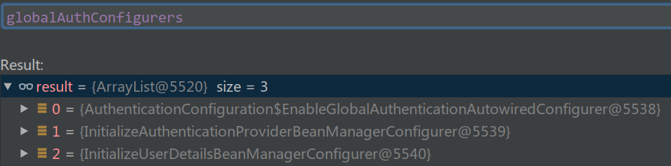

# Spring Security 原理

## Spring Security 核心组件

### SecurityContext

SecurityContext 即安全上下文，关联当前用户的安全信息。用户通过 Spring Security 的校验之后，SecurityContext 会存储验证信息，下文提到的 Authentication 对象包含当前用户的身份信息。SecurityContext 的接口签名如清单 1 所示:

##### 清单 1. SecurityContext 的接口签名

```JAVA
public interface SecurityContext extends Serializable {
       Authentication getAuthentication();
       void setAuthentication(Authentication authentication);
}
```

SecurityContext 存储在 SecurityContextHolder 中。

### SecurityContextHolder

SecurityContextHolder 存储 SecurityContext 对象。SecurityContextHolder 是一个存储代理，有三种存储模式分别是：

- MODE_THREADLOCAL：SecurityContext 存储在线程中。
- MODE_INHERITABLETHREADLOCAL：SecurityContext 存储在线程中，但子线程可以获取到父线程中的 SecurityContext。
- MODE_GLOBAL：SecurityContext 在所有线程中都相同。

SecurityContextHolder 默认使用 MODE_THREADLOCAL 模式，SecurityContext 存储在当前线程中。调用 SecurityContextHolder 时不需要显示的参数传递，在当前线程中可以直接获取到 SecurityContextHolder 对象。但是对于很多 C 端的应用（音乐播放器，游戏等等），用户登录完毕，在软件的整个生命周期中只有当前登录用户，面对这种情况 SecurityContextHolder 更适合采用 MODE_GLOBAL 模式，SecurityContext 相当于存储在应用的进程中，SecurityContext 在所有线程中都相同。

### Authentication

Authentication 即验证，表明当前用户是谁。什么是验证，比如一组用户名和密码就是验证，当然错误的用户名和密码也是验证，只不过 Spring Security 会校验失败。Authentication 接口签名如清单 2 所示:

##### 清单 2. Authentication 的接口签名

```JAVA
public interface Authentication extends Principal, Serializable {
       Collection<? extends GrantedAuthority> getAuthorities();
       Object getCredentials();
       Object getDetails();
       Object getPrincipal();
       boolean isAuthenticated();
       void setAuthenticated(boolean isAuthenticated);
}
```

Authentication 是一个接口，实现类都会定义 authorities，credentials，details，principal，authenticated 等字段，具体含义如下：

- `getAuthorities`: 获取用户权限，一般情况下获取到的是用户的角色信息。
- `getCredentials`: 获取证明用户认证的信息，通常情况下获取到的是密码等信息。
- `getDetails`: 获取用户的额外信息，比如 IP 地址、经纬度等。
- `getPrincipal`: 获取用户身份信息，在未认证的情况下获取到的是用户名，在已认证的情况下获取到的是 UserDetails (暂时理解为，当前应用用户对象的扩展)。
- `isAuthenticated`: 获取当前 Authentication 是否已认证。
- `setAuthenticated`: 设置当前 Authentication 是否已认证。

在验证前，principal 填充的是用户名，credentials 填充的是密码，detail 填充的是用户的 IP 或者经纬度之类的信息。通过验证后，Spring Security 对 Authentication 重新注入，principal 填充用户信息（包含用户名、年龄等）, authorities 会填充用户的角色信息，authenticated 会被设置为 true。重新注入的 Authentication 会被填充到 SecurityContext 中。

### UserDetails

UserDetails 提供 Spring Security 需要的用户核心信息。UserDetails 的接口签名如清单 3 所示:

##### 清单 3. UserDetails 的接口签名

```JAVA
public interface UserDetails extends Serializable {
       Collection<? extends GrantedAuthority> getAuthorities();
       String getPassword();
       String getUsername();
       boolean isAccountNonExpired();
       boolean isAccountNonLocked();
       boolean isCredentialsNonExpired();
       boolean isEnabled();
}
```

UserDetails 用 `isAccountNonExpired`, `isAccountNonLocked`，`isCredentialsNonExpired`，`isEnabled` 表示用户的状态（与下文中提到的 `DisabledException`，`LockedException`，`BadCredentialsException` 相对应），具体含义如下：

- `getAuthorites`：获取用户权限，本质上是用户的角色信息。
- `getPassword`: 获取密码。
- `getUserName`: 获取用户名。
- `isAccountNonExpired`: 账户是否过期。
- `isAccountNonLocked`: 账户是否被锁定。
- `isCredentialsNonExpired`: 密码是否过期。
- `isEnabled`: 账户是否可用。

UserDetails 也是一个接口，实现类都会继承当前应用的用户信息类，并实现 UserDetails 的接口。假设应用的用户信息类是 User，自定义的 CustomUserdetails 继承 User 类并实现 UserDetails 接口。

### AuthenticationManager

AuthenticationManager 负责校验 Authentication 对象。在 AuthenticationManager 的 authenticate 函数中，开发人员实现对 Authentication 的校验逻辑。如果 authenticate 函数校验通过，正常返回一个重新注入的 Authentication 对象；校验失败，则抛出 AuthenticationException 异常。authenticate 函数签名如清单 4 所示:

##### 清单 4. authenticate 函数签名

```JAVA
Authentication authenticate(Authentication authentication)throws AuthenticationException;
```

AuthenticationManager 可以将异常抛出的更加明确：

- 当用户不可用时抛出 `DisabledException`。
- 当用户被锁定时抛出 `LockedException`。
- 当用户密码错误时抛出 `BadCredentialsException`。

重新注入的 Authentication 会包含当前用户的详细信息，并且被填充到 SecurityContext 中，这样 Spring Security 的验证流程就完成了，Spring Security 可以识别到 "你是谁"


### FilterChainProxy

FilterChaniProxy 是 FilterChain 代理。

FilterChain 维护了一个 Filter 队列，这些 Filter 为 Spring Security 提供了强大的功能。

**Spring Security 在 Web 中的入口是 `javax.servlet.Filter`。**

- Spring Security 在 Filter 中创建 Authentication 对象，并调用 AuthenticationManager 进行校验。
- Spring Security 选择 Filter，而没有采用上文中 Controller 的方式有以下优点。
- Spring Security 依赖 J2EE 标准，无需依赖特定的 MVC 框架。
- 另一方面 Spring MVC 通过 Servlet 做请求转发，如果 Spring Security 采用 Servlet，那么 Spring Security 和 Spring MVC 的集成会存在问题。
- FilterChain 维护了很多 Filter，每个 Filter 都有自己的功能，因此在 Spring Security 中添加新功能时，推荐通过 Filter 的方式来实现。

### ProviderManager

**ProviderManager 是 AuthenticationManager 的实现类。**

ProviderManager 并没有实现对 Authentication 的校验功能，而是**采用代理模式将校验功能交给 AuthenticationProvider 去实现。**

这样设计是因为在 Web 环境中可能会支持多种不同的验证方式，比如用户名密码登录、短信登录、指纹登录等等，如果每种验证方式的代码都写在 ProviderManager 中，想想都是灾难。因此为每种验证方式提供对应的 AuthenticationProvider，ProviderManager 将验证任务代理给对应的 AuthenticationProvider，这是一种不错的解决方案。在 ProviderManager 中可以找到以下代码，如清单 7 所示:

##### 清单 7. ProviderManager 代码片段

```JAVA
private List<AuthenticationProvider> providers;
public Authentication authenticate(Authentication authentication)
                      throws AuthenticationException {
       ......
       for (AuthenticationProvider provider : getProviders()) {
              if (!provider.supports(toTest)) {
                      continue;
              }
              try {
                      result = provider.authenticate(authentication);
                      if (result != null) {
                             copyDetails(authentication, result);
                             break;
                      }
              }
       }
}
```

ProviderManager 维护了一个 AuthenticationProvider 队列。当 Authentication 传递进来时，ProviderManager 通过 supports 函数查找支持校验的 AuthenticationProvider。如果没有找到支持的 AuthenticationProvider 将抛出`ProviderNotFoundException` 异常。

### AuthenticationProvider

AuthenticationProvider 是在 Web 环境中真正对 Authentication 进行校验的组件。其接口签名如清单 8 所示:

##### 清单 8. AuthenticationProvider 的接口签名

```JAVA
public interface AuthenticationProvider {
       Authentication authenticate(Authentication authentication)
                      throws AuthenticationException;
       boolean supports(Class<?> authentication);
}
```

其中，authenticate 函数用于校验 Authentication 对象；supports 函数用于判断 provider 是否支持校验 Authentication 对象。

当应用添加新的验证方式时，验证逻辑需要写在对应 AuthenticationProvider 中的 authenticate 函数中。验证通过返回一个重新注入的 Authentication，验证失败抛出 `AuthenticationException` 异常。


## 源码分析

### `@EnableWebSecurity`: 从配置到过滤器链springSecurityFilterChain

Javadoc: 

> Add this annotation to an @Configuration class to have the Spring Security configuration defined in any WebSecurityConfigurer or more likely by extending the WebSecurityConfigurerAdapter base class and overriding individual methods.

可以知道, 这个注解开启了一个继承`WebSecurityConfigurerAdapter` 的`@Configuration`类中的 Spring Security 配置. 

看一下源码: 

```JAVA
@Import({ 
    	//Spring Boot中Security的关键配置类
    	WebSecurityConfiguration.class,
    	//Used by EnableWebSecurity to conditionally import WebMvcSecurityConfiguration
    	//when the DispatcherServlet is present on the classpath.
		SpringWebMvcImportSelector.class,
    	//Used by EnableWebSecurity to conditionally import OAuth2ClientConfiguration 
    	//when the spring-security-oauth2-client module is present on the classpath.
		OAuth2ImportSelector.class })

@EnableGlobalAuthentication //源码是@Import(AuthenticationConfiguration.class)
//被注解类会被加入容器中
@Configuration
public @interface EnableWebSecurity {
	//是否开启debug
	boolean debug() default false;
}
```

接下来对`WebSecurityConfiguration`和`AuthenticationConfiguration`作说明.

#### `WebSecurityConfiguration`

Javadoc:

> Uses a `WebSecurity` to create the `FilterChainProxy` that performs the web based security for Spring Security. It then exports the necessary beans. 
>
> Customizations can be made to WebSecurity by extending WebSecurityConfigurerAdapter and exposing it as a Configuration or implementing WebSecurityConfigurer and exposing it as a Configuration. This configuration is imported when using EnableWebSecurity.

关键的源码:

```JAVA
@Configuration
public class WebSecurityConfiguration implements ImportAware, BeanClassLoaderAware {
	//下面两个私有域在setFilterChainProxySecurityConfigurer方法中赋值
    private WebSecurity webSecurity;
    private List<SecurityConfigurer<Filter, WebSecurity>> webSecurityConfigurers;
    
    /*
    A class used to get all the WebSecurityConfigurer instances from the current 
    ApplicationContext but ignoring the parent.
    */
    @Bean //加入容器
	public static AutowiredWebSecurityConfigurersIgnoreParents
        autowiredWebSecurityConfigurersIgnoreParents(
			ConfigurableListableBeanFactory beanFactory) {
		return new AutowiredWebSecurityConfigurersIgnoreParents(beanFactory);
	}
    
    //Autowired注解在方法上相当于这个Bean的初始化方法之一
    //会在该Bean(WebSecurityConfiguration)初始化时执行
	@Autowired(required = false)
	public void setFilterChainProxySecurityConfigurer(
			ObjectPostProcessor<Object> objectPostProcessor,
        /*
        调用autowiredWebSecurityConfigurersIgnoreParents.getWebSecurityConfigurers()
        来获取webSecurityConfigurers, 其中autowiredWebSecurityConfigurersIgnoreParents
        就是上面注册过的Bean, 可以从里面获取当前ApplicationContext中的所有WebSecurityConfigurer
        */
			@Value("#{@autowiredWebSecurityConfigurersIgnoreParents.getWebSecurityConfigurers()}") List<SecurityConfigurer<Filter, WebSecurity>> webSecurityConfigurers)
			throws Exception {
        //符合Javadoc描述, 创建WebSecurity并加入到域中
		webSecurity = objectPostProcessor
				.postProcess(new WebSecurity(objectPostProcessor));
		if (debugEnabled != null) {
			webSecurity.debug(debugEnabled);
		}
		//对获取到的webSecurityConfigurers进行排序
		Collections.sort(webSecurityConfigurers, AnnotationAwareOrderComparator.INSTANCE);

		Integer previousOrder = null;
		Object previousConfig = null;
        //迭代所有配置类的实例, 判断其order必须不相同, 否则抛出异常
        //因为要想应用配置, 必须保证优先级, 否则无法确定配置覆盖的顺序
		for (SecurityConfigurer<Filter, WebSecurity> config : webSecurityConfigurers) {
			Integer order = AnnotationAwareOrderComparator.lookupOrder(config);
			if (previousOrder != null && previousOrder.equals(order)) {
				throw new IllegalStateException(
						"@Order on WebSecurityConfigurers must be unique. Order of "
								+ order + " was already used on " + previousConfig + ", so it cannot be used on "
								+ config + " too.");
			}
			previousOrder = order;
			previousConfig = config;
		}
        
        //按照顺序应用所有webSecurityConfigurers中的元素到webSecurity.apply方法
		for (SecurityConfigurer<Filter, WebSecurity> webSecurityConfigurer : webSecurityConfigurers) {
            //把自定义的配置加入到AbstractConfiguredSecurityBuilder(WebSecurity父类)中
			webSecurity.apply(webSecurityConfigurer);
		}
        //加入到域中
		this.webSecurityConfigurers = webSecurityConfigurers;
	}

    //Creates the Spring Security Filter Chain, 作为Bean加入到容器中
    //Bean的默认名称是springSecurityFilterChain
	@Bean(name = AbstractSecurityWebApplicationInitializer.DEFAULT_FILTER_NAME)
	public Filter springSecurityFilterChain() throws Exception {
		boolean hasConfigurers = webSecurityConfigurers != null
				&& !webSecurityConfigurers.isEmpty();
		if (!hasConfigurers) {
            //没有自定义webSecurityConfigurers, 创建空配置 new WebSecurityConfigurerAdapter()
			WebSecurityConfigurerAdapter adapter = objectObjectPostProcessor
					.postProcess(new WebSecurityConfigurerAdapter() {
					});
			webSecurity.apply(adapter);
		}
        
        //对应Java doc, 代理给webSecurity来构建Spring Security Filter Chain
		return webSecurity.build();
	}
}
```

#### `WebSecurity`, `HttpSecurity`, `WebSecurityConfigurerAdapter`之间的代码交互

Java doc :

> The `WebSecurity` is created by `WebSecurityConfiguration` to create the `FilterChainProxy` known as the Spring Security Filter Chain (Bean name: springSecurityFilterChain, 可以直接从配置中获取). The springSecurityFilterChain is the Filter that the DelegatingFilterProxy delegates to.

先看看继承关系, 因为下面有很多概念和其父类相关, 先看看`WebSecurity`的父类: 


再看看HttpSecurity:


下面这个继承关系就是自定义Web安全配置时需要继承的适配器.


先看一下`AbstractConfiguredSecurityBuilder#apply()`两个重载方法.

```JAVA
	//传入参数是SecurityConfigurer及其子类
	public <C extends SecurityConfigurer<O, B>> C apply(C configurer) throws Exception {
		//把configure加入到AbstractConfiguredSecurityBuilder中
        add(configurer);
		return configurer;
	}
	//传入参数是SecurityConfigurerAdapter及其子类
	public <C extends SecurityConfigurerAdapter<O, B>> C apply(C configurer)
			throws Exception {
		configurer.addObjectPostProcessor(objectPostProcessor);
		configurer.setBuilder((B) this);
        //把configure加入到AbstractConfiguredSecurityBuilder中
		add(configurer);
		return configurer;
	}
```


再看一下这个类核心的`WebSecurity#build()`方法.

它通过一个CAS操作判断是否已经构建过(本对象的`WebSecurity#build()`是否已经被调用过). 若没有, 调用`WebSecurity#doBuild()`完成过滤器链的创建.

```JAVA
	public final O build() throws Exception {
		if (this.building.compareAndSet(false, true)) {
			this.object = doBuild();
			return this.object;
		}
		throw new AlreadyBuiltException("This object has already been built");
	}
```

`WebSecurity#doBuild()`, Javadoc : 

> Executes the build using the SecurityConfigurer's that have been applied using the following steps:
>
> (有点绕, 翻译一下, 使用之前调用`WebSecurity#apply()`加入进来的`SecurityConfigurer`, 按照以下步骤, 来build Filter Chain)
>
> - Invokes `beforeInit()` for any subclass to hook into
> - Invokes `SecurityConfigurer.init(SecurityBuilder)` for any `SecurityConfigurer` that was applied to this builder.
> - Invokes `beforeConfigure()` for any subclass to hook into
> - Invokes `performBuild()` which actually builds the Object

```JAVA
@Override
protected final O doBuild() throws Exception {
   synchronized (configurers) {
      buildState = BuildState.INITIALIZING;

      //根据Javadoc, 这是一个hook
      beforeInit();
       //回调 SecurityConfigurer.init(SecurityBuilder)
      init();

      buildState = BuildState.CONFIGURING;

       //依旧是hook
      beforeConfigure();
       //配置
      configure();

      buildState = BuildState.BUILDING;
		//最后执行构建
      O result = performBuild();

      buildState = BuildState.BUILT;

      return result;
   }
}
```

所以, 下面按照顺序说明 `init()`,  `configure()`, `performBuild()`

1. `WebSecurity#init()`回调传入过`WebSecurity#apply()`的`init()`

   **如果继承`WebSecurityConfigurerAdapter`自定义配置, 会回调它的init方法.**

   **注意, 下面很多代码将会是`WebSecurityConfigurerAdapter`的.**

   ```JAVA
   public abstract class WebSecurityConfigurerAdapter implements
   		WebSecurityConfigurer<WebSecurity> {
       
   	public void init(final WebSecurity web) throws Exception {
           //获取HttpSecurity和更多的复杂操作, 见下段代码
   		final HttpSecurity http = getHttp();
          
           //下面是对WebSecurity的两个操作
   		web
               //1. 通过web.addSecurityFilterChainBuilder方法把获取到的HttpSecurity实例
           	//	赋值给WebSecurity的securityFilterChainBuilders属性
               //  会在performBuild步骤中调用HttpSecurity#build()
               .addSecurityFilterChainBuilder(http)
               //2. 为WebSecurity追加了一个postBuildAction(build完成后的后置动作)，
           	//	在build都完成后从http中拿出FilterSecurityInterceptor对象并赋值给WebSecurity 
               .postBuildAction(new Runnable() {
   			public void run() {
   				FilterSecurityInterceptor securityInterceptor = http
   						.getSharedObject(FilterSecurityInterceptor.class);
   				web.securityInterceptor(securityInterceptor);
   			}
   		});
   	}
   ```

   ```JAVA
       /*
       getHttp()这个方法在当我们使用默认配置时（大多数情况下）
       会为我们追加各种SecurityConfigurer的具体实现类到httpSecurity中，
       如exceptionHandling()方法会追加一个ExceptionHandlingConfigurer，
       sessionManagement()方法会追加一个SessionManagementConfigurer,
       securityContext()方法会追加一个SecurityContextConfigurer对象，
       这些SecurityConfigurer的具体实现类最终会为我们配置各种具体的filter(在perfromBuild方法中)
       */
       protected final HttpSecurity getHttp() throws Exception {
   		if (http != null) {
   			return http;
   		}
   
   		DefaultAuthenticationEventPublisher eventPublisher = objectPostProcessor
   				.postProcess(new DefaultAuthenticationEventPublisher());
   		localConfigureAuthenticationBldr.authenticationEventPublisher(eventPublisher);
   
           //获取authenticationManager及其他复杂操作, 见下段代码
   		AuthenticationManager authenticationManager = authenticationManager();
   		authenticationBuilder.parentAuthenticationManager(authenticationManager);
   		authenticationBuilder.authenticationEventPublisher(eventPublisher);
   		Map<Class<? extends Object>, Object> sharedObjects = createSharedObjects();
   
   		http = new HttpSecurity(objectPostProcessor, authenticationBuilder,
   				sharedObjects);
   		if (!disableDefaults) {
               // HTTP默认配置如下
   			// @formatter:off
   			http
                   //在这些方法中会调用apply方法, 把相应Configurer加入HttpSecurity
   				.csrf().and()
   				.addFilter(new WebAsyncManagerIntegrationFilter())
   				.exceptionHandling().and()
   				.headers().and()
   				.sessionManagement().and()
   				.securityContext().and()
   				.requestCache().and()
   				.anonymous().and()
   				.servletApi().and()
   				.apply(new DefaultLoginPageConfigurer<>()).and()
   				.logout();
   			// @formatter:on
   			ClassLoader classLoader = this.context.getClassLoader();
   			List<AbstractHttpConfigurer> defaultHttpConfigurers =
   					SpringFactoriesLoader.loadFactories
                   (AbstractHttpConfigurer.class, classLoader);
   
   			for (AbstractHttpConfigurer configurer : defaultHttpConfigurers) {
   				http.apply(configurer);
   			}
   		}
               
           //在这里调用configure(HttpSecurity http)自定义配置来覆盖上面的默认配置
   		configure(http);
   		return http;
   	}
   ```

   ```java
   protected AuthenticationManager authenticationManager() throws Exception {
      if (!authenticationManagerInitialized) {
          //调用自定义配置的configure(AuthenticationManagerBuilder auth)
          //来自定义AuthenticationManager
          //默认操作为disableLocalConfigureAuthenticationBldr = true
          //意思是关闭自定义的AuthenticationManagerBuilder, 因为没有自定义配置
          //因此默认会进行下一个if里面的内容
         configure(localConfigureAuthenticationBldr);
         if (disableLocalConfigureAuthenticationBldr) {
             //调用AuthenticationConfiguration#getAuthenticationManager();
             //关于AuthenticationConfiguration见下节
            authenticationManager = authenticationConfiguration
                  .getAuthenticationManager();
         }
         else {
             //相反, 如果覆盖了configure(AuthenticationManagerBuilder auth)方法
             //会走到else, 用自定义的authenticationManagerBuilder来build
            authenticationManager = localConfigureAuthenticationBldr.build();
         }
         authenticationManagerInitialized = true;
      }
      return authenticationManager;
   }
   ```

   支持自定义配置的`configure(AuthenticationManagerBuilder auth)`源码如下:

   > Used by the default implementation of authenticationManager() to attempt to obtain an AuthenticationManager. If overridden, the AuthenticationManagerBuilder should be used to specify the AuthenticationManager.
   > The authenticationManagerBean() method can be used to expose the resulting AuthenticationManager as a Bean. The userDetailsServiceBean() can be used to expose the last populated UserDetailsService that is created with the AuthenticationManagerBuilder as a Bean. The UserDetailsService will also automatically be populated on HttpSecurity.getSharedObject(Class) for use with other SecurityContextConfigurer (i.e. RememberMeConfigurer )
   > For example, the following configuration could be used to register in memory authentication that exposes an in memory UserDetailsService:
   >
   > ```JAVA
   > 	   @Override
   > 	   protected void configure(AuthenticationManagerBuilder auth) {
   > 	   	auth
   > 	   	// enable in memory based authentication with a user named
   > 	   	// "user" and "admin"
   > 	   	.inMemoryAuthentication().withUser("user").password("password").roles("USER").and()
   > 	   			.withUser("admin").password("password").roles("USER", "ADMIN");
   > 	   }
   > 	  
   > 	   // Expose the UserDetailsService as a Bean
   > 	   @Bean
   > 	   @Override
   > 	   public UserDetailsService userDetailsServiceBean() throws Exception {
   > 	   	return super.userDetailsServiceBean();
   > 	   }
   > ```

   ```JAVA
       protected void configure(AuthenticationManagerBuilder auth) throws Exception {
   		this.disableLocalConfigureAuthenticationBldr = true;
   	}
   }
   ```

   **`WebSecurityConfigurerAdapter`的代码到此结束!!!**

   

2. `WebSecurity#configure()`

   回调`WebSecurityConfigurerAdapter#configure(WebSecurity web)`方法, 自定义配置写在其中.

3. `WebSecurity#performBuild()`

```JAVA
protected Filter performBuild() throws Exception {
   Assert.state(
         !securityFilterChainBuilders.isEmpty(),
         () -> "At least one SecurityBuilder<? extends SecurityFilterChain> needs to be specified. "
               + "Typically this done by adding a @Configuration that extends WebSecurityConfigurerAdapter. "
               + "More advanced users can invoke "
               + WebSecurity.class.getSimpleName()
               + ".addSecurityFilterChainBuilder directly");
   int chainSize = ignoredRequests.size() + securityFilterChainBuilders.size();
    //把所有从配置中提取出来的, 对应配置中请求模式的
    //构造成不同的SecurityFilterChain, 全都加入到list里面
   List<SecurityFilterChain> securityFilterChains = new ArrayList<>(
         chainSize);
    //加入被忽略的请求到securityFilterChains
   for (RequestMatcher ignoredRequest : ignoredRequests) {
       							//注意, 和下面的链不是同一个链
      securityFilterChains.add(new DefaultSecurityFilterChain(ignoredRequest));
   }
    //调用所有securityFilterChainBuilders.build()来构造另一个链
    //见下面的继承关系图可知, 被调用的是HttpSecurity对象
    //HttpSecurity对象是在init()步骤中被显式加入WebSecurity的
   for (SecurityBuilder<? extends SecurityFilterChain> securityFilterChainBuilder : securityFilterChainBuilders) {
      securityFilterChains.add(
          //父类方法的递归: 因为WebSecurity和HttpSecurity有相同父类 AbstractConfiguredSecurityBuilder
          //调用HttpSecurity父类AbstractConfiguredSecurityBuilder域中的configurers的init, configure
          //最后调用HttpSecurity实现的doBuild(), 见下面代码
          securityFilterChainBuilder.build()
      );
   }
   FilterChainProxy filterChainProxy = new FilterChainProxy(securityFilterChains);
   if (httpFirewall != null) {
      filterChainProxy.setFirewall(httpFirewall);
   }
   filterChainProxy.afterPropertiesSet();

   Filter result = filterChainProxy;
   if (debugEnabled) {
      logger.warn("\n\n"
            + "********************************************************************\n"
            + "**********        Security debugging is enabled.       *************\n"
            + "**********    This may include sensitive information.  *************\n"
            + "**********      Do not use in a production system!     *************\n"
            + "********************************************************************\n\n");
      result = new DebugFilter(filterChainProxy);
   }
    //回调初始化时加入的postBuildAction
   postBuildAction.run(
       //	在build都完成后从http中拿出FilterSecurityInterceptor对象并赋值给WebSecurity
				FilterSecurityInterceptor securityInterceptor = http
						.getSharedObject(FilterSecurityInterceptor.class);
				web.securityInterceptor(securityInterceptor);
		);
   return result;
}
```

4. `HttpSecurity#init()`回调传入过`HttpSecurity#apply()`的配置类的`init()`

   在用户代码`WebSecurityConfigurerAdapter#configure(HttpSecurity)`方法中(这个方法在本篇上下文中是在`WebSecurityConfigurerAdapter#getHttp()`中被调用的), 每个`HttpSecurity`的配置方法都会对new某一类配置的一个实例(如`CorsConfigurer`), **然后隐式调用`HttpSecurity#apply(Configurer)`**, 用户端对返回的进行一系列自定义配置(打开关闭, 设置允许的报头等等), 用户的自定义配置.

   ```JAVA
   public final class HttpSecurity {
   	public CorsConfigurer<HttpSecurity> cors() throws Exception {
           //new某一类配置的一个实例
   		return getOrApply(new CorsConfigurer<>());
   	}
   
   		private <C extends SecurityConfigurerAdapter<DefaultSecurityFilterChain,
   														HttpSecurity>> C getOrApply(
   			C configurer) throws Exception {
   		C existingConfig = (C) getConfigurer(configurer.getClass());
   		if (existingConfig != null) {
   			return existingConfig;
   		}
           //隐式调用HttpSecurity#apply(Configurer)
   		return apply(configurer);
   	}
   }
   ```

   

5. `HttpSecurity#configure()`

   同上, 回调传入过`HttpSecurity#apply()`的配置类的`configure(HttpSecurity)`

   在每个`HttpConfigurer`的方法中都会调用`HttpSecurity#add(Filter)`, 将自己的过滤器加入到`HttpSecurity`中去

6. `HttpSecurity#performBuild()`

```JAVA
	@Override
	protected DefaultSecurityFilterChain HttpSecurity#performBuild() throws Exception {
        //这些filters
		//将filters排序, 之后加入链中返回
        Collections.sort(filters, comparator);
		return new DefaultSecurityFilterChain(requestMatcher, filters);
	}	

	public DefaultSecurityFilterChain(RequestMatcher requestMatcher, List<Filter> filters) {
		logger.info("Creating filter chain: " + requestMatcher + ", " + filters);
		this.requestMatcher = requestMatcher;
		this.filters = new ArrayList<>(filters);
	}
```


#### `AuthenticationManager`和`AuthenticationConfiguration`

**这个类是对认证配置的默认配置, 提供了默认的`AuthenticationManager`(一个ProviderManager), 从下面`WebSecurityConfigurerAdapter`获取`AuthenticationManager`的源码中就可以看出相应逻辑: **

- 如果用户覆盖了`WebSecurityConfigurerAdapter#configure(AuthenticationManagerBuilder)`自定义了一些认证配置, 就使用用户自定义过的`AuthenticationManagerBuilder`来构造`AuthenticationManager`
- 否则, 会使用`AuthenticationConfiguration`提供的@Bean:`authenticationManagerBuilder()`来构造
  - 如果容器中没有用户继承的`GlobalAuthenticationConfigurerAdapter`, 将提供默认配置
  - 如果有, 将把这些配置应用到`AuthenticationConfiguration#authenticationManagerBuilder()`上

思路回到:


```JAVA
WebSecurity#init() -> WebSecurityConfigurerAdapter#getHttp() -> WebSecurityConfigurerAdapter#authenticationManager()
```

> Gets the AuthenticationManager to use.
>
>  **The default strategy is if `configure(AuthenticationManagerBuilder)` method is overridden to use the AuthenticationManagerBuilder that was passed in.** 
>
> Otherwise, autowire the AuthenticationManager by type.

```JAVA
protected AuthenticationManager authenticationManager() throws Exception {
   if (!authenticationManagerInitialized) {
       //调用configure(AuthenticationManagerBuilder auth)给用户自定义AuthenticationManager的机会
       //默认操作为disableLocalConfigureAuthenticationBldr = true
       //即, 不使用localConfigureAuthenticationBldr, 因为此时没有覆盖这个方法进行自定义配置
       //从而下面的if将会执行AuthenticationConfiguration#getAuthenticationManager();
      configure(localConfigureAuthenticationBldr);
      if (disableLocalConfigureAuthenticationBldr) {
          //关闭了localConfigureAuthenticationBldr
          //调用AuthenticationConfiguration#getAuthenticationManager();
          //见下面源码
         authenticationManager = authenticationConfiguration
               .getAuthenticationManager();
      }
      else {
          //相反, 如果覆盖了configure(AuthenticationManagerBuilder auth)方法
          //会走到else, 用自定义的authenticationManagerBuilder来build
         authenticationManager = localConfigureAuthenticationBldr.build();
      }
      authenticationManagerInitialized = true;
   }
   return authenticationManager;
}
```

```JAVA
@Configuration
@Import(ObjectPostProcessorConfiguration.class)
public class AuthenticationConfiguration {
    
    public AuthenticationManager getAuthenticationManager() throws Exception {
        //authenticationManager是否已经构建好, 如果是直接返回
		if (this.authenticationManagerInitialized) {
			return this.authenticationManager;
		}
            
		AuthenticationManagerBuilder authBuilder = 
            //直接调用@Bean方法来获取Bean
            authenticationManagerBuilder(this.objectPostProcessor, this.applicationContext);
        
        //CAS操作来判断authBuilder是否已经应用过GlobalAuthenticationConfigurerAdapter
		if (this.buildingAuthenticationManager.getAndSet(true)) {
			return new AuthenticationManagerDelegator(authBuilder);
		}

        //从容器中拿出所有GlobalAuthenticationConfigurerAdapter, 应用到authBuilder上
        //用户没有自定义的情况下, 
		for (GlobalAuthenticationConfigurerAdapter config : globalAuthConfigurers) {
			authBuilder.apply(config);
		}
        
        //构建, 过程还是init configure performBuild
		authenticationManager = authBuilder.build();

        //默认返回的authenticationManager不为空, 不会执行if中的逻辑
		if (authenticationManager == null) {
			authenticationManager = getAuthenticationManagerBean();
		}

		this.authenticationManagerInitialized = true;
		return authenticationManager;
	}
    
	@Bean
	public AuthenticationManagerBuilder authenticationManagerBuilder(
			ObjectPostProcessor<Object> objectPostProcessor, ApplicationContext context) {
		LazyPasswordEncoder defaultPasswordEncoder = new LazyPasswordEncoder(context);
		AuthenticationEventPublisher authenticationEventPublisher = getBeanOrNull(context, AuthenticationEventPublisher.class);

		DefaultPasswordEncoderAuthenticationManagerBuilder result = new DefaultPasswordEncoderAuthenticationManagerBuilder(objectPostProcessor, defaultPasswordEncoder);
		if (authenticationEventPublisher != null) {
			result.authenticationEventPublisher(authenticationEventPublisher);
		}
		return result;
	}
    
    //下面是3个以@Bean方式给出的authenticationManagerBuilder默认配置
 	@Bean
	public static GlobalAuthenticationConfigurerAdapter 
        enableGlobalAuthenticationAutowiredConfigurer(
			ApplicationContext context) {
		return new EnableGlobalAuthenticationAutowiredConfigurer(context);
	}

	@Bean
	public static InitializeUserDetailsBeanManagerConfigurer 
        initializeUserDetailsBeanManagerConfigurer(ApplicationContext context) {
		return new InitializeUserDetailsBeanManagerConfigurer(context);
	}

	@Bean
	public static InitializeAuthenticationProviderBeanManagerConfigurer 
        initializeAuthenticationProviderBeanManagerConfigurer(ApplicationContext context) {
		return new InitializeAuthenticationProviderBeanManagerConfigurer(context);
	}   
}
```

用户没有自定义`GlobalAuthenticationConfigurerAdapter`的情况下, `AuthenticationConfiguration`提供的几个配置, 这些配置都是通过@Bean方法给出的:




### TODO 拦截器链的执行流程


### TODO Oauth2组件与`@EnableAuthorizationServer`


### Oauth2的执行流程


# Spring Security 功能与实践

Spring Security 提供的功能

- 认证 (authentication)
- 授权 (authorization)
- Oauth2模块

实践:

- 利用`@EnableWebSecurity`实现简单的SSO, 使用了认证和授权功能.
- 利用`@EnableAuthorizationServer`和`@EnableOAuth2Client`实现前端和微服务, 微服务们之间的Oauth2认证.


## 简单的SSO

具体配置和README请参见[spr-security项目的sso分支](https://github.com/RadonFreedom/spr-security/branches).

用户认证相关的关键接口:

- `UserDetails UserDetailsService#loadUserByUsername(String username)`: Spring Security 提供的获取用户认证所需信息的Service接口, 返回的`UserDetails`当然就是对应username的用户认证信息

- 

  `UserDetails`接口保存了用户认证需要的所有认证信息, 需要实现类, 提供的默认实现类是`User`

- `PasswordEncoder`接口提供了密码的加密(encode), 比对(matches)功能. 

  

  应该知道的是, 保存在数据库中的密码都是经过加密之后的, 使用当时对密码进行加密的`PasswordEncoder`来比对用户登录密码和之前在数据库中保存的密码就可以完成比对.


## OAUTH2初步实践

**三种模式的模型和流程请参考 [RFC6749](https://tools.ietf.org/html/rfc6749#section-4.1).**

三种模式的应用场景:

- 授权码模式 (Authorization Code Grant): 三方应用调用本方API获取后台资源.

  流程复杂, 不仅需要用户认证, 还需要客户端提供 `client_id` 和 `client_secret` .

- 用户密码模式 (Resource Owner Password Credentials Grant): 本方前端UI获取后台资源.

  仅需要用户认证即可获取 `token`.

- 客户端认证模式 (Client Credentials Grant): 后端微服务之间REST API相互调用获取资源.

  仅需要客户端提供 `client_id` 和 `client_secret` 即可完成认证, 获取`token`.


先来从`@EnableAuthorizationServer`Java doc看看: 

> Convenience annotation for enabling an Authorization Server (i.e. an AuthorizationEndpoint and a TokenEndpoint) in the current application context, which must be a DispatcherServlet context. Many features of the server can be customized using @Beans of type AuthorizationServerConfigurer (e.g. by extending AuthorizationServerConfigurerAdapter). 
>
> **The user is responsible for securing the Authorization Endpoint (/oauth/authorize) using normal Spring Security features (@EnableWebSecurity etc.)**, 
>
> but **the Token Endpoint (/oauth/token) will be automatically secured using HTTP Basic authentication on the client's credentials.** 
>
> **Clients must be registered by providing a ClientDetailsService through one or more AuthorizationServerConfigurers.**

从上面可以看出来的有:

1. 使用`@EnableWebSecurity`为oauth2的`/oauth/authorize`端点提供基本认证保护, 客户端如果想访问`/oauth/authorize`需要先进行基本的安全认证 (这个节点正是授权码模式的模型中获得授权码的节点).
2. 利用`ClientDetailsService`来注册oauth2的客户端信息.
3. 从`/oauth/token`端点获取token, 这个端点默认要进行客户端身份认证, 但没有用户身份认证.


### 授权码模式

#### 配置代码

```JAVA
@EnableAuthorizationServer
@Configuration
public class Oauth2Config extends AuthorizationServerConfigurerAdapter {
	public void configure(ClientDetailsServiceConfigurer clients) throws Exception {

        // @formatter:off
        clients.inMemory()
                .withClient("client")
                .secret("radon")
                //设置授权类型
                .authorizedGrantTypes( "authorization_code", "refresh_token")
                /*
                在Spring Security的授权码模式下
                oauth2服务器必须显式地配置redirect_uri
                oauth2客户端必须在请求中提供redirect_uri
                这是和参考模型不同之处
                 */
                .redirectUris("/redirect")
                .scopes("client")
    }
}
```

```JAVA
//为oauth2授权码模式的/oauth/authorize节点提供基本用户认证
@EnableWebSecurity(debug = true)
@Configuration
public class WebSecurityConfig extends WebSecurityConfigurerAdapter {

    @Bean
    public PasswordEncoder passwordEncoder() {
        return new PasswordEncoder() {
            @Override
            public String encode(CharSequence rawPassword) {
                return rawPassword.toString();
            }

            @Override
            public boolean matches(CharSequence rawPassword, String encodedPassword) {

                return encodedPassword != null && encodedPassword.equals(rawPassword.toString());
            }
        };
    }

    @Override
    protected void configure(HttpSecurity http) throws Exception {
        http
                .authorizeRequests()
                .anyRequest()
                .authenticated()

                .and()
                //当未授权用户对被保护节点/oauth/authorize进行访问, 将被导向认证页面
                .formLogin()
                .permitAll()

                .and()
                .csrf().disable();
    }
}
```

#### 流程

**Role Play:**

- 第三方客户端: 浏览器
- 用户: 你
- 认证服务器: 启动后的Spring Boot项目


**访问流程如下**: 

1. 在浏览器中按照`Oauth2Config`中对 `client` 这个客户端的配置**访问服务器的授权endpoint: `/oauth/authorize`**.

   ```
   localhost:8080/oauth/authorize?client_id=client&response_type=code&redirect_uri=/redirect&scope=client
   ```

   跳转到配置的用户认证页面进行用户认证

   

   校验通过, 重定向到授权URL, 引导用户授权

   

   

2. 用户授权后, 客户端将被重定向到**客户端和服务器双方约定**的`redirect_uri`, 并将服务器提供的授权码`code`作为请求的参数

   

   方便起见, 我简单跳转到了本站下的`/redirect` 路径, 并返回了授权码, 如下所示:

   ```JAVA
   @RestController
   public class AuthorizationCodeController {
       @RequestMapping("/redirect")
       public String redirect(@RequestParam("code") String authorizationCode) {
           return authorizationCode;
       }
   }
   ```

   

3. 客户端需要使用这个code访问服务器的token获取endpoint: `/oauth/token`

   ```
   localhost:8080/oauth/token?grant_type=authorization_code&client_id=client&redirect_uri=/redirect&scope=client&code=${替换成授权码}
   ```

   注意, 为了能够用GET方法访问`/oauth/token`节点, 需要进行如下配置, 不然默认只能用POST: 

   ```JAVA
       @Override
       public void configure(AuthorizationServerEndpointsConfigurer endpoints) throws Exception {
   
           endpoints
                   .allowedTokenEndpointRequestMethods(HttpMethod.GET, HttpMethod.POST);
       }
   ```

   

   服务器通过`client_id`和`client_secret`进行客户端认证(client credentials).

4. 客户端认证成功后返回最终结果

   

   注意, 因为我们在配置`client`客户端时设置的授权类型包含了`refresh_token`, 因此在返回的结果中也包含了这个东西. 它是用来刷新`access_token`的.

   

5. **流程中应该有但是没涉及到的一些步骤是:** 

   - 授权服务器在生成token后对token的存储(默认是存在内存中).
   - 客户端拿着得到的token访问资源服务器.
   - 资源服务器向授权服务器进行token验证.


### 用户密码模式

#### 配置代码

注意: 

- 因为`/oauth/token`默认没有涉及到用户认证, 所以需要给`AuthorizationServerEndpointsConfigurer`提供`authenticationManager`, 保证`/oauth/token`这个端点有用户认证功能.
- 在授权码模式中没有讨论token认证的问题, 其实可以利用`/oauth/check_token`这个endpoint来进行token校验

```JAVA
@EnableAuthorizationServer
@Configuration
public class Oauth2Config extends AuthorizationServerConfigurerAdapter {
    
    @Override
    public void configure(AuthorizationServerSecurityConfigurer oauthServer) throws Exception {
        oauthServer
                //url:/oauth/check_token allow check token
                .checkTokenAccess("isAuthenticated()")
                .allowFormAuthenticationForClients();
    }
    
   	@Override
	public void configure(ClientDetailsServiceConfigurer clients) throws Exception {

        // @formatter:off
        clients.inMemory()
                .withClient("ui")
                .authorizedGrantTypes( "password", "refresh_token")
                .scopes("ui")
    }
    
    @Override
    public void configure(AuthorizationServerEndpointsConfigurer endpoints) throws Exception {

        endpoints
                .allowedTokenEndpointRequestMethods(HttpMethod.GET, HttpMethod.POST)
                //注入authenticationManager来支持 password grant type
                .authenticationManager(authenticationManager);

    }
}
```


#### 访问流程

1. 根据模型中所需请求参数访问下面的URL:

   

   

2. 模拟资源服务器向授权服务器发出请求, 进行token校验

   


### 客户端认证模式

#### 配置代码

```JAVA
@EnableAuthorizationServer
@Configuration
public class Oauth2Config extends AuthorizationServerConfigurerAdapter {
    
    @Override
    public void configure(AuthorizationServerSecurityConfigurer oauthServer) throws Exception {
        oauthServer
                //url:/oauth/check_token allow check token
                .checkTokenAccess("isAuthenticated()");
    }
    
   	@Override
	public void configure(ClientDetailsServiceConfigurer clients) throws Exception {

        clients.inMemory()
                .withClient("account-service")
                .secret(ACCOUNT_SERVICE_PASSWORD)
                .authorizedGrantTypes("client_credentials", "refresh_token")
                .scopes("server");
    }
}
```


#### 访问流程


## 搭建资源服务器

为了去繁就简, 使用`RestTemplate`来负责微服务之间的沟通.


