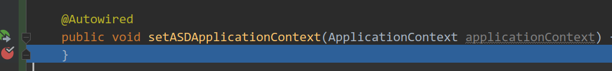
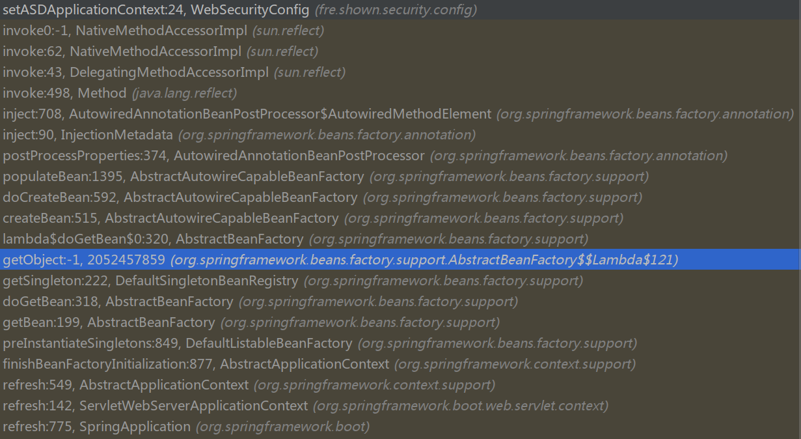

# Spring 细节

### `@Autowired`

不同情况下的`@Autowired`调用时机不同.

1. 在方法上标注, 调用时机为Bean初始化. 这说明被标注的方法一定会在初始化过程中执行一次. 因此这种方式下可以不正当地自定义初始化方法.

   

   

2. 在域上标注, 赋值时机也为Bean初始化.

   

   

3. 标注在方法参数上, 直到方法被调用时才会自动装配, 图略.